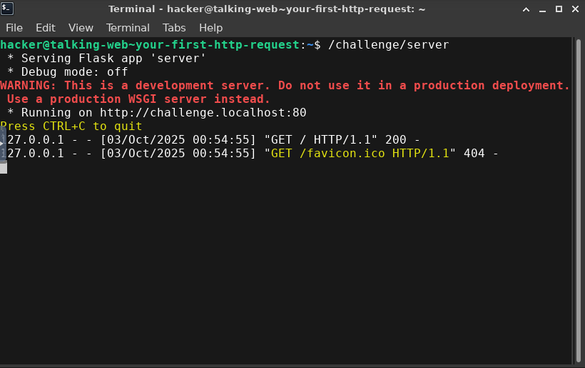
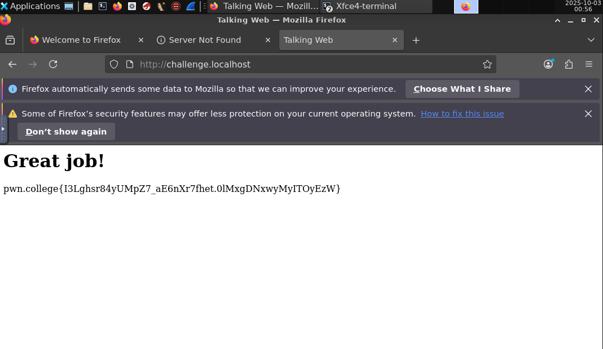
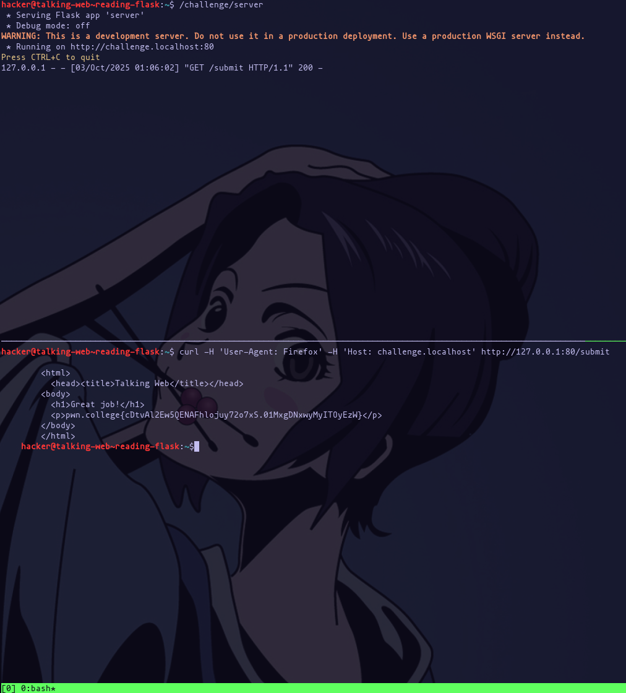
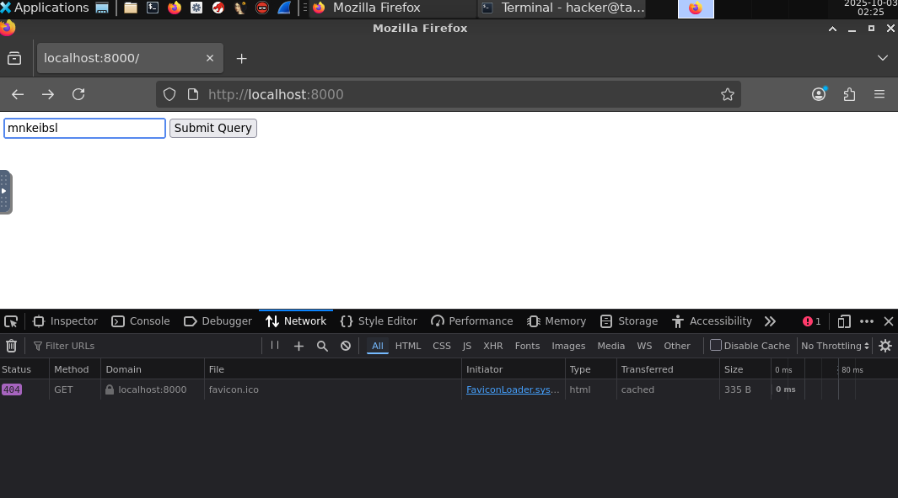
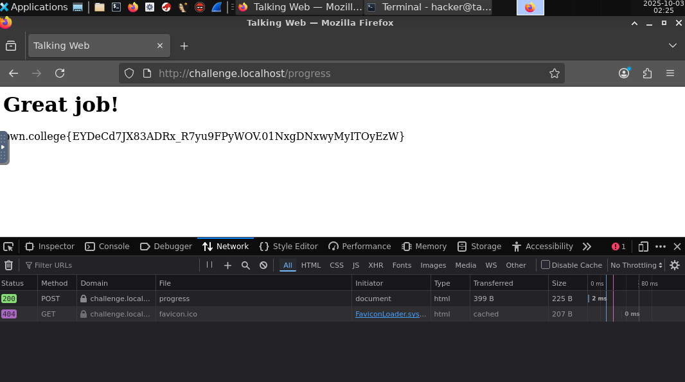

# Talking Web

## Your First HTTP Request

We have to use the GUI Desktop in `pwn.college`. Run `/challenge/run` in the Terminal and open Firefox on the Flask development server.





Flag: `pwn.college{I3Lghsr84yUMpZ7_aE6nXr7fhet.0lMxgDNxwyMyITOyEzW}`

## Reading Flask

```python
#!/opt/pwn.college/python

import flask
import os

app = flask.Flask(__name__)


@app.route("/submit", methods=["GET"])
def challenge():
    if "Firefox" not in flask.request.headers.get("User-Agent"):
        flask.abort(400, "You are using an incorrect client to access this resource!")

    return f"""
        <html>
          <head><title>Talking Web</title></head>
        <body>
          <h1>Great job!</h1>
          <p>{open("/flag").read().strip()}</p>
        </body>
        </html>
    """


app.secret_key = os.urandom(8)
app.run("challenge.localhost", 80)
```

We can solve with `tmux`, without opening Firefox:



Run the development Flask server `/challenge/server` in one window, and in the other one use `curl`:

```
hacker@talking-web~reading-flask:~$ curl -H 'User-Agent: Firefox' -H 'Host: challenge.localhost' http://127.0.0.1:80/submit
```

## Commented Data

```python
#!/opt/pwn.college/python

import flask
import os

app = flask.Flask(__name__)


@app.route("/pass", methods=["GET"])
def challenge():
    if "Firefox" not in flask.request.headers.get("User-Agent"):
        flask.abort(400, "You are using an incorrect client to access this resource!")

    return f"""
        <html>
          <head><title>Talking Web</title></head>
        <body>
          <h1>Great job!</h1>
          <!-- TOP SECRET: <p>{open("/flag").read().strip()}</p> -->
        </body>
        </html>
    """


app.secret_key = os.urandom(8)
app.run("challenge.localhost", 80)
```

Same thing, run `tmux`. Run `/challenge/server` on one window, and `curl` on another:

```
hacker@talking-web~commented-data:~$ curl -H 'User-Agent: Firefox' -H 'Host: challenge.localhost' http://localhost/pass

        <html>
          <head><title>Talking Web</title></head>
        <body>
          <h1>Great job!</h1>
          <!-- TOP SECRET: <p>pwn.college{IS2OLuJ3hJQUAjo7t1AzQXMft46.0FNxgDNxwyMyITOyEzW}</p> -->
        </body>
        </html>
```

## HTTP Metadata

```python
#!/opt/pwn.college/python

import flask
import os

app = flask.Flask(__name__)


@app.route("/pwn", methods=["GET"])
def challenge():
    if "Firefox" not in flask.request.headers.get("User-Agent"):
        flask.abort(400, "You are using an incorrect client to access this resource!")

    response = flask.make_response(
        "<html><head><title>Talking Web</title></head><body><h1>Great job!</h1></body></html>"
    )
    response.headers["X-Flag"] = open("/flag").read().strip()
    return response


app.secret_key = os.urandom(8)
app.run("challenge.localhost", 80)
```

```
hacker@talking-web~http-metadata:~$ curl -v -H 'User-Agent: Firefox' -H 'Host: challenge.localhost' http://localhost/pwn
* Host localhost:80 was resolved.
* IPv6: ::1
* IPv4: 127.0.0.1
*   Trying [::1]:80...
* connect to ::1 port 80 from ::1 port 41780 failed: Connection refused
*   Trying 127.0.0.1:80...
* Connected to localhost (127.0.0.1) port 80
* using HTTP/1.x
> GET /pwn HTTP/1.1
> Host: challenge.localhost
> Accept: */*
> User-Agent: Firefox
>
* Request completely sent off
< HTTP/1.1 200 OK
< Server: Werkzeug/3.0.6 Python/3.8.10
< Date: Fri, 03 Oct 2025 01:15:18 GMT
< Content-Type: text/html; charset=utf-8
< Content-Length: 84
< X-Flag: pwn.college{UftH6EOkx_qDofXiZdcymgBhlbz.0VNxgDNxwyMyITOyEzW}
< Connection: close
<
* shutting down connection #0
<html><head><title>Talking Web</title></head><body><h1>Great job!</h1></body></html>
```

## HTTP (netcat)

```python
#!/opt/pwn.college/python

import flask
import os

app = flask.Flask(__name__)


import pathlib
import psutil


# This function determines the process that is on the
# other side of the file descriptor we pass in.
def peer_process_of(fd):
    server_connection = next(connection for connection in psutil.Process().net_connections() if connection.fd == fd)
    client_connection = next(
        connection
        for connection in psutil.net_connections()
        if connection.raddr == server_connection.laddr and connection.laddr == server_connection.raddr
    )
    return psutil.Process(client_connection.pid)


# This function returns the filename of a peer process for a given
# file descriptor, verifying that the path is owned by root and
# not open to shenanigans.
def name_of_program_for(process):
    client_path = pathlib.Path(process.exe())
    for p in reversed(client_path.parents):
        if p.owner() != "root":
            return None
        if str(p) in ("/home", "/tmp", "/var/tmp", "/dev/shm"):
            return None
    return client_path.stem


@app.route("/", methods=["GET"])
def challenge():
    if name_of_program_for(peer_process_of(flask.request.input_stream.fileno())) not in ["nc"]:
        flask.abort(400, "You are using an incorrect client to access this resource!")

    response = flask.make_response(
        "<html><head><title>Talking Web</title></head><body><h1>Great job!</h1></body></html>"
    )
    response.headers["X-Flag"] = open("/flag").read().strip()
    return response


app.secret_key = os.urandom(8)
app.run("challenge.localhost", 80)
```

Using `nc`, and writing the HTTP request manually:
```
hacker@talking-web~http-netcat:~$ nc -v challenge.localhost 80
Connection to challenge.localhost (127.0.0.1) 80 port [tcp/http] succeeded!
GET / HTTP/1.1
Host: challenge.localhost
Accept: */*

HTTP/1.1 200 OK
Server: Werkzeug/3.0.6 Python/3.8.10
Date: Fri, 03 Oct 2025 01:21:58 GMT
Content-Type: text/html; charset=utf-8
Content-Length: 84
X-Flag: pwn.college{MSMWs1VLOiiAv4ZxY_5_IulVhkC.QX5YjMzwyMyITOyEzW}
Connection: close

<html><head><title>Talking Web</title></head><body><h1>Great job!</h1></body></html>
```

## HTTP Paths (netcat)

```python
#!/opt/pwn.college/python

import flask
import os

app = flask.Flask(__name__)


import pathlib
import psutil


# This function determines the process that is on the
# other side of the file descriptor we pass in.
def peer_process_of(fd):
    server_connection = next(connection for connection in psutil.Process().net_connections() if connection.fd == fd)
    client_connection = next(
        connection
        for connection in psutil.net_connections()
        if connection.raddr == server_connection.laddr and connection.laddr == server_connection.raddr
    )
    return psutil.Process(client_connection.pid)


# This function returns the filename of a peer process for a given
# file descriptor, verifying that the path is owned by root and
# not open to shenanigans.
def name_of_program_for(process):
    client_path = pathlib.Path(process.exe())
    for p in reversed(client_path.parents):
        if p.owner() != "root":
            return None
        if str(p) in ("/home", "/tmp", "/var/tmp", "/dev/shm"):
            return None
    return client_path.stem


@app.route("/pass", methods=["GET"])
def challenge():
    if name_of_program_for(peer_process_of(flask.request.input_stream.fileno())) not in ["nc"]:
        flask.abort(400, "You are using an incorrect client to access this resource!")

    return f"""
        <html>
          <head><title>Talking Web</title></head>
        <body>
          <h1>Great job!</h1>
          <p>{open("/flag").read().strip()}</p>
        </body>
        </html>
    """


app.secret_key = os.urandom(8)
app.run("challenge.localhost", 80)
```

```
hacker@talking-web~http-paths-netcat:~$ nc -v challenge.localhost 80
Connection to challenge.localhost (127.0.0.1) 80 port [tcp/http] succeeded!
GET /pass HTTP/1.1
Host: challenge.localhost
Accept: */*

HTTP/1.1 200 OK
Server: Werkzeug/3.0.6 Python/3.8.10
Date: Fri, 03 Oct 2025 01:25:21 GMT
Content-Type: text/html; charset=utf-8
Content-Length: 224
Connection: close


        <html>
          <head><title>Talking Web</title></head>
        <body>
          <h1>Great job!</h1>
          <p>pwn.college{EG0kDXsFIX6YIgA6qZniTA8YyDY.QX1cjMzwyMyITOyEzW}</p>
        </body>
        </html>
```

## HTTP (curl)

```python
#!/opt/pwn.college/python

import flask
import os

app = flask.Flask(__name__)


import pathlib
import psutil


# This function determines the process that is on the
# other side of the file descriptor we pass in.
def peer_process_of(fd):
    server_connection = next(connection for connection in psutil.Process().net_connections() if connection.fd == fd)
    client_connection = next(
        connection
        for connection in psutil.net_connections()
        if connection.raddr == server_connection.laddr and connection.laddr == server_connection.raddr
    )
    return psutil.Process(client_connection.pid)


# This function returns the filename of a peer process for a given
# file descriptor, verifying that the path is owned by root and
# not open to shenanigans.
def name_of_program_for(process):
    client_path = pathlib.Path(process.exe())
    for p in reversed(client_path.parents):
        if p.owner() != "root":
            return None
        if str(p) in ("/home", "/tmp", "/var/tmp", "/dev/shm"):
            return None
    return client_path.stem


@app.route("/authenticate", methods=["GET"])
def challenge():
    if name_of_program_for(peer_process_of(flask.request.input_stream.fileno())) not in ["curl"]:
        flask.abort(400, "You are using an incorrect client to access this resource!")

    return f"""
        <html>
          <head><title>Talking Web</title></head>
        <body>
          <h1>Great job!</h1>
          <p>{open("/flag").read().strip()}</p>
        </body>
        </html>
    """


app.secret_key = os.urandom(8)
app.run("challenge.localhost", 80)
```

```
hacker@talking-web~http-curl:~$ curl http://challenge.localhost/authenticate

        <html>
          <head><title>Talking Web</title></head>
        <body>
          <h1>Great job!</h1>
          <p>pwn.college{YHHPQksEw9qPACqnPfxArqGmywj.QX0cjMzwyMyITOyEzW}</p>
        </body>
        </html>
```

## HTTP (python)

```python
#!/opt/pwn.college/python

import flask
import os

app = flask.Flask(__name__)


import pathlib
import psutil


# This function determines the process that is on the
# other side of the file descriptor we pass in.
def peer_process_of(fd):
    server_connection = next(connection for connection in psutil.Process().net_connections() if connection.fd == fd)
    client_connection = next(
        connection
        for connection in psutil.net_connections()
        if connection.raddr == server_connection.laddr and connection.laddr == server_connection.raddr
    )
    return psutil.Process(client_connection.pid)


# This function returns the filename of a peer process for a given
# file descriptor, verifying that the path is owned by root and
# not open to shenanigans.
def name_of_program_for(process):
    client_path = pathlib.Path(process.exe())
    for p in reversed(client_path.parents):
        if p.owner() != "root":
            return None
        if str(p) in ("/home", "/tmp", "/var/tmp", "/dev/shm"):
            return None
    return client_path.stem


@app.route("/check", methods=["GET"])
def challenge():
    if name_of_program_for(peer_process_of(flask.request.input_stream.fileno())) not in ["python3"]:
        flask.abort(400, "You are using an incorrect client to access this resource!")

    return f"""
        <html>
          <head><title>Talking Web</title></head>
        <body>
          <h1>Great job!</h1>
          <p>{open("/flag").read().strip()}</p>
        </body>
        </html>
    """


app.secret_key = os.urandom(8)
app.run("challenge.localhost", 80)
```

```
hacker@talking-web~http-python:~$ python3 -c 'import requests; resp = requests.get("http://challenge.localhost:80/check"); print(resp.text)'

        <html>
          <head><title>Talking Web</title></head>
        <body>
          <h1>Great job!</h1>
          <p>pwn.college{gtN8CIMSmTc0YlT5_J18RArf-bd.QX2cjMzwyMyITOyEzW}</p>
        </body>
        </html>
```

## HTTP Host Header (python)

```
#!/opt/pwn.college/python

import flask
import os

app = flask.Flask(__name__)


import pathlib
import psutil


# This function determines the process that is on the
# other side of the file descriptor we pass in.
def peer_process_of(fd):
    server_connection = next(connection for connection in psutil.Process().net_connections() if connection.fd == fd)
    client_connection = next(
        connection
        for connection in psutil.net_connections()
        if connection.raddr == server_connection.laddr and connection.laddr == server_connection.raddr
    )
    return psutil.Process(client_connection.pid)


# This function returns the filename of a peer process for a given
# file descriptor, verifying that the path is owned by root and
# not open to shenanigans.
def name_of_program_for(process):
    client_path = pathlib.Path(process.exe())
    for p in reversed(client_path.parents):
        if p.owner() != "root":
            return None
        if str(p) in ("/home", "/tmp", "/var/tmp", "/dev/shm"):
            return None
    return client_path.stem


@app.route("/mission", methods=["GET"])
def challenge():
    if name_of_program_for(peer_process_of(flask.request.input_stream.fileno())) not in ["python3"]:
        flask.abort(400, "You are using an incorrect client to access this resource!")

    return f"""
        <html>
          <head><title>Talking Web</title></head>
        <body>
          <h1>Great job!</h1>
          <p>{open("/flag").read().strip()}</p>
        </body>
        </html>
    """


app.secret_key = os.urandom(8)
app.config["SERVER_NAME"] = "net-force.nl:80"
app.run("challenge.localhost", 80)
```

```
hacker@talking-web~http-host-header-python:~$ python3 -c 'import requests; r = requests.get("http://localhost:80/mission",headers={"Host":"net-force.nl"}); print(r.text)'

        <html>
          <head><title>Talking Web</title></head>
        <body>
          <h1>Great job!</h1>
          <p>pwn.college{QYbLq5X7bMBMiEiIrihKm7iGWTg.QXzcjMzwyMyITOyEzW}</p>
        </body>
        </html>
```

## HTTP Host Header (curl)

```
#!/opt/pwn.college/python

import flask
import os

app = flask.Flask(__name__)


import pathlib
import psutil


# This function determines the process that is on the
# other side of the file descriptor we pass in.
def peer_process_of(fd):
    server_connection = next(connection for connection in psutil.Process().net_connections() if connection.fd == fd)
    client_connection = next(
        connection
        for connection in psutil.net_connections()
        if connection.raddr == server_connection.laddr and connection.laddr == server_connection.raddr
    )
    return psutil.Process(client_connection.pid)


# This function returns the filename of a peer process for a given
# file descriptor, verifying that the path is owned by root and
# not open to shenanigans.
def name_of_program_for(process):
    client_path = pathlib.Path(process.exe())
    for p in reversed(client_path.parents):
        if p.owner() != "root":
            return None
        if str(p) in ("/home", "/tmp", "/var/tmp", "/dev/shm"):
            return None
    return client_path.stem


@app.route("/gate", methods=["GET"])
def challenge():
    if name_of_program_for(peer_process_of(flask.request.input_stream.fileno())) not in ["curl"]:
        flask.abort(400, "You are using an incorrect client to access this resource!")

    return f"""
        <html>
          <head><title>Talking Web</title></head>
        <body>
          <h1>Great job!</h1>
          <p>{open("/flag").read().strip()}</p>
        </body>
        </html>
    """


app.secret_key = os.urandom(8)
app.config["SERVER_NAME"] = "sadservers.com:80"
app.run("challenge.localhost", 80)
```

```
hacker@talking-web~http-host-header-curl:~$ curl -H 'Host: sadservers.com' http://localhost:80/gate

        <html>
          <head><title>Talking Web</title></head>
        <body>
          <h1>Great job!</h1>
          <p>pwn.college{ctMfwIUhHedT6nECJV4zSWBV35N.QXxcjMzwyMyITOyEzW}</p>
        </body>
        </html>
```

## HTTP Host Header (netcat)

```python
#!/opt/pwn.college/python

import flask
import os

app = flask.Flask(__name__)


import pathlib
import psutil


# This function determines the process that is on the
# other side of the file descriptor we pass in.
def peer_process_of(fd):
    server_connection = next(connection for connection in psutil.Process().net_connections() if connection.fd == fd)
    client_connection = next(
        connection
        for connection in psutil.net_connections()
        if connection.raddr == server_connection.laddr and connection.laddr == server_connection.raddr
    )
    return psutil.Process(client_connection.pid)


# This function returns the filename of a peer process for a given
# file descriptor, verifying that the path is owned by root and
# not open to shenanigans.
def name_of_program_for(process):
    client_path = pathlib.Path(process.exe())
    for p in reversed(client_path.parents):
        if p.owner() != "root":
            return None
        if str(p) in ("/home", "/tmp", "/var/tmp", "/dev/shm"):
            return None
    return client_path.stem


@app.route("/verify", methods=["GET"])
def challenge():
    if name_of_program_for(peer_process_of(flask.request.input_stream.fileno())) not in ["nc"]:
        flask.abort(400, "You are using an incorrect client to access this resource!")

    response = flask.make_response(
        "<html><head><title>Talking Web</title></head><body><h1>Great job!</h1></body></html>"
    )
    response.headers["X-Flag"] = open("/flag").read().strip()
    return response


app.secret_key = os.urandom(8)
app.config["SERVER_NAME"] = "gandalf.lakera.ai:80"
app.run("challenge.localhost", 80)
```

```
hacker@talking-web~http-host-header-netcat:~$ nc -v localhost 80
nc: connect to localhost (::1) port 80 (tcp) failed: Connection refused
Connection to localhost (127.0.0.1) 80 port [tcp/http] succeeded!
GET /verify HTTP/1.1
Host: gandalf.lakera.ai

HTTP/1.1 200 OK
Server: Werkzeug/3.0.6 Python/3.8.10
Date: Fri, 03 Oct 2025 01:39:33 GMT
Content-Type: text/html; charset=utf-8
Content-Length: 84
X-Flag: pwn.college{4XUmfZVILf9VS9wZc_Vii3MKkrY.QXycjMzwyMyITOyEzW}
Connection: close

<html><head><title>Talking Web</title></head><body><h1>Great job!</h1></body></html>
```

## URL Encoding (netcat)

```python
#!/opt/pwn.college/python

import flask
import os

app = flask.Flask(__name__)


import pathlib
import psutil


# This function determines the process that is on the
# other side of the file descriptor we pass in.
def peer_process_of(fd):
    server_connection = next(connection for connection in psutil.Process().net_connections() if connection.fd == fd)
    client_connection = next(
        connection
        for connection in psutil.net_connections()
        if connection.raddr == server_connection.laddr and connection.laddr == server_connection.raddr
    )
    return psutil.Process(client_connection.pid)


# This function returns the filename of a peer process for a given
# file descriptor, verifying that the path is owned by root and
# not open to shenanigans.
def name_of_program_for(process):
    client_path = pathlib.Path(process.exe())
    for p in reversed(client_path.parents):
        if p.owner() != "root":
            return None
        if str(p) in ("/home", "/tmp", "/var/tmp", "/dev/shm"):
            return None
    return client_path.stem


@app.route("/evaluate verify meet", methods=["GET"])
def challenge():
    if name_of_program_for(peer_process_of(flask.request.input_stream.fileno())) not in ["nc"]:
        flask.abort(400, "You are using an incorrect client to access this resource!")

    response = flask.make_response(
        "<html><head><title>Talking Web</title></head><body><h1>Great job!</h1></body></html>"
    )
    response.headers["X-Flag"] = open("/flag").read().strip()
    return response


app.secret_key = os.urandom(8)
app.config["SERVER_NAME"] = "challenge.localhost:80"
app.run("challenge.localhost", 80)
```

```
hacker@talking-web~url-encoding-netcat:~$ nc -v localhost 80
nc: connect to localhost (::1) port 80 (tcp) failed: Connection refused
Connection to localhost (127.0.0.1) 80 port [tcp/http] succeeded!
GET /evaluate%20verify%20meet HTTP/1.1
Host: challenge.localhost

HTTP/1.1 200 OK
Server: Werkzeug/3.0.6 Python/3.8.10
Date: Fri, 03 Oct 2025 01:42:43 GMT
Content-Type: text/html; charset=utf-8
Content-Length: 84
X-Flag: pwn.college{47CcG7YuCfK8YAxK0ePUguEoww8.QX5cjMzwyMyITOyEzW}
Connection: close

<html><head><title>Talking Web</title></head><body><h1>Great job!</h1></body></html>
```

## HTTP GET Parameters

```
#!/opt/pwn.college/python

import flask
import os

app = flask.Flask(__name__)


@app.route("/meet", methods=["GET"])
def challenge():
    if flask.request.args.get("pass", None) != "qslkkqxj":
        flask.abort(403, "Incorrect value for get parameter pass!")

    return f"""
        <html>
          <head><title>Talking Web</title></head>
        <body>
          <h1>Great job!</h1>
          <p>{open("/flag").read().strip()}</p>
        </body>
        </html>
    """


app.secret_key = os.urandom(8)
app.config["SERVER_NAME"] = "challenge.localhost:80"
app.run("challenge.localhost", 80)
```

```
hacker@talking-web~http-get-parameters:~$ curl -H 'Host: challenge.localhost' 'http://localhost:80/meet?pass=qslkkqxj'

        <html>
          <head><title>Talking Web</title></head>
        <body>
          <h1>Great job!</h1>
          <p>pwn.college{ULbyMrOG6qyQZdIRg5jQZMflTIw.QXwgjMzwyMyITOyEzW}</p>
        </body>
        </html>
```

## Multiple HTTP Parameters (netcat)

```python
#!/opt/pwn.college/python

import flask
import os

app = flask.Flask(__name__)


import pathlib
import psutil


# This function determines the process that is on the
# other side of the file descriptor we pass in.
def peer_process_of(fd):
    server_connection = next(connection for connection in psutil.Process().net_connections() if connection.fd == fd)
    client_connection = next(
        connection
        for connection in psutil.net_connections()
        if connection.raddr == server_connection.laddr and connection.laddr == server_connection.raddr
    )
    return psutil.Process(client_connection.pid)


# This function returns the filename of a peer process for a given
# file descriptor, verifying that the path is owned by root and
# not open to shenanigans.
def name_of_program_for(process):
    client_path = pathlib.Path(process.exe())
    for p in reversed(client_path.parents):
        if p.owner() != "root":
            return None
        if str(p) in ("/home", "/tmp", "/var/tmp", "/dev/shm"):
            return None
    return client_path.stem


@app.route("/task", methods=["GET"])
def challenge():
    if name_of_program_for(peer_process_of(flask.request.input_stream.fileno())) not in ["nc"]:
        flask.abort(400, "You are using an incorrect client to access this resource!")

    if flask.request.args.get("signature", None) != "pbdtqqwb":
        flask.abort(403, "Incorrect value for get parameter signature!")

    if flask.request.args.get("code", None) != "ytpohdyp":
        flask.abort(403, "Incorrect value for get parameter code!")

    if flask.request.args.get("access_code", None) != "pfgdjzvf":
        flask.abort(403, "Incorrect value for get parameter access_code!")

    return f"""
        <html>
          <head><title>Talking Web</title></head>
        <body>
          <h1>Great job!</h1>
          <p>{open("/flag").read().strip()}</p>
        </body>
        </html>
    """


app.secret_key = os.urandom(8)
app.config["SERVER_NAME"] = "challenge.localhost:80"
app.run("challenge.localhost", 80)
```

```
hacker@talking-web~multiple-http-parameters-netcat:~$ nc -v 127.0.0.1 80
Connection to 127.0.0.1 80 port [tcp/http] succeeded!
GET /task?signature=pbdtqqwb&code=ytpohdyp&access_code=pfgdjzvf HTTP/1.1
Host: challenge.localhost

HTTP/1.1 200 OK
Server: Werkzeug/3.0.6 Python/3.8.10
Date: Fri, 03 Oct 2025 01:49:09 GMT
Content-Type: text/html; charset=utf-8
Content-Length: 224
Connection: close


        <html>
          <head><title>Talking Web</title></head>
        <body>
          <h1>Great job!</h1>
          <p>pwn.college{0T-pTlf4GN-d0RpvkGMOyvfOo7S.QX0gjMzwyMyITOyEzW}</p>
        </body>
        </html>
```

## Multiple HTTP Parameters (curl)

```python
#!/opt/pwn.college/python

import flask
import os

app = flask.Flask(__name__)


import pathlib
import psutil


# This function determines the process that is on the
# other side of the file descriptor we pass in.
def peer_process_of(fd):
    server_connection = next(connection for connection in psutil.Process().net_connections() if connection.fd == fd)
    client_connection = next(
        connection
        for connection in psutil.net_connections()
        if connection.raddr == server_connection.laddr and connection.laddr == server_connection.raddr
    )
    return psutil.Process(client_connection.pid)


# This function returns the filename of a peer process for a given
# file descriptor, verifying that the path is owned by root and
# not open to shenanigans.
def name_of_program_for(process):
    client_path = pathlib.Path(process.exe())
    for p in reversed(client_path.parents):
        if p.owner() != "root":
            return None
        if str(p) in ("/home", "/tmp", "/var/tmp", "/dev/shm"):
            return None
    return client_path.stem


@app.route("/trial", methods=["GET"])
def challenge():
    if name_of_program_for(peer_process_of(flask.request.input_stream.fileno())) not in ["curl"]:
        flask.abort(400, "You are using an incorrect client to access this resource!")

    if flask.request.args.get("code", None) != "keoetqzz":
        flask.abort(403, "Incorrect value for get parameter code!")

    if flask.request.args.get("unlock_code", None) != "xuigyijp":
        flask.abort(403, "Incorrect value for get parameter unlock_code!")

    if flask.request.args.get("flag", None) != "vatxdzwv":
        flask.abort(403, "Incorrect value for get parameter flag!")

    return f"""
        <html>
          <head><title>Talking Web</title></head>
        <body>
          <h1>Great job!</h1>
          <p>{open("/flag").read().strip()}</p>
        </body>
        </html>
    """


app.secret_key = os.urandom(8)
app.config["SERVER_NAME"] = "challenge.localhost:80"
app.run("challenge.localhost", 80)
```

```
hacker@talking-web~multiple-http-parameters-curl:~$ curl -H 'Host: challenge.localhost' 'http://127.0.0.1:80/trial?code=keoetqzz&unlock_code=xuigyijp&flag=vatxdzwv'

        <html>
          <head><title>Talking Web</title></head>
        <body>
          <h1>Great job!</h1>
          <p>pwn.college{EGP3kDycmwMtQ9i1t_4QnT30jAU.QXzgjMzwyMyITOyEzW}</p>
        </body>
        </html>
```

## HTTP Forms

```python
#!/opt/pwn.college/python

import flask
import os

app = flask.Flask(__name__)


@app.route("/", methods=["GET"])
def challenge_index():
    return """<html>
      <h1>Your form:</h1>
      <form action="/meet" method=post>
            <input name=credential>
            <input type=submit value=Submit>
      </form>
    </html>"""


@app.route("/meet", methods=["POST"])
def challenge():
    if "Firefox" not in flask.request.headers.get("User-Agent"):
        flask.abort(400, "You are using an incorrect client to access this resource!")

    if flask.request.form.get("credential", None) != "eiozsbzy":
        flask.abort(403, "Incorrect value for post parameter credential!")

    return f"""
        <html>
          <head><title>Talking Web</title></head>
        <body>
          <h1>Great job!</h1>
          <p>{open("/flag").read().strip()}</p>
        </body>
        </html>
    """


app.secret_key = os.urandom(8)
app.config["SERVER_NAME"] = "challenge.localhost:80"
app.run("challenge.localhost", 80)
```

```
hacker@talking-web~http-forms:~$ curl -X POST -d 'credential=eiozsbzy' -H 'User-Agent: Firefox' http://challenge.localhost:80/meet

        <html>
          <head><title>Talking Web</title></head>
        <body>
          <h1>Great job!</h1>
          <p>pwn.college{gHwEPc16qAKBOgeSX1ExHmI_NjA.0lNxgDNxwyMyITOyEzW}</p>
        </body>
        </html>
```

## HTTP Forms (curl)

```python
#!/opt/pwn.college/python

import flask
import os

app = flask.Flask(__name__)


import pathlib
import psutil


# This function determines the process that is on the
# other side of the file descriptor we pass in.
def peer_process_of(fd):
    server_connection = next(connection for connection in psutil.Process().net_connections() if connection.fd == fd)
    client_connection = next(
        connection
        for connection in psutil.net_connections()
        if connection.raddr == server_connection.laddr and connection.laddr == server_connection.raddr
    )
    return psutil.Process(client_connection.pid)


# This function returns the filename of a peer process for a given
# file descriptor, verifying that the path is owned by root and
# not open to shenanigans.
def name_of_program_for(process):
    client_path = pathlib.Path(process.exe())
    for p in reversed(client_path.parents):
        if p.owner() != "root":
            return None
        if str(p) in ("/home", "/tmp", "/var/tmp", "/dev/shm"):
            return None
    return client_path.stem


@app.route("/fulfill", methods=["POST"])
def challenge():
    if name_of_program_for(peer_process_of(flask.request.input_stream.fileno())) not in ["curl"]:
        flask.abort(400, "You are using an incorrect client to access this resource!")

    if flask.request.form.get("solution", None) != "yjivelfj":
        flask.abort(403, "Incorrect value for post parameter solution!")

    return f"""
        <html>
          <head><title>Talking Web</title></head>
        <body>
          <h1>Great job!</h1>
          <p>{open("/flag").read().strip()}</p>
        </body>
        </html>
    """


app.secret_key = os.urandom(8)
app.config["SERVER_NAME"] = "challenge.localhost:80"
app.run("challenge.localhost", 80)
```

```
hacker@talking-web~http-forms-curl:~$ curl -X POST -d 'solution=yjivelfj' http://challenge.localhost:80/fulfill

        <html>
          <head><title>Talking Web</title></head>
        <body>
          <h1>Great job!</h1>
          <p>pwn.college{cXroyUKf-GR8ROm-zIByr4PF40G.QX2gjMzwyMyITOyEzW}</p>
        </body>
        </html>
```

## HTTP Forms (netcat)

```python
#!/opt/pwn.college/python

import flask
import os

app = flask.Flask(__name__)


import pathlib
import psutil


# This function determines the process that is on the
# other side of the file descriptor we pass in.
def peer_process_of(fd):
    server_connection = next(connection for connection in psutil.Process().net_connections() if connection.fd == fd)
    client_connection = next(
        connection
        for connection in psutil.net_connections()
        if connection.raddr == server_connection.laddr and connection.laddr == server_connection.raddr
    )
    return psutil.Process(client_connection.pid)


# This function returns the filename of a peer process for a given
# file descriptor, verifying that the path is owned by root and
# not open to shenanigans.
def name_of_program_for(process):
    client_path = pathlib.Path(process.exe())
    for p in reversed(client_path.parents):
        if p.owner() != "root":
            return None
        if str(p) in ("/home", "/tmp", "/var/tmp", "/dev/shm"):
            return None
    return client_path.stem


@app.route("/fulfill", methods=["POST"])
def challenge():
    if name_of_program_for(peer_process_of(flask.request.input_stream.fileno())) not in ["nc"]:
        flask.abort(400, "You are using an incorrect client to access this resource!")

    if flask.request.form.get("solution", None) != "tnzjoknq":
        flask.abort(403, "Incorrect value for post parameter solution!")

    return f"""
        <html>
          <head><title>Talking Web</title></head>
        <body>
          <h1>Great job!</h1>
          <p>{open("/flag").read().strip()}</p>
        </body>
        </html>
    """


app.secret_key = os.urandom(8)
app.config["SERVER_NAME"] = "challenge.localhost:80"
app.run("challenge.localhost", 80)
```

```
hacker@talking-web~http-forms-netcat:~$ nc -v localhost 80
nc: connect to localhost (::1) port 80 (tcp) failed: Connection refused
Connection to localhost (127.0.0.1) 80 port [tcp/http] succeeded!
POST /fulfill HTTP/1.1
Host: challenge.localhost
Content-Type: application/x-www-form-urlencoded
Content-Length: 17
Connection: Close

solution=tnzjoknq
HTTP/1.1 200 OK
Server: Werkzeug/3.0.6 Python/3.8.10
Date: Fri, 03 Oct 2025 02:12:03 GMT
Content-Type: text/html; charset=utf-8
Content-Length: 224
Connection: close


        <html>
          <head><title>Talking Web</title></head>
        <body>
          <h1>Great job!</h1>
          <p>pwn.college{4azVlxsV4ywZoz4SVt2lAClZaEy.QX3gjMzwyMyITOyEzW}</p>
        </body>
        </html>
```

## HTTP Forms (python)

```python
#!/opt/pwn.college/python

import flask
import os

app = flask.Flask(__name__)


import pathlib
import psutil


# This function determines the process that is on the
# other side of the file descriptor we pass in.
def peer_process_of(fd):
    server_connection = next(connection for connection in psutil.Process().net_connections() if connection.fd == fd)
    client_connection = next(
        connection
        for connection in psutil.net_connections()
        if connection.raddr == server_connection.laddr and connection.laddr == server_connection.raddr
    )
    return psutil.Process(client_connection.pid)


# This function returns the filename of a peer process for a given
# file descriptor, verifying that the path is owned by root and
# not open to shenanigans.
def name_of_program_for(process):
    client_path = pathlib.Path(process.exe())
    for p in reversed(client_path.parents):
        if p.owner() != "root":
            return None
        if str(p) in ("/home", "/tmp", "/var/tmp", "/dev/shm"):
            return None
    return client_path.stem


@app.route("/meet", methods=["POST"])
def challenge():
    if name_of_program_for(peer_process_of(flask.request.input_stream.fileno())) not in ["python3"]:
        flask.abort(400, "You are using an incorrect client to access this resource!")

    if flask.request.form.get("secure_key", None) != "ylrwhjat":
        flask.abort(403, "Incorrect value for post parameter secure_key!")

    return f"""
        <html>
          <head><title>Talking Web</title></head>
        <body>
          <h1>Great job!</h1>
          <p>{open("/flag").read().strip()}</p>
        </body>
        </html>
    """


app.secret_key = os.urandom(8)
app.config["SERVER_NAME"] = "challenge.localhost:80"
app.run("challenge.localhost", 80)
```

```
hacker@talking-web~http-forms-python:~$ python3 -c 'import requests; r = requests.post("http://127.0.0.1:80/meet",headers={"Host":"challenge.localhost"},data={"secure_key":"ylrwhjat"});print(r.text)'

        <html>
          <head><title>Talking Web</title></head>
        <body>
          <h1>Great job!</h1>
          <p>pwn.college{svzF8B_eP1L5kJtrWIFJKSp5vwu.QX4gjMzwyMyITOyEzW}</p>
        </body>
        </html>
```

## HTTP Forms Without Forms

```python
#!/opt/pwn.college/python

import flask
import os

app = flask.Flask(__name__)


@app.route("/progress", methods=["POST"])
def challenge():
    if "Firefox" not in flask.request.headers.get("User-Agent"):
        flask.abort(400, "You are using an incorrect client to access this resource!")

    if flask.request.form.get("hash", None) != "mnkeibsl":
        flask.abort(403, "Incorrect value for post parameter hash!")

    return f"""
        <html>
          <head><title>Talking Web</title></head>
        <body>
          <h1>Great job!</h1>
          <p>{open("/flag").read().strip()}</p>
        </body>
        </html>
    """


app.secret_key = os.urandom(8)
app.config["SERVER_NAME"] = "challenge.localhost:80"
app.run("challenge.localhost", 80)
```

We create a HTML page `index.html` with the HTTP form:
```html
<html>
<body>
<form action="http://challenge.localhost/progress" method="post">
<input type="text" name="hash" value="test"/>
<input type="submit"/>
</form>
</body>
</html>
```

We serve it locally on port 8000:
```
hacker@talking-web~http-forms-without-forms:~$ python3 -m http.server
```




Flag: `pwn.college{EYDeCd7JX83ADRx_R7yu9FPyWOV.01NxgDNxwyMyITOyEzW}`


## Multiple Form Fields (curl)

```python
#!/opt/pwn.college/python

import flask
import os

app = flask.Flask(__name__)


import pathlib
import psutil


# This function determines the process that is on the
# other side of the file descriptor we pass in.
def peer_process_of(fd):
    server_connection = next(connection for connection in psutil.Process().net_connections() if connection.fd == fd)
    client_connection = next(
        connection
        for connection in psutil.net_connections()
        if connection.raddr == server_connection.laddr and connection.laddr == server_connection.raddr
    )
    return psutil.Process(client_connection.pid)


# This function returns the filename of a peer process for a given
# file descriptor, verifying that the path is owned by root and
# not open to shenanigans.
def name_of_program_for(process):
    client_path = pathlib.Path(process.exe())
    for p in reversed(client_path.parents):
        if p.owner() != "root":
            return None
        if str(p) in ("/home", "/tmp", "/var/tmp", "/dev/shm"):
            return None
    return client_path.stem


@app.route("/hack", methods=["POST"])
def challenge():
    if name_of_program_for(peer_process_of(flask.request.input_stream.fileno())) not in ["curl"]:
        flask.abort(400, "You are using an incorrect client to access this resource!")

    if flask.request.form.get("token", None) != "ieovmiim":
        flask.abort(403, "Incorrect value for post parameter token!")

    if flask.request.form.get("authcode", None) != "dhcrcdvp":
        flask.abort(403, "Incorrect value for post parameter authcode!")

    if flask.request.form.get("access", None) != "cbmupwsi":
        flask.abort(403, "Incorrect value for post parameter access!")

    return f"""
        <html>
          <head><title>Talking Web</title></head>
        <body>
          <h1>Great job!</h1>
          <p>{open("/flag").read().strip()}</p>
        </body>
        </html>
    """


app.secret_key = os.urandom(8)
app.config["SERVER_NAME"] = "challenge.localhost:80"
app.run("challenge.localhost", 80)
```

```
hacker@talking-web~multiple-form-fields-curl:~$ curl -X POST -d 'token=ieovmiim&authcode=dhcrcdvp&access=cbmupwsi' http://challenge.localhost:80/hack

        <html>
          <head><title>Talking Web</title></head>
        <body>
          <h1>Great job!</h1>
          <p>pwn.college{8JVOETYfJ0ofMb5X28_cBQDfyI9.QX5gjMzwyMyITOyEzW}</p>
        </body>
        </html>
```

## Multiple Form Fields (netcat)

```python
#!/opt/pwn.college/python

import flask
import os

app = flask.Flask(__name__)


import pathlib
import psutil


# This function determines the process that is on the
# other side of the file descriptor we pass in.
def peer_process_of(fd):
    server_connection = next(connection for connection in psutil.Process().net_connections() if connection.fd == fd)
    client_connection = next(
        connection
        for connection in psutil.net_connections()
        if connection.raddr == server_connection.laddr and connection.laddr == server_connection.raddr
    )
    return psutil.Process(client_connection.pid)


# This function returns the filename of a peer process for a given
# file descriptor, verifying that the path is owned by root and
# not open to shenanigans.
def name_of_program_for(process):
    client_path = pathlib.Path(process.exe())
    for p in reversed(client_path.parents):
        if p.owner() != "root":
            return None
        if str(p) in ("/home", "/tmp", "/var/tmp", "/dev/shm"):
            return None
    return client_path.stem


@app.route("/trial", methods=["POST"])
def challenge():
    if name_of_program_for(peer_process_of(flask.request.input_stream.fileno())) not in ["nc"]:
        flask.abort(400, "You are using an incorrect client to access this resource!")

    if flask.request.form.get("secure_key", None) != "vbwurlji":
        flask.abort(403, "Incorrect value for post parameter secure_key!")

    if flask.request.form.get("pin", None) != "tszszeta":
        flask.abort(403, "Incorrect value for post parameter pin!")

    if flask.request.form.get("secret", None) != "gpqwdmyp":
        flask.abort(403, "Incorrect value for post parameter secret!")

    if flask.request.form.get("verify", None) != "shejreci":
        flask.abort(403, "Incorrect value for post parameter verify!")

    return f"""
        <html>
          <head><title>Talking Web</title></head>
        <body>
          <h1>Great job!</h1>
          <p>{open("/flag").read().strip()}</p>
        </body>
        </html>
    """


app.secret_key = os.urandom(8)
app.config["SERVER_NAME"] = "challenge.localhost:80"
app.run("challenge.localhost", 80)
```

```
hacker@talking-web~multiple-form-fields-netcat:~$ nc -v localhost 80
nc: connect to localhost (::1) port 80 (tcp) failed: Connection refused
Connection to localhost (127.0.0.1) 80 port [tcp/http] succeeded!
POST /trial HTTP/1.1
Host: challenge.localhost
Content-Type: application/x-www-form-urlencoded
Content-Length: 64
Connection: Close

secure_key=vbwurlji&pin=tszszeta&secret=gpqwdmyp&verify=shejreci
HTTP/1.1 200 OK
Server: Werkzeug/3.0.6 Python/3.8.10
Date: Fri, 03 Oct 2025 02:36:57 GMT
Content-Type: text/html; charset=utf-8
Content-Length: 224
Connection: close


        <html>
          <head><title>Talking Web</title></head>
        <body>
          <h1>Great job!</h1>
          <p>pwn.college{o7xX-K0gQOfosMT6WLrH0I-MxuL.QXwkjMzwyMyITOyEzW}</p>
        </body>
        </html>
```

## HTTP Redirects (netcat)
