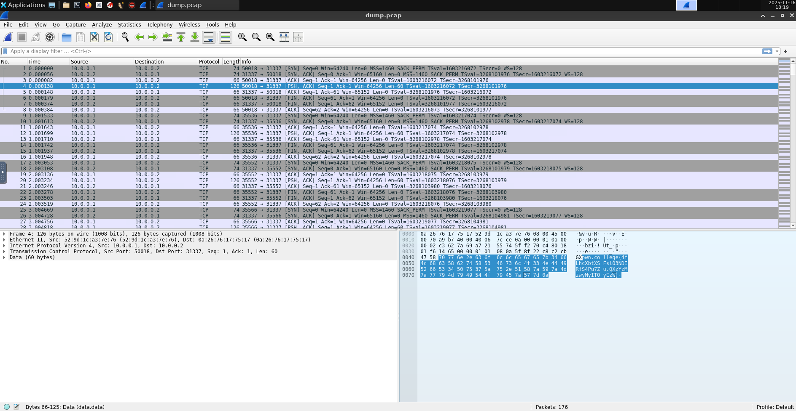
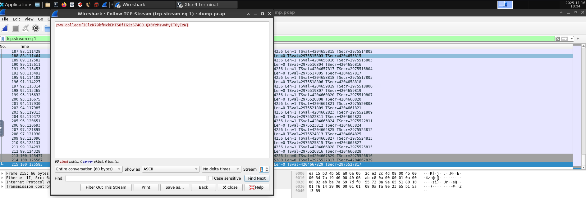
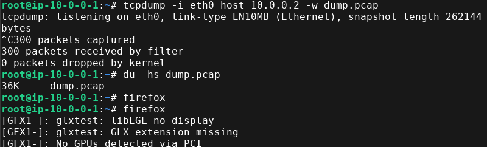
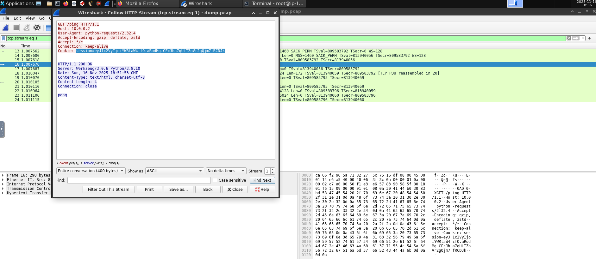
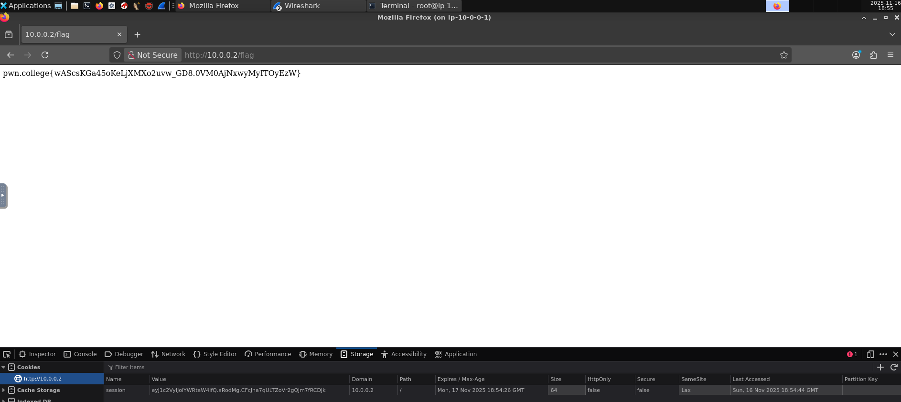

# Intercepting Communication

## Connect

```
hacker@intercepting-communication~connect:~$ /challenge/run 
root@ip-10-0-0-1:~# ip a
1: lo: <LOOPBACK,UP,LOWER_UP> mtu 65536 qdisc noqueue state UNKNOWN group default qlen 1000
    link/loopback 00:00:00:00:00:00 brd 00:00:00:00:00:00
    inet 127.0.0.1/8 scope host lo
       valid_lft forever preferred_lft forever
    inet6 ::1/128 scope host proto kernel_lo 
       valid_lft forever preferred_lft forever
3: eth0@if4: <BROADCAST,MULTICAST,UP,LOWER_UP> mtu 1500 qdisc noqueue state UP group default qlen 1000
    link/ether 92:80:e2:df:2e:38 brd ff:ff:ff:ff:ff:ff link-netnsid 0
    inet 10.0.0.1/24 scope global eth0
       valid_lft forever preferred_lft forever
    inet6 fe80::9080:e2ff:fedf:2e38/64 scope link proto kernel_ll 
       valid_lft forever preferred_lft forever
root@ip-10-0-0-1:~# nc -v 10.0.0.2 31337
Connection to 10.0.0.2 31337 port [tcp/*] succeeded!
pwn.college{YRA5pGMHlaJILr7D3s48kHiE0yO.QX5UzMzwyMyITOyEzW}
```

For curiosity:

```python
#!/usr/bin/exec-suid --real -- /usr/local/bin/python -I
# /challenge/run 

import os
import socket

import psutil
from dojjail import Host, Network

flag = open("/flag").read()
parent_process = psutil.Process(os.getppid())

class ServerHost(Host):
    def entrypoint(self):
        server_socket = socket.socket()
        server_socket.bind(("0.0.0.0", 31337))
        server_socket.listen()
        while True:
            try:
                connection, _ = server_socket.accept()
                connection.sendall(flag.encode())
                connection.close()
            except ConnectionError:
                continue

user_host = Host("ip-10-0-0-1", privileged_uid=parent_process.uids().effective)
server_host = ServerHost("ip-10-0-0-2")
network = Network(hosts={user_host: "10.0.0.1", server_host: "10.0.0.2"}, subnet="10.0.0.0/24")
network.run()

user_host.interactive(environ=parent_process.environ())
```

## Send

```
hacker@intercepting-communication~send:~$ /challenge/run
root@ip-10-0-0-1:~# ip a
1: lo: <LOOPBACK,UP,LOWER_UP> mtu 65536 qdisc noqueue state UNKNOWN group default qlen 1000
    link/loopback 00:00:00:00:00:00 brd 00:00:00:00:00:00
    inet 127.0.0.1/8 scope host lo
       valid_lft forever preferred_lft forever
    inet6 ::1/128 scope host proto kernel_lo 
       valid_lft forever preferred_lft forever
3: eth0@if4: <BROADCAST,MULTICAST,UP,LOWER_UP> mtu 1500 qdisc noqueue state UP group default qlen 1000
    link/ether 7e:4b:fd:1a:36:e6 brd ff:ff:ff:ff:ff:ff link-netnsid 0
    inet 10.0.0.1/24 scope global eth0
       valid_lft forever preferred_lft forever
    inet6 fe80::7c4b:fdff:fe1a:36e6/64 scope link proto kernel_ll 
       valid_lft forever preferred_lft forever
root@ip-10-0-0-1:~# nc -v 10.0.0.2 31337
Connection to 10.0.0.2 31337 port [tcp/*] succeeded!
Hello, World!
pwn.college{4nr2Dq7Qy5uXt67p3qIlBsdNZ7G.0VNyAjNxwyMyITOyEzW}
```

```python
#!/usr/bin/exec-suid --real -- /usr/local/bin/python -I

import os
import socket

import psutil
from dojjail import Host, Network

flag = open("/flag").read()
parent_process = psutil.Process(os.getppid())

class ServerHost(Host):
    def entrypoint(self):
        server_socket = socket.socket()
        server_socket.bind(("0.0.0.0", 31337))
        server_socket.listen()
        while True:
            try:
                connection, _ = server_socket.accept()
                while True:
                    client_message = connection.recv(1024).decode()
                    if not client_message:
                        break
                    if client_message == "Hello, World!\n":
                        connection.sendall(flag.encode())
                        break
                connection.close()
            except ConnectionError:
                continue

user_host = Host("ip-10-0-0-1", privileged_uid=parent_process.uids().effective)
server_host = ServerHost("ip-10-0-0-2")
network = Network(hosts={user_host: "10.0.0.1", server_host: "10.0.0.2"}, subnet="10.0.0.0/24")
network.run()

user_host.interactive(environ=parent_process.environ())
```

## Shutdown

From the `man nc` (this implementation of netcat is different from the one in my Void Linux).

```
-N      shutdown(2) the network socket after EOF on the input.  Some servers require this to finish their work.
```

Press `Ctrl-D` to send `EOF`:

```
hacker@intercepting-communication~shutdown:~$ /challenge/run 
root@ip-10-0-0-1:~# ip a
1: lo: <LOOPBACK,UP,LOWER_UP> mtu 65536 qdisc noqueue state UNKNOWN group default qlen 1000
    link/loopback 00:00:00:00:00:00 brd 00:00:00:00:00:00
    inet 127.0.0.1/8 scope host lo
       valid_lft forever preferred_lft forever
    inet6 ::1/128 scope host proto kernel_lo 
       valid_lft forever preferred_lft forever
3: eth0@if4: <BROADCAST,MULTICAST,UP,LOWER_UP> mtu 1500 qdisc noqueue state UP group default qlen 1000
    link/ether 6e:3d:7d:3b:fe:bb brd ff:ff:ff:ff:ff:ff link-netnsid 0
    inet 10.0.0.1/24 scope global eth0
       valid_lft forever preferred_lft forever
    inet6 fe80::6c3d:7dff:fe3b:febb/64 scope link proto kernel_ll 
       valid_lft forever preferred_lft forever
root@ip-10-0-0-1:~# nc -v -N 10.0.0.2 31337
Connection to 10.0.0.2 31337 port [tcp/*] succeeded!
pwn.college{Ekh8T1Kd1hX-TNssuw58xSyPbnj.0lNyAjNxwyMyITOyEzW}
```

```python
#!/usr/bin/exec-suid --real -- /usr/local/bin/python -I

import os
import socket

import psutil
from dojjail import Host, Network

flag = open("/flag").read()
parent_process = psutil.Process(os.getppid())

class ServerHost(Host):
    def entrypoint(self):
        server_socket = socket.socket()
        server_socket.bind(("0.0.0.0", 31337))
        server_socket.listen()
        while True:
            try:
                connection, _ = server_socket.accept()
                while True:
                    if not connection.recv(1):
                        connection.sendall(flag.encode())
                        break
                connection.close()
            except ConnectionError:
                continue

user_host = Host("ip-10-0-0-1", privileged_uid=parent_process.uids().effective)
server_host = ServerHost("ip-10-0-0-2")
network = Network(hosts={user_host: "10.0.0.1", server_host: "10.0.0.2"}, subnet="10.0.0.0/24")
network.run()

user_host.interactive(environ=parent_process.environ())
```

## Listen

```
hacker@intercepting-communication~listen:~$ /challenge/run
root@ip-10-0-0-1:~# nc -lvnp 31337
Listening on 0.0.0.0 31337
Connection received on 10.0.0.2 55882
pwn.college{kvU_Re7OaZYs8tpu3fCgbQr7J_M.QXwYzMzwyMyITOyEzW}
```

```python
#!/usr/bin/exec-suid --real -- /usr/local/bin/python -I

import os
import socket
import time

import psutil
from dojjail import Host, Network

flag = open("/flag").read()
parent_process = psutil.Process(os.getppid())

class ClientHost(Host):
    def entrypoint(self):
        while True:
            time.sleep(1)
            try:
                client_socket = socket.socket()
                client_socket.connect(("10.0.0.1", 31337))
                client_socket.sendall(flag.encode())
                client_socket.close()
            except (ConnectionError, TimeoutError):
                continue

user_host = Host("ip-10-0-0-1", privileged_uid=parent_process.uids().effective)
server_host = ClientHost("ip-10-0-0-2")
network = Network(hosts={user_host: "10.0.0.1", server_host: "10.0.0.2"}, subnet="10.0.0.0/24")
network.run()

user_host.interactive(environ=parent_process.environ())
```

## Scan 1

```
hacker@intercepting-communication~scan-1:~$ /challenge/run 
root@ip-10-0-0-1:~# for i in $(seq 0 255); do ip="10.0.0.$i"; timeout 0.1s ping -c 1 $ip &>/dev/null && echo $ip; done
-bash: child setpgid (9 to 165): Operation not permitted
10.0.0.1
10.0.0.82
root@ip-10-0-0-1:~# nc -v 10.0.0.82 31337
Connection to 10.0.0.82 31337 port [tcp/*] succeeded!
pwn.college{ofefpMw5tJY-1pf1V42KZnRrJyp.QXxYzMzwyMyITOyEzW}
```

## Scan 2

```
hacker@intercepting-communication~scan-2:~$ /challenge/run
root@ip-10-0-0-1:~# nmap -T5 -sn -n --min-rate 10000 10.0.0.0/16
Starting Nmap 7.97 ( https://nmap.org ) at 2025-11-16 18:11 +0000
Nmap scan report for 10.0.0.1
Host is up.
Nmap scan report for 10.0.138.144
Host is up (0.000019s latency).
MAC Address: AE:13:57:4E:E4:B8 (Unknown)
Nmap done: 65536 IP addresses (2 hosts up) scanned in 20.54 seconds
root@ip-10-0-0-1:~# nc -v 10.0.138.144 31337
Connection to 10.0.138.144 31337 port [tcp/*] succeeded!
pwn.college{k1u27WRPDhmCOH9cP4iJ1eRSUqo.QXyYzMzwyMyITOyEzW}
```

## Monitor 1

```python
#!/usr/bin/exec-suid --real -- /usr/local/bin/python -I

import os
import socket
import time

import psutil
from dojjail import Host, Network

flag = open("/flag").read()
parent_process = psutil.Process(os.getppid())

class ClientHost(Host):
    def entrypoint(self):
        while True:
            time.sleep(1)
            try:
                client_socket = socket.socket()
                client_socket.connect(("10.0.0.2", 31337))
                client_socket.sendall(flag.encode())
                client_socket.close()
            except (ConnectionError, TimeoutError):
                continue

class ServerHost(Host):
    def entrypoint(self):
        server_socket = socket.socket()
        server_socket.bind(("0.0.0.0", 31337))
        server_socket.listen()
        while True:
            try:
                connection, _ = server_socket.accept()
                connection.recv(1024)
                connection.close()
            except ConnectionError:
                continue

user_host = ClientHost("ip-10-0-0-1", privileged_uid=parent_process.uids().effective)
server_host = ServerHost("ip-10-0-0-2")
network = Network(hosts={user_host: "10.0.0.1", server_host: "10.0.0.2"}, subnet="10.0.0.0/24")
network.run()

user_host.interactive(environ=parent_process.environ())
```

```
hacker@intercepting-communication~monitor-1:~$ /challenge/run 
root@ip-10-0-0-1:~# tcpdump -i eth0 -w dump.pcap port 31337
tcpdump: listening on eth0, link-type EN10MB (Ethernet), snapshot length 262144 bytes

^C176 packets captured
184 packets received by filter
0 packets dropped by kernel
```

Then use Wireshark to open the `dump.pcap` file:



Flag: `pwn.college{4fLhcXbtXSFslO3NDIRfS4Pu7Zu.QXzYzMzwyMyITOyEzW}`

## Monitor 2

```python
#!/usr/bin/exec-suid --real -- /usr/local/bin/python -I

import os
import socket
import time

import psutil
from dojjail import Host, Network

flag = open("/flag").read()
parent_process = psutil.Process(os.getppid())

class ClientHost(Host):
    def entrypoint(self):
        while True:
            time.sleep(1)
            try:
                client_socket = socket.socket()
                client_socket.connect(("10.0.0.2", 31337))
                for c in flag:
                    client_socket.sendall(c.encode())
                    time.sleep(1)
                client_socket.close()
            except (ConnectionError, TimeoutError):
                continue

class ServerHost(Host):
    def entrypoint(self):
        server_socket = socket.socket()
        server_socket.bind(("0.0.0.0", 31337))
        server_socket.listen()
        while True:
            try:
                connection, _ = server_socket.accept()
                while connection.recv(1):
                    pass
                connection.close()
            except ConnectionError:
                continue

user_host = ClientHost("ip-10-0-0-1", privileged_uid=parent_process.uids().effective)
server_host = ServerHost("ip-10-0-0-2")
network = Network(hosts={user_host: "10.0.0.1", server_host: "10.0.0.2"}, subnet="10.0.0.0/24")
network.run()

user_host.interactive(environ=parent_process.environ())
```

```
hacker@intercepting-communication~monitor-2:~$ /challenge/run 
root@ip-10-0-0-1:~# tcpdump -i eth0 -w dump.pcap host 10.0.0.2
tcpdump: listening on eth0, link-type EN10MB (Ethernet), snapshot length 262144 bytes
^C640 packets captured
640 packets received by filter
0 packets dropped by kernel
```

Open Wireshark, right-click and Follow TCP Stream. Then we change the Stream from 0 to 1, indicated by `tcp.stream eq 1`.



Flag: `pwn.college{IClcK79kfMxkEMTS8fIGizS74GD.QX0YzMzwyMyITOyEzW}`

## Sniffing Cookies

```python
#!/usr/bin/exec-suid --real -- /usr/local/bin/python -I

import requests
import random
import psutil
import string
import flask
import time
import sys
import os

from dojjail import Host, Network

flag = open("/flag").read()
parent_process = psutil.Process(os.getppid())
admin_pw = "".join(random.sample(string.ascii_letters*10, 8))

def ensure_new_file_fd(path, flags):
    return os.open(path, os.O_CREAT|os.O_EXCL|os.O_WRONLY)

class ClientHost(Host):
    def entrypoint(self):
        sys.stderr = open("/tmp/client-stderr", "w", opener=ensure_new_file_fd)

        time.sleep(2)
        s = requests.Session()
        assert s.post("http://10.0.0.2/login", data={"username":"admin", "password":admin_pw}).status_code == 200
        while True:
            try:
                s.get("http://10.0.0.2/ping")
                time.sleep(1)
            except (OSError, ConnectionError, TimeoutError, RequestException):
                continue

class ServerHost(Host):
    def entrypoint(self):
        sys.stderr = open("/tmp/server-output", "w", opener=ensure_new_file_fd)
        sys.stdout = sys.stderr

        app = flask.Flask("server")

        @app.route("/login", methods=["POST"])
        def login():
            username = flask.request.form.get("username")
            password = flask.request.form.get("password")
            if username == "admin" and password == admin_pw:
                flask.session["user"] = "admin"
                return "OK"
            flask.abort(403, "NOPE")

        @app.route("/ping", methods=["GET"])
        def ping():
            return "pong"

        @app.route("/flag", methods=["GET"])
        def get_flag():
            if flask.session.get("user", None) != "admin":
                flask.abort(403, "NOPE")
            return flag

        app.secret_key = os.urandom(8)
        app.run("0.0.0.0", 80)

client_host = ClientHost("ip-10-0-0-1", privileged_uid=parent_process.uids().effective)
server_host = ServerHost("ip-10-0-0-2")
network = Network(hosts={ client_host: "10.0.0.1", server_host: "10.0.0.2" }, subnet="10.0.0.0/24")
network.run()

client_host.interactive(environ=parent_process.environ())
```

We capture the packets with `tcpdump` and save to a `dump.pcap` file.



We search for the HTTP traffic and **Follow HTTP stream**.



We get the cookies and add them to the browser on the URL `http://10.0.0.2/flag` (we open `firefox` in the terminal while in the shell `root@ip-10-0-0-1`).



Flag: `pwn.college{wAScsKGa45oKeLjXMXo2uvw_GD8.0VM0AjNxwyMyITOyEzW}`

## Network Configuration

```
hacker@intercepting-communication~network-configuration:~$ /challenge/run
root@ip-10-0-0-1:~# ip a
1: lo: <LOOPBACK,UP,LOWER_UP> mtu 65536 qdisc noqueue state UNKNOWN group default qlen 1000
    link/loopback 00:00:00:00:00:00 brd 00:00:00:00:00:00
    inet 127.0.0.1/8 scope host lo
       valid_lft forever preferred_lft forever
    inet6 ::1/128 scope host proto kernel_lo
       valid_lft forever preferred_lft forever
3: eth0@if4: <BROADCAST,MULTICAST,UP,LOWER_UP> mtu 1500 qdisc noqueue state UP group default qlen 1000
    link/ether 6e:c0:c6:23:37:9c brd ff:ff:ff:ff:ff:ff link-netnsid 0
    inet 10.0.0.1/24 scope global eth0
       valid_lft forever preferred_lft forever
    inet6 fe80::6cc0:c6ff:fe23:379c/64 scope link proto kernel_ll
       valid_lft forever preferred_lft forever
root@ip-10-0-0-1:~# ip addr add 10.0.0.3 dev eth0
root@ip-10-0-0-1:~# ip a
1: lo: <LOOPBACK,UP,LOWER_UP> mtu 65536 qdisc noqueue state UNKNOWN group default qlen 1000
    link/loopback 00:00:00:00:00:00 brd 00:00:00:00:00:00
    inet 127.0.0.1/8 scope host lo
       valid_lft forever preferred_lft forever
    inet6 ::1/128 scope host proto kernel_lo
       valid_lft forever preferred_lft forever
3: eth0@if4: <BROADCAST,MULTICAST,UP,LOWER_UP> mtu 1500 qdisc noqueue state UP group default qlen 1000
    link/ether 6e:c0:c6:23:37:9c brd ff:ff:ff:ff:ff:ff link-netnsid 0
    inet 10.0.0.1/24 scope global eth0
       valid_lft forever preferred_lft forever
    inet 10.0.0.3/32 scope global eth0
       valid_lft forever preferred_lft forever
    inet6 fe80::6cc0:c6ff:fe23:379c/64 scope link proto kernel_ll
       valid_lft forever preferred_lft forever
root@ip-10-0-0-1:~# nc -lvnp 31337
Listening on 0.0.0.0 31337
Connection received on 10.0.0.2 36488
pwn.college{0ZEFN5Rm7pckFqOH019zoI2BF6r.QX1YzMzwyMyITOyEzW}
```

